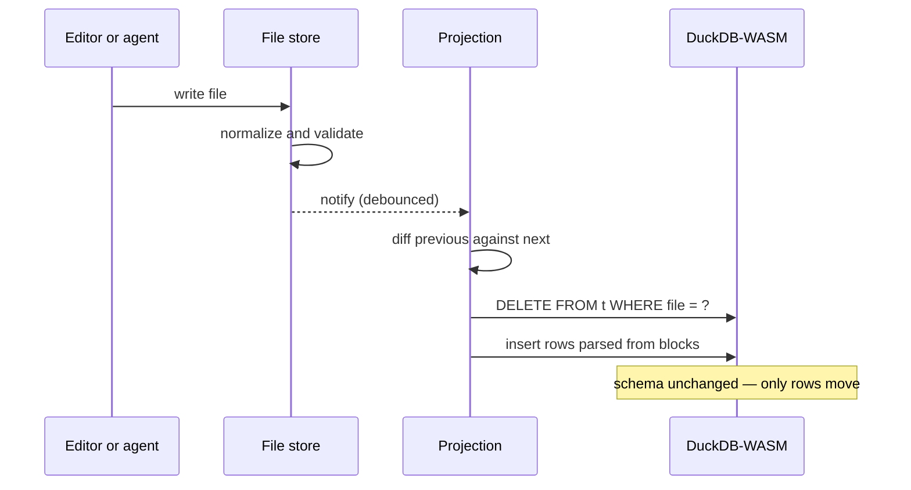

# Data model

A list of Markdown files. That's it. Models love generating Markdown and JSON, and here the two are combined into the source of truth.

An analysis note, carrying a chart and the document's attributes:

````markdown
# Framing shift, March–June 2020

As reported cases climbed, the language of the briefings moved with them. Early transcripts lean on proportionality — measures presented as weighed against a stated risk. By May the same speakers are coding predominantly for compliance and enforcement, with proportionality surviving mainly as a preamble.

```json-chart
{
  "id": "chart-2mv8ptc6",
  "caption": { "label": "Share of codings by frame, per month" },
  "query": "SELECT strftime(a.date, '%Y-%m') AS month, c.title AS frame, n.code AS code, count(*) * 1.0 / sum(count(*)) OVER (PARTITION BY strftime(a.date, '%Y-%m')) AS share FROM annotations n JOIN attributes a ON a.file = n.file JOIN callouts c ON c.id = n.code GROUP BY 1, 2, 3 ORDER BY 1",
  "spec": {
    "type": "stacked-bar",
    "x": { "field": "month", "label": "Month" },
    "y": { "field": "share", "label": "Share of codings", "format": ".0%" },
    "series": "frame",
    "color": "{code:color}",
    "tooltip": "{code} — {share:.0%} of codings in {month}"
  }
}
```

```json-attributes
{
  "tags": ["covid-19", "rhetoric"],
  "date": "2020-06-30",
  "type": "analysis-note",
  "source": "Rijksoverheid",
  "subject": "shift in ministerial framing"
}
```
````

## Registering a block

Each block type is declared once, as a single config object. Writing that config and one Zod schema is all it takes to add a type, and everything else follows from the declaration:

- **Validation** — the Zod schema runs on every write, plus cross-file checks against the corpus
- **Model-facing schema** — JSON Schema sent to the model each turn
- **Tools** — `patch`, `delete`, `add` and `move`, generated per type
- **SQL tables** — DuckDB DDL, with child tables for array fields
- **Normalization** — generated ids, field order etc

### Fields

**Shape**

| Field            | Purpose                                                       |
| ---------------- | ------------------------------------------------------------- |
| `schema`         | Shape and validation of the block as written in the document  |
| `singleton`      | At most one per document, so it needs no id to address        |
| `constraints`    | Rules the schema cannot express, handed to the model as prose |
| `asyncValidate?` | Checks that need other files or the database                  |

**What the model may write**

| Field           | Purpose                                                                         |
| --------------- | ------------------------------------------------------------------------------- |
| `readonly`      | Hidden from the model, for fields the app writes itself                         |
| `immutable`     | Cannot change once set; `id` is included automatically                          |
| `allowedFiles?` | Restricts a block to named files, so settings live only in `settings.hidden.md` |
| `patchSchema?`  | Loosens the model-facing schema where a patch need not repeat the whole object  |

**Rendering**

| Field          | Purpose                                                            |
| -------------- | ------------------------------------------------------------------ |
| `renderer`     | Render function to as block call in editor                         |
| `labelKey?`    | Where the block's human-readable label sits                        |
| `captionType?` | Caption prefix, e.g. `Figure`, numbered per type down the document |

**SQL projection**

| Field        | Purpose                                                                                    |
| ------------ | ------------------------------------------------------------------------------------------ |
| `projected?` | Becomes a table named after the language minus its `json-` prefix, shaped after the schema |
| `tableName?` | Overrides that table name                                                                  |
| `rowPath?`   | Projects this array field as the table's rows instead of the block itself                  |

**Identity and cross-references**

| Field           | Purpose                                                                           |
| --------------- | --------------------------------------------------------------------------------- |
| `idPaths?`      | Which fields hold entity ids, and the prefix each carries — `callout-3kf9m2qp`    |
| `actorPaths?`   | Fields stamped `ai` or `user` on write                                            |
| `expandIdRefs?` | Swaps an id in a field's text for what it refers to, so the text reads on its own |

**Normalization on write**

| Field              | Purpose                                                                          |
| ------------------ | -------------------------------------------------------------------------------- |
| `fuzzyFields?`     | Matched approximately when patching, for text the model quotes from the document |
| `normalizeAsFile?` | String fields normalized the same way file content is                            |
| `normalize?`       | Repairs the document after a patch, against what it held before                  |

### Tools

Editing tools for agentic calls are generated from the same declaration. Every type gets `patch_*` and `delete_*`; non-singletons additionally get `add_*` and `move_*`, since only they can be positioned and addressed by id.

## Identity

Entity ids are one strict format across the whole system: the entity's prefix, then eight characters matching `[0-9][a-z0-9]{7}`. Blocks declare which of their fields are ids and what prefix they carry, which is what lets the model write `callout-3kf9m2qp` in prose and have it resolve to a code. Tags are referenced by slug instead, as `#covid-19`.

A resolved id is never shown raw (eg in chat). It renders as a pill carrying the entity's label, its colour where it has one, and a link to the definition — in documents and in chat alike, so the model can name a code and the researcher can click straight through to it.

Ids referenced before their defining file has loaded are marked pending and resolved when the definition arrives — see [sync](04-sync.md).

## Writes

Every write goes through one path, whether it originates from the editor or from a tool call:

1. **Normalize** — field order settled, ids generated for new records, cross-file references expanded.
2. **Validate the shape** — a malformed or unparseable block throws before it reaches the store, so a rejected write never corrupts a file.
3. **Check immutability** — a field declared `immutable` cannot change once set.
4. **Validate against the corpus** — the checks that need other files, such as whether a referenced code exists.
5. **Record the change** — the diff becomes typed entries in a mutation timeline.

## Projection

Files are truth; DuckDB is a cache of them. The database is never written to directly and never migrated. It is rebuilt by diffing two snapshots of the store: files that disappeared are dropped, files whose content changed are re-parsed and re-inserted.



Rows are replaced per file rather than patched, which makes the sync idempotent and makes a partial failure recoverable by re-running it. Changes are batched twenty files at a time so a large import does not block the frame.

### Tables from schemas

Table structure is derived from the block's JSON Schema. Scalars become columns, nested objects flatten to prefixed columns, and arrays of objects become child tables keyed by file:

| JSON Schema                    | DuckDB      |
| ------------------------------ | ----------- |
| `boolean`                      | `BOOLEAN`   |
| `integer`                      | `INTEGER`   |
| `string` with `format: "date"` | `DATE`      |
| array of `string`              | `VARCHAR[]` |
| array of `number`              | `FLOAT[]`   |
| anything else                  | `VARCHAR`   |

Two escape hatches exist for types whose natural table shape differs from their block shape. `rowPath` projects one array field as the table's rows — `json-annotations` holds an `annotations` array and projects one row per annotation, not one row per block. `tableName` renames, so `json-callout` becomes `callouts`.

Embeddings are projected separately: their blocks live in companion files, and a `fileMapper` rewrites `notes.embeddings.hidden.md` back to `notes.md` so a join against document rows works without the caller knowing companions exist. Their `hash` and `embedding` columns are hidden from the schema shown to the model, which has no use for a thousand floats.

### The schema is the contract

The generated DDL is handed to the model on every turn as the description of what it may query. Both the tables and their description come from the same registry, so the schema the model writes SQL against cannot drift from the tables that exist.

## See also

- [Retrieval](02-retrieval.md) — how the same files become chunks, vectors and a search index
- [Agentic tools](03-agentic/tools.md) — how generated tools are executed and applied
