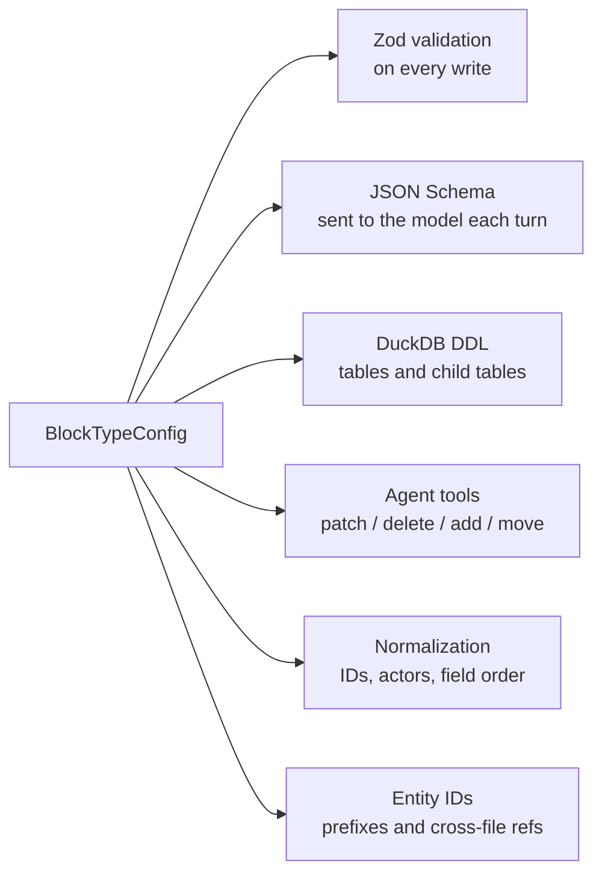
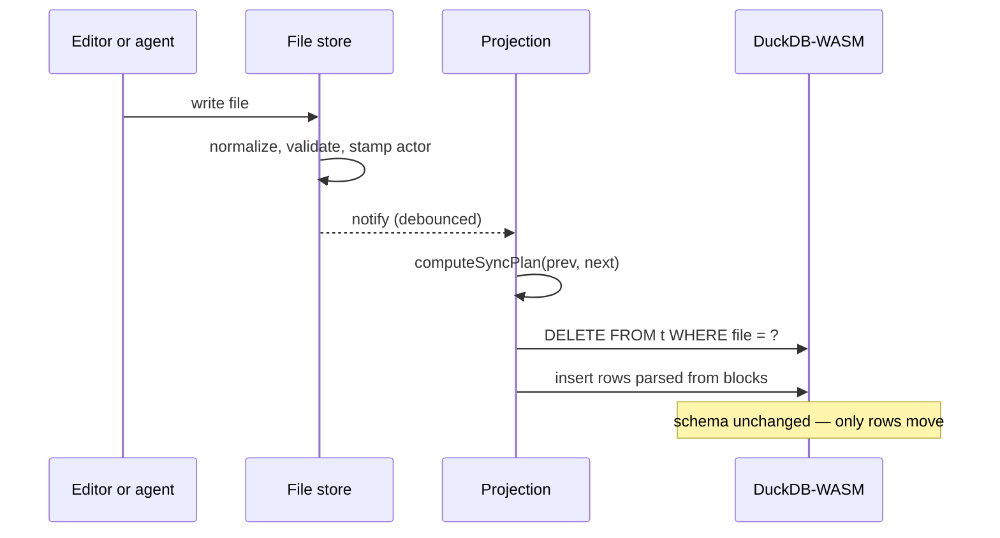

# Data model

A project is a map of filename to markdown:

```ts
export type FileStore = Record<string, string>
```

That is the whole store. Documents, the codebook, settings and cached embeddings are all entries in it. Nothing else is authoritative, and every derived structure in the app — SQL tables, search indexes, the agent's tool definitions — is rebuilt from it.

## Blocks

Structured data lives in fenced JSON blocks inside the markdown, tagged with a language that names the record type.

````markdown
Prose reads normally.

```json-callout
{
  "id": "3kf9m2qp",
  "type": "codebook-code",
  "title": "Proportionality framing",
  "content": "Applied where a restriction is presented as calibrated.",
  "color": "amber",
  "collapsed": false
}
```
````

Prose and records share one substrate. A document stays readable in any editor, diffs line by line in git, and is simultaneously a row in a queryable table.

Seven block types exist:

| Language           | Renderer | Singleton | Projected     | Holds                                  |
| ------------------ | -------- | --------- | ------------- | -------------------------------------- |
| `json-annotations` | hidden   | yes       | yes           | coded spans in a document              |
| `json-attributes`  | hidden   | yes       | yes           | document date, tags, classification    |
| `json-callout`     | callout  | no        | yes           | codebook codes, rendered inline        |
| `json-chart`       | chart    | no        | no            | chart specs, rendered from a SQL query |
| `json-settings`    | hidden   | yes       | yes           | project tags, saved searches           |
| `json-ux`          | hidden   | yes       | no            | view state                             |
| `json-embeddings`  | hidden   | no        | via companion | one chunk vector per block             |

**Singleton** means at most one block of that type per file, so it needs no identifier to address. **Projected** means it becomes a SQL table.

## The registry

Each block type is declared once, as a single config object:

```ts
export interface BlockTypeConfig<T = unknown> {
  schema: (ctx?: ValidationContext) => z.ZodType<T>
  immutable: Record<string, string>
  constraints: string[]
  renderer: "hidden" | "callout" | "chart"
  singleton: boolean
  projected?: boolean
  tableName?: string
  allowedFiles?: string[]
  labelKey?: string
  idPaths?: IdPathConfig[]
  actorPaths?: ActorPathConfig[]
  fuzzyFields?: string[]
  rowPath?: string
  asyncValidate?: (parsed: T, context: AsyncValidationContext) => Promise<ValidationError[]>
}
```

Six independent subsystems read that object. None of them are written per type.



Adding a block type means writing one config and one Zod schema. The table, the tools, the validation and the model-facing schema follow without further work.

### Tools

Editing tools are generated from the same declaration. Every type gets `patch_*` and `delete_*`; non-singletons additionally get `add_*` and `move_*`, since only they can be positioned and addressed by id.

```ts
const buildEntry = (language: string): AnyTool[] => {
  const config = mustGetConfig(language)
  const tools: AnyTool[] = [
    generatePatchTool(language, config),
    generateDeleteTool(language, config),
  ]
  if (!config.singleton) {
    tools.push(generateAddTool(language, config))
    tools.push(generateMoveTool(language, config))
  }
  return tools
}
```

Five languages currently produce fourteen tools. Their parameter schemas and their prose descriptions — including which operations exist and which fields each accepts — are derived from the Zod schema, so a new field on a record becomes a documented operation without touching a prompt.

## Projection

Files are truth; DuckDB is a cache of them. The database is never written to directly and never migrated. It is rebuilt by diffing two snapshots of the store:

```ts
export const computeSyncPlan = (prev: FileStore, next: FileStore): SyncPlan => {
  const deleted = Object.keys(prev).filter((f) => !(f in next))
  const changed = Object.keys(next).filter((f) => next[f] !== prev[f])
  return { deleted, changed }
}
```



Rows are replaced per file rather than patched, which makes the sync idempotent and makes a partial failure recoverable by re-running it. Changes are batched twenty files at a time so a large import does not block the frame.

### Tables from schemas

Table structure is derived from the block's JSON Schema. Scalars become columns, nested objects flatten to prefixed columns, and arrays of objects become child tables keyed by file:

```ts
const jsonTypeToDuckDb = (prop: JsonSchema): DuckDbType => {
  if (prop.type === "boolean") return "BOOLEAN"
  if (prop.type === "integer") return "INTEGER"
  if (prop.type === "string" && prop.format === "date") return "DATE"
  if (prop.type === "array" && prop.items?.type === "string") return "VARCHAR[]"
  if (prop.type === "array" && prop.items?.type === "number") return "FLOAT[]"
  return "VARCHAR"
}
```

Two escape hatches exist for types whose natural table shape differs from their block shape. `rowPath` projects one array field as the table's rows — `json-annotations` holds an `annotations` array and projects one row per annotation, not one row per block. `tableName` renames, so `json-callout` becomes `callouts`.

Embeddings are projected separately: their blocks live in companion files, and a `fileMapper` rewrites `notes.embeddings.hidden.md` back to `notes.md` so a join against document rows works without the caller knowing companions exist. Their `hash` and `embedding` columns are hidden from the schema shown to the agent, which has no use for a thousand floats.

### The schema is the contract

The generated DDL is handed to the model on every turn as the description of what it may query. Both the tables and their description come from the same registry, so the schema the agent writes SQL against cannot drift from the tables that exist.

## Writes

Every write goes through one path, whether it originates from the editor or from a tool call:

1. **Normalize** — field order, generated ids for new records, expansion of cross-file id references.
2. **Validate structurally** — malformed or unparseable blocks are rejected before they can reach the store, and a rejected write throws rather than corrupting a file.
3. **Check immutability** — fields declared `immutable` cannot change once set.
4. **Stamp the actor** — records carry `"ai"` or `"user"` at the paths named by `actorPaths`, decided by comparing the new record against the old rather than by trusting the caller.
5. **Validate asynchronously** — cross-file checks that need the corpus, such as whether a referenced code exists.
6. **Diff into history** — the change becomes typed entries in a mutation timeline.

Actor stamping is what makes the interface honest about provenance: every annotation and every code in the UI can be attributed without a separate audit log, because the attribution lives in the record.

## Identity

Entity ids are one strict format across the whole system — eight characters, `[0-9][a-z0-9]{7}`, defined once and enforced identically in code, tests and fixtures. Blocks declare which of their fields are ids and what prefix those ids carry, which is what lets the agent write `#3kf9m2qp` in prose and have it resolve to a code.

Ids referenced before their defining file has loaded are marked pending and resolved when the definition arrives — see [sync](04-sync.md).

## See also

- [Retrieval](02-retrieval.md) — how the same files become chunks, vectors and a search index
- [Agentic tools](03-agentic/tools.md) — how generated tools are executed and applied
