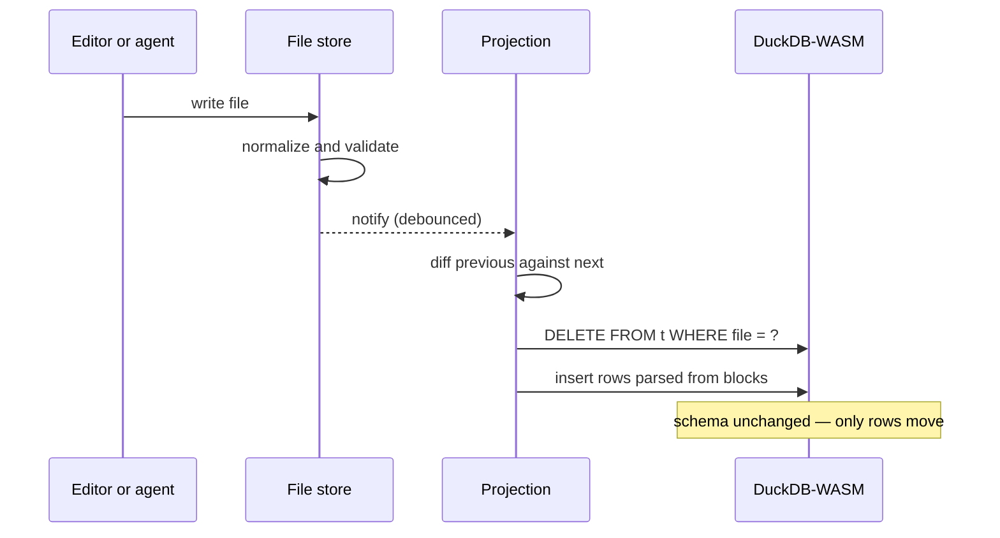
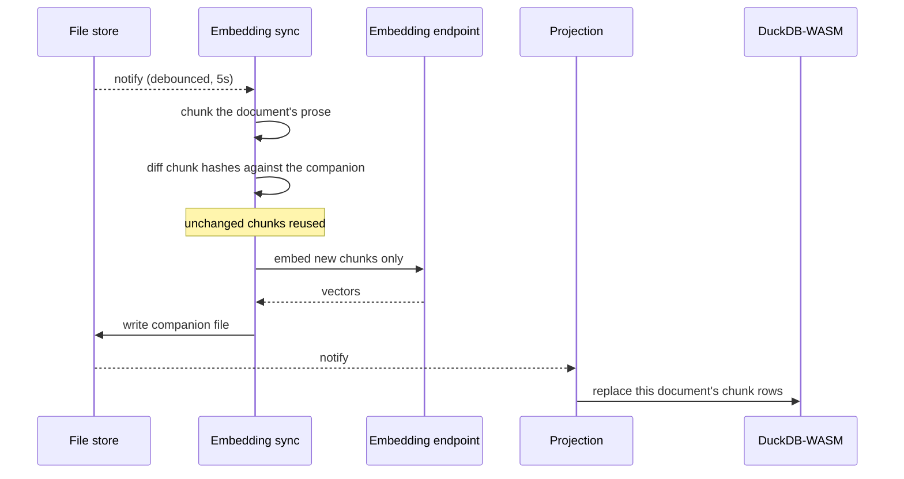

# Documents

A project is a list of Markdown files. That is the whole of it — prose for what a researcher writes, JSON code blocks for everything structured, and nothing kept anywhere else. The codebook, the annotations applied across a corpus and the figures drawn from them all sit in those same files.

Both are formats models generate reliably, which is what lets an agent edit a document as readily as a person does.

## Example document

````markdown
# Framing shift, March–June 2020

As reported cases climbed, the language of the briefings moved with them. Early transcripts lean on proportionality — measures presented as weighed against a stated risk. By May the same speakers are coding predominantly for compliance and enforcement, with proportionality surviving mainly as a preamble.

```json-chart
{
  "id": "chart-2mv8ptc6",
  "caption": { "label": "Share of codings by frame, per month" },
  "query": "SELECT strftime(a.date, '%Y-%m') AS month, c.title AS frame, n.code AS code, count(*) * 1.0 / sum(count(*)) OVER (PARTITION BY strftime(a.date, '%Y-%m')) AS share FROM annotations n JOIN attributes a ON a.file = n.file JOIN callouts c ON c.id = n.code GROUP BY 1, 2, 3 ORDER BY 1",
  "spec": {
    "type": "stacked-bar",
    "x": { "field": "month", "label": "Month" },
    "y": { "field": "share", "label": "Share of codings", "format": ".0%" },
    "series": "frame",
    "color": "{code:color}",
    "tooltip": "{code} — {share:.0%} of codings in {month}"
  }
}
```

```json-attributes
{
  "tags": ["covid-19", "rhetoric"],
  "date": "2020-06-30",
  "type": "analysis-note",
  "source": "Rijksoverheid",
  "subject": "shift in ministerial framing"
}
```
````

## Registering a block

Each block type is declared once, as a single config object. Writing that config and one Zod schema is all it takes to add a type, and everything else follows from the declaration:

- **Validation** — the Zod schema runs on every write, plus cross-file checks against the corpus
- **Model-facing schema** — generated JSON Schema sent to the model each turn
- **Tools** — `patch`, `delete`, `add` and `move`, generated per type
- **SQL tables** — generated DuckDB DDL, with child tables for array fields
- **Normalization** — generated ids, field order etc

The block config's other fields are listed in the [reference](#config-reference) at the end of this page.

### Tools

Editing tools for agentic calls are generated from the same declaration. Every type gets `patch_*` and `delete_*`; non-singletons additionally get `add_*` and `move_*`, since only they can be positioned and addressed by id.

## Identity

Entity ids are one strict format across the whole system: the entity's prefix, then eight characters matching `[0-9][a-z0-9]{7}`. Blocks declare which of their fields are ids and what prefix they carry, which is what lets the model write `callout-3kf9m2qp` in prose and have it resolve to a code. Tags are referenced by slug instead, as `#covid-19`.

An id is never shown raw. What it renders as, and how a quotation is matched back to the passage it came from, is [grounded answers](03-grounded-answers.md).

Ids referenced before their defining file has loaded are marked pending and resolved when the definition arrives — see [sync](07-sync.md).

## Writes

Every write goes through one path, whether it originates from the editor or from a tool call:

1. **Normalize** — field order settled, ids generated for new records, cross-file references expanded.
2. **Validate the shape** — a malformed or unparseable block throws before it reaches the store, so a rejected write never corrupts a file.
3. **Check immutability** — a field declared `immutable` cannot change once set.
4. **Validate against the corpus** — the checks that need other files, such as whether a referenced code exists.
5. **Record the change** — the diff becomes typed entries in a mutation timeline.

## Projection

Every write projects twice. A document's blocks become rows in DuckDB directly. Its prose takes a longer path: embedded first, stored in a companion file, and projected from there. Both results are derived, so neither is ever written to by hand.

Files are truth; DuckDB is a cache of them. The database is never migrated, only rebuilt by diffing two snapshots of the store: files that disappeared are dropped, files whose content changed are re-parsed and re-inserted.



Rows are replaced per file rather than patched, which makes the sync idempotent and makes a partial failure recoverable by re-running it. Changes are batched twenty files at a time so a large import does not block the frame.

### Tables from schemas

Table structure is derived from the block's JSON Schema. Scalars become columns, nested objects flatten to prefixed columns, and arrays of objects become child tables keyed by file:

| JSON Schema                         | DuckDB      |
| ----------------------------------- | ----------- |
| `boolean`                           | `BOOLEAN`   |
| `integer`                           | `INTEGER`   |
| `string` with `format: "date"`      | `DATE`      |
| `string` with `format: "date-time"` | `TIMESTAMP` |
| array of `string`                   | `VARCHAR[]` |
| array of `number`                   | `FLOAT[]`   |
| anything else                       | `VARCHAR`   |

Two escape hatches exist for types whose natural table shape differs from their block shape. `rowPath` projects one array field as the table's rows — `json-annotations` holds an `annotations` array and projects one row per annotation, not one row per block. `tableName` renames, so `json-callout` becomes `callouts`.

### Vectors

A document's prose is embedded and stored beside it, in a companion file that is itself Markdown with JSON blocks:

```text
2020-03-12-press-conference.md
2020-03-12-press-conference.embeddings.hidden.md
```

The companion holds one block per chunk of the document's prose, each carrying the chunk's hash, text, character offsets and vector. Keeping vectors in files rather than in a separate store means they version, back up and restore with the corpus.

Embedding is its own pass over the store, running once the edits settle:



Writing the companion is an ordinary file write, so it re-enters the store exactly as an edit does and the projection picks it up without knowing where it came from. Hidden files are not embeddable, so a companion never gets a companion of its own.

Chunks land in a table named `files` — one row per chunk, not per document — which is what a semantic query selects from. A `fileMapper` rewrites the companion's path back to the document's on the way in, so those rows join against block rows without the caller knowing companions exist, and the `hash` and `embedding` columns are hidden from the schema shown to the model, which has no use for a thousand floats.

### The schema is the contract

The generated DDL is handed to the model on every turn as the description of what it may query. Both the tables and their description come from the same registry, so the schema the model writes SQL against cannot drift from the tables that exist.

## Regions

Annotations mark short spans. Nothing in them says _who is speaking here_ or _what date this passage is from_, so a transcript is a flat wall of coded spans with no way to ask which are Rutte's, and a diary is one document with no way to order its entries.

Regions are a second layer of markup that cuts a document into stretches rather than spans. A region has a **kind** — `speaker`, `date` — and a **value** drawn from a vocabulary shared across the whole corpus, so `rutte` is one person in every file rather than four spellings.

Detection runs by itself, on the same debounce as embedding. One model call finds the occurrences in a stretch of the document; a second decides which sentences each occurrence owns. The result is written into the document as a `json-regions` block, so the document stays the only source of truth and reopening it re-runs no model call.

In the editor, each region's label is drawn on the document's own words — the phrase the occurrence was found by — with the kind's icon and colour. Nothing is inserted: a transcript turn reading "Rutte: yeah, it was quite the event" carries the word Rutte once, and the chip is that word. Hovering a label tints the text that region covers.

### Regions become columns

The payoff is at read time. Every JSON block in a document is handed the regions it sits inside, as a field named `inferred_meta` keyed by kind:

```json
{
  "text": "the budget was settled",
  "reason": "attribution of the decision",
  "code": "callout-3kf9m2qp",
  "inferred_meta": {
    "speaker": ["rutte"],
    "date": { "start": "2020-03-12T00:00:00Z", "end": "2020-03-12T00:00:00Z" }
  }
}
```

That field is never stored. It is recomputed on every read and stripped on every write, so the file on disk holds the regions block and nothing else. What it produces is columns — `inferred_meta_speaker`, `inferred_meta_date_start`, `inferred_meta_date_end` — on every projected table, which turns two questions into ordinary SQL:

```sql
SELECT * FROM annotations WHERE list_contains(inferred_meta_speaker, 'rutte');
SELECT * FROM charts WHERE inferred_meta_date_start >= TIMESTAMP '2020-03-01';
```

Kinds are a shipped list, not user configuration: adding one is a commit, the same as adding a block type. A kind is a folder holding the prose that describes it and a few lines of config naming its icon, its colour, and whether its values are free strings or timestamps.

Regions are derived output, so no agent tool writes them — there is no verb to invoke rather than a verb that refuses.

## Config reference

Every field of the config object introduced under [registering a block](#registering-a-block), grouped as the declaration groups them.

**Shape**

| Field            | Purpose                                                       |
| ---------------- | ------------------------------------------------------------- |
| `schema`         | Shape and validation of the block as written in the document  |
| `singleton`      | At most one per document, so it needs no id to address        |
| `constraints`    | Rules the schema cannot express, handed to the model as prose |
| `asyncValidate?` | Checks that need other files or the database                  |

**What the model may write**

| Field           | Purpose                                                                         |
| --------------- | ------------------------------------------------------------------------------- |
| `readonly`      | Hidden from the model, for fields the app writes itself                         |
| `immutable`     | Cannot change once set; `id` is included automatically                          |
| `allowedFiles?` | Restricts a block to named files, so settings live only in `settings.hidden.md` |
| `patchSchema?`  | Loosens the model-facing schema where a patch need not repeat the whole object  |

**Rendering**

| Field          | Purpose                                                            |
| -------------- | ------------------------------------------------------------------ |
| `renderer`     | Which render function the editor calls for the block               |
| `labelKey?`    | Where the block's human-readable label sits                        |
| `captionType?` | Caption prefix, e.g. `Figure`, numbered per type down the document |

**SQL projection**

| Field            | Purpose                                                                                    |
| ---------------- | ------------------------------------------------------------------------------------------ |
| `projected?`     | Becomes a table named after the language minus its `json-` prefix, shaped after the schema |
| `tableName?`     | Overrides that table name                                                                  |
| `rowPath?`       | Projects this array field as the table's rows instead of the block itself                  |
| `hiddenColumns?` | Columns kept in the table but hidden from the schema the model is shown                    |

**Where a row sits in the document**

| Field        | Purpose                                                                               |
| ------------ | ------------------------------------------------------------------------------------- |
| `spanField?` | Row field holding text quoted from the prose, located to give the row its own regions |

**Identity and cross-references**

| Field           | Purpose                                                                           |
| --------------- | --------------------------------------------------------------------------------- |
| `idPaths?`      | Which fields hold entity ids, and the prefix each carries — `callout-3kf9m2qp`    |
| `actorPaths?`   | Fields stamped `ai` or `user` on write                                            |
| `expandIdRefs?` | Swaps an id in a field's text for what it refers to, so the text reads on its own |

**Normalization on write**

| Field              | Purpose                                                                          |
| ------------------ | -------------------------------------------------------------------------------- |
| `fuzzyFields?`     | Matched approximately when patching, for text the model quotes from the document |
| `normalizeAsFile?` | String fields normalized the same way file content is                            |
| `normalize?`       | Repairs the document after a patch, against what it held before                  |

## See also

- [Sync](07-sync.md) — how files reach disk, and how references resolve when they arrive out of order
- [Agentic tools](06-tools.md) — how the generated tools are executed and applied

## Next: querying

Two projections mean two kinds of questions that can be answered, and [querying](02-querying.md) covers both.
