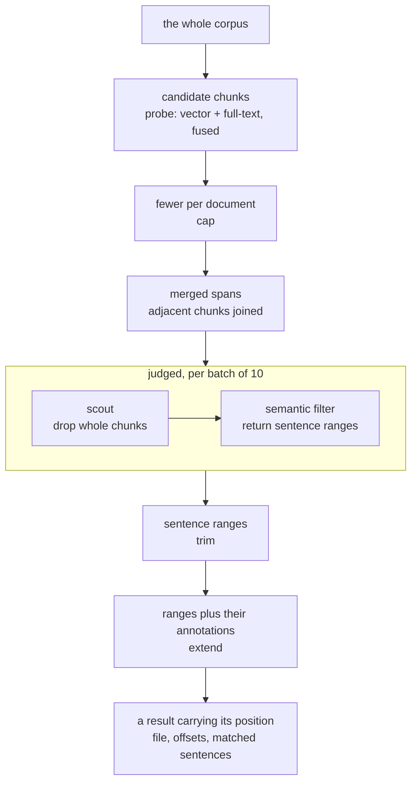

# Querying

Research needs results a reader can check. Every document projects twice — rows in DuckDB and vectors in a companion file, both described in [documents](01-documents.md) — and this is what those two projections let you ask.

The two kinds of question differ in kind. How many, how often, which ones: answered by counting, over the tables. What was said, where, and in what terms: answered by meaning, over the vectors. Both run entirely in the browser — vectors, the full-text index and the SQL engine are all local, and the only calls that leave the tab are to the model gateway, for judgement rather than for lookup.

## Structured queries

The tables come from the block declarations, so anything written as a block is queryable the moment it lands: annotations, codes, tags, dates, document types. That covers every question turning on counting rather than on meaning — how many documents carry a code, which carry none, what the corpus's date range is, how the balance of codes shifted month by month.

The generated DDL travels with each request, so the model writes SQL against a schema it can see rather than one it remembers.

An answer can be written back into a document as a chart block, which stores the query beside the spec for drawing it — the analysis note in [documents](01-documents.md) carries an example. Because the block holds the query rather than a table of numbers, the figure describes the corpus as it stands, not as it stood on the day the chart was made.

## Chunks

Chunking is the unit of identity for the whole system. Search results, embedding cache entries and analysis candidates all address content by chunk hash, which works only because exactly one function produces them, always from the file's prose with its JSON blocks stripped — never the raw file, never a rendered view.

Chunks are 250 tokens with 20% overlap, and their boundaries are adjusted twice: back to the nearest whitespace so words stay whole, then out to the nearest sentence boundary when one lies within 300 characters. Each chunk is identified by a content hash of its final text.

Because identity is content-derived, editing one paragraph invalidates the two or three chunks that overlap it and leaves the rest of the document's vectors untouched. Writing in a document does not cost a re-embedding of the whole of it.

## Keeping vectors current

The embedding pass diffs hashes rather than content: chunks whose hash already appears in the companion are reused, and only genuinely new text is sent to the embedding endpoint. Requests are batched against both a count limit and a token budget, and the pass is debounced by five seconds, so a burst of typing produces one sync rather than one per keystroke.

> [!NOTE]
> Companion blocks are parsed by a dedicated scanner rather than the shared block cache. A thousand-float vector makes an enormous cache key, and caching them would evict the small blocks that are read constantly.

## Query expansion

A natural-language intent is turned into hypothetical passages — HyDE: text that would plausibly appear in a document answering the query — and each is embedded and searched independently. The reason is register: a single embedding of the user's question matches the question's phrasing, not the corpus's. A query asking whether restrictions were framed as proportionate will not sit near a transcript sentence about proportionality unless something bridges the gap.

Each set of passages covers five angles:

- `direct` — the claim stated plainly
- `hedged` — the same claim stated cautiously, as institutional prose usually states it
- `consequence` — what follows if the claim holds
- `signal` — surrounding language that tends to co-occur
- `keywords` — bare terms, which the full-text retriever can use

How many sets are generated depends on the corpus, because the passages are written against what it actually holds. Documents are classified into a type and a subject, and classification is skipped when a document's content hash is unchanged.

Those labels are then consolidated — embedded, compared pairwise by cosine similarity, and merged with union-find — so that near-duplicate phrasings collapse to one representative and a subject means the same thing wherever it appears.

A set is drawn per subject rather than one set for the query as a whole, which is what makes the passages specific. Ask where the measures met resistance, and a corpus known to hold both interview transcripts and policy reports gets passages in each register — "I just stopped bothering with it" alongside "compliance rates declined over the reporting period". Generated blind, every passage would sit in one register, and half the corpus would go unmatched.

Passages are generated in the corpus's own language. Language is detected per chunk, a separate full-text index is kept per language, and retrieval runs per language before results are combined.

## Fusion

Each hypothetical passage produces a ranked list by cosine similarity, and the full-text retriever produces its own. All of them are combined by reciprocal rank fusion: every list a chunk appears in contributes `1 / (k + rank)` to that chunk's score.

Fusion is on rank, not score, so a cosine similarity and a BM25 score never have to be made commensurable. A chunk that places tenth for most of the passages outranks one that places first for a single passage — which is the behaviour wanted, since a chunk matching many angles of the question is more likely to be about it.

The fused candidate pool is the larger of a thousand chunks or a fifth of the corpus. It is deliberately generous; narrowing happens later, with the model in the loop.

## Semantic SQL

The two kinds of question meet in one statement. Search is expressed as SQL over `files`, the chunk table described in [documents](01-documents.md), extended by two functions:

```sql
SELECT file, text FROM files
WHERE SEMANTIC('framing restrictions as proportionate')
ORDER BY _semantic_score DESC
LIMIT 30
```

Before execution, a resolver extracts the tokens, generates and embeds the hypothetical passages, runs fusion, and rewrites the query against the resulting chunk set — neither function reaches DuckDB as written. `EMBEDDINGS_FROM_FILE('code.md')` makes a document the query instead: the named file is embedded and searched against the corpus, which is how a corpus is compared against itself — what echoes a note, what covers the same ground, what is a near-duplicate. Point it at a codebook entry and the spans that entry might apply to come back, which is what the [analysis pass](03-agentic/consensus.md) runs once per code.

Meaning and structure therefore compose: proportionality framing, in press conferences from March 2020, in documents not yet coded, is one `WHERE` clause rather than a pipeline anyone has to orchestrate. Nothing outside the resolver ever handles a vector.

## The cascade

Recall is cheap and precision is expensive, so retrieval casts wide and then narrows with the model. Every stage below discards: the corpus goes in, and what comes out is a handful of sentences, each carrying the range in the file it was taken from.



**Cap** limits how many chunks any one file may contribute, so a single long document cannot crowd out the corpus.

**Merge** grows a high-scoring chunk into its neighbours when their scores are within a ratio of the seed's, then re-slices the merged span from the source file. A passage that spans a chunk boundary is returned whole rather than as two fragments with a seam.

**Verdict** is the only stage that calls the model, and the only one that streams. Batches of ten hits are judged concurrently, and each batch's results run the remaining stages immediately rather than waiting for the rest — results appear progressively.

Within a batch, two filters run in sequence. The scout sees whole chunks and answers only which are irrelevant; it is coarse, cheap and aware of the coding framework. What survives goes to the semantic filter, which returns sentence ranges rather than a verdict: a start and an end reference, and the clause or signal that range satisfies.

Passages are presented with per-hit letter prefixes and numbered sentences, so a reference names both which hit and which sentences.

Filtering therefore also does extraction: the pipeline learns not only that a hit is relevant, but which sentences carry the relevance. Each hit's verdict is cached by intent and content, so repeating or refining a search re-judges only what actually changed.

**Trim** cuts each hit down to exactly those sentence ranges.

**Extend** grows the returned byte range to cover any annotation that overlaps it and appends those annotations to the hit's text. A result therefore arrives carrying the coding already applied to it, so a researcher sees what is coded and what is not without asking twice.

**Barren exit** stops paging when consecutive batches yield nothing rather than at a fixed depth. The allowance scales with how many results were asked for, so a request for many results is given more room to find them before the corpus is declared exhausted.

What arrives is therefore not a list of documents to go and read. Each result is a few sentences, named by the file they came from and the byte range they occupy in it, which is what lets a result be followed back to the passage in its document rather than searched for a second time by hand.

Every stage after `probe` can be disabled individually at runtime. Turning off filtering and trimming shows the raw fused candidates, which is how a retrieval problem is separated from a judgement problem.

## See also

- [Consensus](03-agentic/consensus.md) — the analysis pass that runs this cascade once per code
