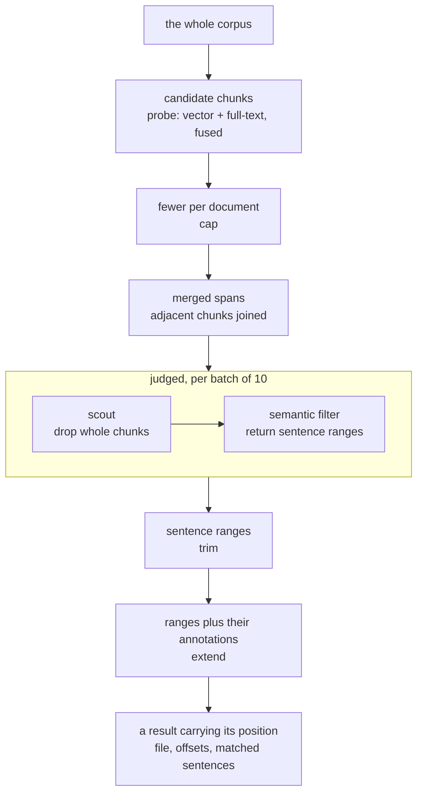

# Querying

Every document projects twice — rows in DuckDB and vectors in a companion file, both described in [documents](01-documents.md). This is what those two projections let you ask.

How many, how often, which ones: answered by counting, over the tables. What was said, where, and in what terms: answered by meaning, over the vectors. Vectors, the full-text index and the SQL engine are all local, so the only calls leaving the tab go to the model gateway, for judgement rather than lookup.

## Structured queries

The tables come from the block declarations, so anything written as a block is queryable the moment it lands: annotations, codes, tags, dates, document types. That covers every question turning on counting — how many documents carry a code, which carry none, how the balance shifted month by month.

The generated DDL travels with each request, so the model writes SQL against a schema it can see.

A table the user writes inside a document is queryable the same way, under its own table name. Those tables are not in the DDL that travels with the request — they come and go with the documents, and a schema that changed on every table edit would invalidate the prompt cache each time — so the model discovers them at query time from `duckdb_tables()`, whose comment carries each table's caption, its file, and any count of cells failing their column type.

An answer can be written back as a chart block, which stores the query beside the spec for drawing it — the analysis note in [documents](01-documents.md) carries an example. Holding the query rather than a table of numbers, the figure describes the corpus as it stands rather than as it stood the day the chart was made.

## Chunks

The chunk is the unit of identity for the whole system: search results, embedding cache entries and analysis candidates all address content by chunk hash. That works only because exactly one function produces them, always from the file's prose with its JSON blocks stripped.

Chunks are 250 tokens with 20% overlap, and their boundaries are adjusted twice when querying: back to the nearest whitespace so words stay whole, then out to the nearest sentence boundary when one lies within 300 characters. Each chunk is identified by a content hash of its final text.

Because identity is content-derived, editing one paragraph invalidates the two or three chunks overlapping it and leaves the document's other vectors untouched.

## Keeping vectors current

Vector synchronization is done by hashing each chunk and finding if a vector result already exists in the companion file. If not they are requested (debounced, so not every keystroke triggers new requests) from the embeddings endpoint and written into the companion file. The companion file then uses the same sync mechanism to sync itself to DuckDB as regular files.

## Query expansion for semantic search

A natural-language intent is turned into hypothetical passages — HyDE: text that would plausibly appear in a document answering the query — and each is embedded and searched independently. The reason is register: a single embedding of the question matches the question's phrasing, not the corpus's. A query asking whether restrictions were framed as proportionate will not sit near a transcript sentence about proportionality unless something bridges the gap.

Each set of passages covers five angles:

- `direct` — the claim stated plainly
- `hedged` — the same claim stated cautiously, as institutional prose usually states it
- `consequence` — what follows if the claim holds
- `signal` — surrounding language that tends to co-occur
- `keywords` — bare terms, which the full-text retriever can use

How many sets are generated depends on the corpus, because the passages are written against what it holds. Documents are classified into a type and a subject, and classification is skipped when a document's content hash is unchanged.

Those labels are then consolidated — embedded, compared pairwise by cosine similarity, and merged with union-find — so a subject means the same thing wherever it appears.

A set is drawn per subject rather than one for the query as a whole, which is what makes the passages specific. Ask where the measures met resistance, and a corpus holding both interview transcripts and policy reports gets passages in each register — "I just stopped bothering with it" alongside "compliance rates declined over the reporting period". Generated blind, every passage would sit in one register and half the corpus would go unmatched.

Passages are generated in the corpus's own language. Language is detected per chunk, each language keeps its own full-text index, and retrieval runs against each before the results are combined.

## Fusion

Each hypothetical passage produces a ranked list by cosine similarity, and the full-text retriever produces its own. All of them are combined by reciprocal rank fusion: every list a chunk appears in contributes `1 / (k + rank)` to that chunk's score.

Fusion is on rank, not score, so a cosine similarity and a BM25 score never have to be made commensurable. A chunk placing tenth for most of the passages outranks one placing first for a single passage, since a chunk matching many angles of the question is more likely to be about it.

The fused candidate pool is the larger of a thousand chunks or a fifth of the corpus. It is deliberately generous, because recall is cheap and precision is expensive.

## The cascade

That pool is what the rest of retrieval narrows. Every stage below discards: the corpus goes in, and what comes out is a handful of sentences, each carrying the range in the file it was taken from.



**Cap** limits how many chunks any one file may contribute, so a single long document cannot crowd out the corpus.

**Merge** grows a high-scoring chunk into its neighbours when their scores are within a ratio of the seed's, then re-slices the merged span from the source file, so a passage crossing a chunk boundary comes back whole rather than as two fragments with a seam.

**Verdict** is the only stage that calls the model, and the only one that streams. Batches of ten hits are judged concurrently, and each batch runs the remaining stages immediately rather than waiting for the rest, so results appear progressively.

Within a batch, two filters run in sequence. The scout sees whole chunks and answers only which are irrelevant; it is coarse, cheap and aware of the coding framework. What survives goes to the semantic filter, which returns sentence ranges rather than a verdict: a start and an end reference, and the clause or signal that range satisfies.

Passages are presented with per-hit letter prefixes and numbered sentences, so a reference names both which hit and which sentences.

Filtering therefore also does extraction. Each hit's verdict is cached by intent and content, so repeating or refining a search re-judges only what changed.

**Trim** cuts each hit down to exactly those sentence ranges.

**Extend** grows the returned byte range to cover any annotation overlapping it and appends those annotations to the hit's text, so a result arrives showing the coding already applied to it.

**Barren exit** stops paging when consecutive batches yield nothing rather than at a fixed depth. The allowance scales with how many results were asked for, so a larger request gets more room before the corpus is declared exhausted.

What arrives is therefore not a list of documents to go and read. Each result carries the file and byte range it came from, so it can be followed back to the passage rather than searched for a second time by hand.

Every stage after `probe` can be disabled individually at runtime. Turning off filtering and trimming shows the raw fused candidates, which is how a retrieval problem is separated from a judgement problem.

## Semantic SQL

The two kinds of question meet in one statement. Search is expressed as SQL over `files`, the chunk table described in [documents](01-documents.md), extended by two functions:

### SEMANTIC()

```sql
SELECT file, text FROM files
WHERE SEMANTIC('framing restrictions as proportionate')
ORDER BY _semantic_score DESC
LIMIT 30
```

Before execution, a resolver extracts the tokens, generates and embeds the hypothetical passages, runs fusion, and rewrites the query against the resulting chunk set for standard DuckDB compatbility.

### EMBEDDINGS_FROM_FILE()

`EMBEDDINGS_FROM_FILE('code.md')` makes a document the query instead: the named file is embedded and searched against the corpus, which is how a corpus is compared against itself — what echoes a note, what covers the same ground. Point it at a codebook entry and the spans that entry might apply to come back, which is what the [analysis pass](04-consensus.md) runs once per code.

Meaning and structure therefore compose: proportionality framing, in press conferences from March 2020, in documents not yet coded, is one `WHERE` clause rather than a pipeline anyone has to orchestrate. Nothing outside the resolver ever handles a vector.

## See also

- [Consensus](04-consensus.md) — the analysis pass that runs this cascade once per code

## Next: grounded answers

When the LLM answers the user, its answers should be easily recognizable as being grouned in the corpus and navigatable to its source. [Grounded answers](03-grounded-answers.md) is where that proces is described.
