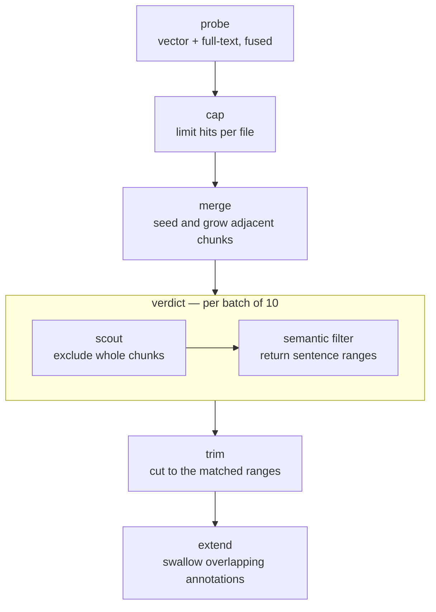

# Retrieval

For research its important to have high quality grounded results. Multiple systems work together to achieve this.

## Embeddings / Hyde generation

## Database Projection

## Anchored responses

Search runs entirely in the browser. Vectors, the full-text index and the SQL engine are all local; the only calls that leave the tab are to the model gateway, and they are for judgement rather than for lookup.

The design assumption is that recall is cheap and precision is expensive. Retrieval casts wide — two independent retrievers, and the question restated as hypothetical passages — then narrows with the model, first at chunk granularity and then at sentence granularity.

## Chunks

Chunking is the unit of identity for the whole system. Search results, embedding cache entries and analysis candidates all address content by chunk hash, which works only because exactly one function produces them, always from the file's prose with its JSON blocks stripped — never the raw file, never a rendered view.

Chunks are 250 tokens with 20% overlap, and their boundaries are adjusted twice: back to the nearest whitespace so words stay whole, then out to the nearest sentence boundary when one lies within 300 characters. Each chunk is identified by a content hash of its final text.

Because identity is content-derived, editing one paragraph invalidates the two or three chunks that overlap it and leaves the rest of the document's vectors untouched.

## Companion files

Vectors are stored beside the document they belong to, in the same format as everything else:

```text
2020-03-12-press-conference.md
2020-03-12-press-conference.embeddings.hidden.md
```

The companion holds one `json-embeddings` block per chunk, each with the chunk's hash, text, character offsets and vector. Keeping them in files rather than in a separate store means they sync, back up and restore with the corpus, and it means the embedding cache survives a browser reset.

Sync diffs hashes rather than content: chunks whose hash already appears in the companion are reused, and only genuinely new text is sent to the embedding endpoint. Requests are batched against both a count limit and a token budget, and the whole pass is debounced so a burst of typing produces one sync.

> [!NOTE]
> Companion blocks are parsed by a dedicated scanner rather than the shared block cache. A thousand-float vector makes an enormous cache key, and caching them would evict the small blocks that are read constantly.

## Query expansion

A natural-language intent is turned into hypothetical passages — HyDE: text that would plausibly appear in a document answering the query — and each is embedded and searched independently. How many are generated depends on the corpus, since the set is drawn once per language and subject it holds. Each set covers five angles:

- `direct` — the claim stated plainly
- `hedged` — the same claim stated cautiously, as institutional prose usually states it
- `consequence` — what follows if the claim holds
- `signal` — surrounding language that tends to co-occur
- `keywords` — bare terms, which the full-text retriever can use

The angles exist because a single embedding of the user's question matches the question's register, not the corpus's. A query asking whether restrictions were framed as proportionate will not sit near a transcript sentence about proportionality unless something bridges the gap in phrasing.

Passages are generated in the corpus's own language. Language is detected per chunk, a separate full-text index is kept per language, and retrieval runs per language before results are combined.

## Fusion

Each hypothetical passage produces a ranked list by cosine similarity, and the full-text retriever produces its own. All of them are combined by reciprocal rank fusion: every list a chunk appears in contributes `1 / (k + rank)` to that chunk's score.

Fusion is on rank, not score, so a cosine similarity and a BM25 score never have to be made commensurable. A chunk that places tenth for most of the passages outranks one that places first for a single passage — which is the behaviour wanted, since a chunk matching many angles of the question is more likely to be about it.

The fused candidate pool is the larger of a thousand chunks or a fifth of the corpus. It is deliberately generous; narrowing happens later, with the model in the loop.

## Semantic SQL

Search is expressed as SQL. Two functions extend it:

```sql
SELECT file, text FROM files
WHERE SEMANTIC('framing restrictions as proportionate')
ORDER BY _semantic_score DESC
LIMIT 30
```

Before execution, a resolver extracts the tokens, generates and embeds the hypothetical passages, runs fusion, and rewrites the query against the resulting chunk set — neither function reaches DuckDB as written. `EMBEDDINGS_FROM_FILE('code.md')` does the same using a codebook entry's own text as the query, which is what the analysis pass uses to find candidate spans for a code.

The model therefore composes retrieval and structured filtering in one expression: semantic search restricted to documents with a given tag and date range is a `WHERE` clause, not a pipeline it has to orchestrate. It also never handles a vector.

## The cascade



**Cap** limits how many chunks any one file may contribute, so a single long document cannot crowd out the corpus.

**Merge** grows a high-scoring chunk into its neighbours when their scores are within a ratio of the seed's, then re-slices the merged span from the source file. A passage that spans a chunk boundary is returned whole rather than as two fragments with a seam.

**Verdict** is the only stage that calls the model, and the only one that streams. Batches of ten hits are judged concurrently, and each batch's results run the remaining stages immediately rather than waiting for the rest — results appear progressively.

Within a batch, two filters run in sequence. The scout sees whole chunks and answers only which are irrelevant; it is coarse, cheap and aware of the coding framework. What survives goes to the semantic filter, which returns sentence ranges rather than a verdict:

```json
{
  "results": [
    {
      "start": "a-3",
      "end": "a-7",
      "confidence": "clear",
      "reasonToKeep": "States the measure was weighed against the harm"
    }
  ]
}
```

Passages are presented with per-hit letter prefixes and numbered sentences, so a reference names both which hit and which sentences.

Filtering therefore also does extraction: the pipeline learns not only that a hit is relevant, but which sentences carry the relevance. Each hit's verdict is cached by intent and content, so repeating or refining a search re-judges only what actually changed.

**Trim** cuts each hit down to exactly those sentence ranges.

**Extend** grows the returned byte range to cover any annotation that overlaps it and appends those annotations to the hit's text. A search result therefore arrives carrying the coding already applied to it, which is what lets the model reason about what is coded and what is not without a second query.

**Barren exit** stops paging when consecutive batches yield nothing rather than at a fixed depth. The allowance scales with how many results were asked for, so a request for many results is given more room to find them before the corpus is declared exhausted.

Every stage after `probe` can be disabled individually at runtime. Turning off filtering and trimming shows the raw fused candidates, which is how a retrieval problem is separated from a judgement problem.

## Corpus structure

Alongside search, documents are classified into a type and a subject, and classification is skipped when a document's content hash is unchanged.

Both label sets are then consolidated: labels are embedded, compared pairwise by cosine similarity, and merged with union-find so that near-duplicate phrasings collapse to one representative.

The result is a description of what the corpus actually holds, and HyDE generation runs against it. Ask where the measures met resistance, and a corpus known to hold both interview transcripts and policy reports gets passages in each register — "I just stopped bothering with it" alongside "compliance rates declined over the reporting period". Generated blind, every passage would sit in one register, and half the corpus would go unmatched.

## See also

- [Data model](01-data-model.md) — where blocks and companion files come from
- [Consensus](03-agentic/consensus.md) — the analysis pass that runs this pipeline once per code
