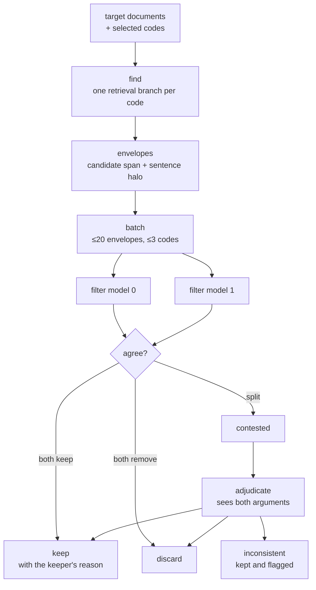

# Consensus

Applying a codebook to a corpus is the tool the rest of the system exists to support. A code — "restriction framed as proportionate" — has to be located in thousands of sentences, and each candidate has to be judged. The judgement is subjective enough that two competent human coders disagree on a meaningful fraction of it, which is exactly why a single model's answer should not be taken as the result.

The pass therefore does not ask a model whether a span matches. It asks two models independently, treats agreement as decided, and escalates disagreement to a third that has both arguments in front of it.



## Find

Each selected code becomes its own retrieval branch, running the [search cascade](../02-retrieval.md) with the code's own definition text as the query — that is what `EMBEDDINGS_FROM_FILE` exists for. Branches run concurrently, and candidates are restricted to the chunk hashes that overlap the targeted documents and line ranges, so scope is enforced before any model sees anything.

Matches come back as sentence ranges rather than chunks, since the filter stage of retrieval already works at sentence granularity.

## Envelopes

A matched span is wrapped with its surrounding sentences before it is judged:

```text
<target id="4" code="proportionality-framing">
The measures announced today are far-reaching. We have not taken them lightly.
<marked>They are proportionate to the risk we currently face.</marked>
Their necessity will be reviewed every three weeks. The advice remains unchanged.
</target>
```

Six sentences either side. A span judged without context is judged on its wording; a span judged with context is judged on its meaning, and coding decisions turn on meaning. Envelope boundaries are computed against a sentence index of the whole file, so the halo never splits a sentence.

## Batching

Envelopes are packed into calls to keep each judgement in a useful context — twenty per call, and no more than three distinct codes mixed into one:

```ts
export const planBatches = (
  envelopes: readonly Envelope[],
  cap: number = ENVELOPES_PER_CALL,
  maxCodes: number = MAX_CODES_PER_MIXED_CALL
): Envelope[][] => { ... }
```

Codes with enough candidates get their own batches; the remainder are packed largest-first into mixed ones. Judging twenty spans against one code is a consistent task, and consistency is what a filter pass needs. Mixing ten codes into one call invites the model to compare codes against each other rather than each span against its code.

## Voting

Two filter models see the identical batch, at the same endpoint with a different `model` parameter — the [gateway](../../README.md#model-gateway) resolves each to a different model, and the caller never learns which. Each returns a judgement and a reason per span.

```ts
const mergeVotes = (votes: IndexedJudgment[]): MergedJudgment => {
  const keeps = votes.filter(isKeep)
  const removes = votes.filter(isRemove)

  if (removes.length === votes.length) return { outcome: "remove", reason: "" }

  if (keeps.length === votes.length) {
    const reason = pickReason(keeps.map((k) => k.judgment.reason))
    return { outcome: "keep", reason }
  }

  const keepReason = keeps[0]?.judgment.reason ?? ""
  const removeReason = formatRemoveReview(removes)
  return { outcome: "contested", reason: keepReason, review: removeReason }
}
```

This is unanimity-or-escalate, not majority. With two voters a majority rule is meaningless, and the point is not to average two opinions — it is to detect that the case is hard. Disagreement is signal about the span, and it is the cheapest reliable signal available: the spans two models split on are very close to the spans two human coders would argue about.

Both reasons are retained. The keeper's becomes the annotation's justification if the span survives; the remover's is carried forward as the case against.

## Adjudication

Only contested spans go to the third model, and they arrive with the argument already made on both sides:

```text
<target id="2" code="proportionality-framing">
...
<marked>They are proportionate to the risk we currently face.</marked>
...
<keep-case>Explicitly weighs the measure against the stated risk.</keep-case>
<remove-case>Asserts proportionality without reference to any cost being weighed.</remove-case>
</target>
```

The adjudicator is deciding between two positions rather than re-deriving the judgement from scratch, which is a materially easier task and a materially cheaper call. It has three outcomes:

```ts
export const applyVerdict = (e: Envelope, v: Verdict): Envelope | null => {
  switch (v.judgment) {
    case "reject":
      return null
    case "keep":
      return { ...e, review: undefined }
    case "inconsistent":
      return { ...e, review: v.reason }
  }
}
```

`inconsistent` is the one that matters. When a span genuinely sits on the boundary of a code, the correct output is not a decision — it is a flag saying the codebook is ambiguous here. Those spans are kept and surfaced for review, and a cluster of them is usually evidence that a code needs splitting or its definition needs sharpening.

Forcing a binary answer at this point would discard the most useful thing the pass produces.

## Reporting

Every run prints its own counts per code:

```text
[deep-analysis] documents/2020-03
per-code pipeline counts:
  filter       spans each filter model voted 'keep' (m0/m1)
  adjud(k/r/a) contested spans resolved as kept / rejected / still-ambig

code                     filter        adjud(k/r/a)
-----------------------  ------------  ------------
proportionality-framing  m0:31 m1:24   k:5 r:9 a:2
institutional-hedging    m0:12 m1:13   k:2 r:1 a:0
```

The two filter columns are the diagnostic worth watching. A code where the models agree closely is well defined. A code where one votes keep three times as often as the other is not a code — it is two codes, or a definition that has not been written yet. A high ambiguous count in adjudication says the same thing more loudly.

The pass therefore reports on the codebook as much as it reports on the corpus, and the numbers are what a researcher uses to decide whether to accept the run or go back and rewrite a definition.

## Concurrency

Retrieval branches run ten at a time, batch processing five, and every stage is pooled rather than sequential — a failure in one branch is collected as an error and does not take down the run. Errors are returned with the results rather than thrown, so a pass that partly succeeded reports both what it found and what it could not reach.

## See also

- [Retrieval](../02-retrieval.md) — the pipeline each find branch runs
- [Tools](tools.md) — how the resulting annotations are written back
