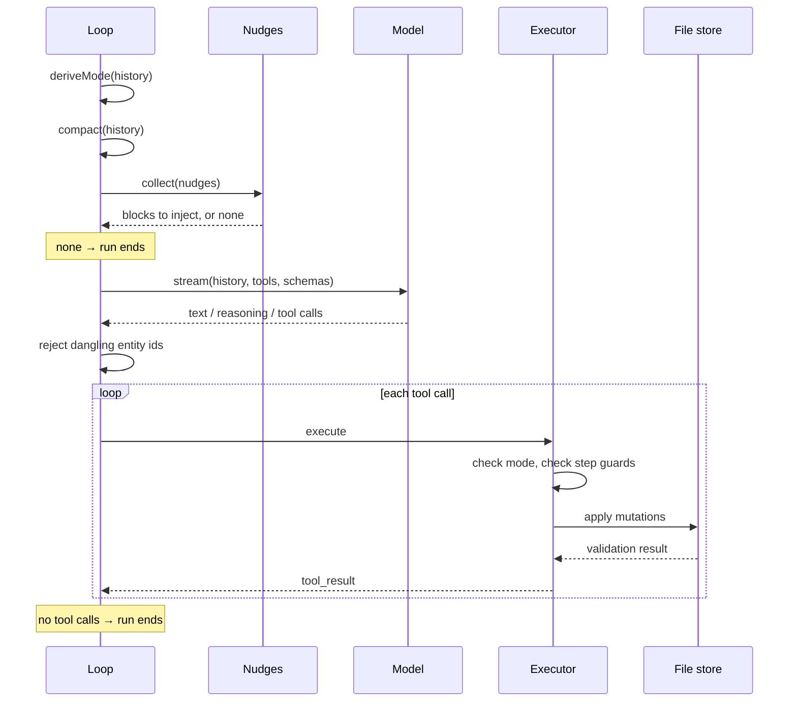

# The loop

The agent is a loop over a block list. Each iteration resolves what the agent currently is — which tools it may call, which context it needs, how its history should be compacted — from that list, calls the model, executes any tool calls, and repeats until a turn produces no tool calls.

```ts
export const runAgentLoop = async (config: AgentRunConfig): Promise<void> => {
  for (let turn = 0; turn < maxTurns; turn++) {
    const sourceBlocks = filterBySource(getAllBlocks(), source)
    const iter = config.resolve(sourceBlocks)
    ...
  }
}
```

`resolve` is a parameter. The loop itself has no knowledge of modes, prompts or tools — it is a driver that a caller configures per iteration, which is what lets the same loop run the main conversation and the sub-agent passes without special cases.

## History is the state machine

There is no mode variable. Mode is derived by scanning the block list backwards for the most recent thing that would have changed it:

```ts
export const deriveMode = (blocks: Block[]): ModeName => {
  for (let i = blocks.length - 1; i >= 0; i--) {
    const block = blocks[i]
    if (block.type === "tool_result" && block.toolName) {
      const mode = triggerToMode[block.toolName]
      if (mode) return mode
    }
    if (block.type === "system") {
      const mode = modeFromPromptMarker(block.content)
      if (mode) return mode
    }
  }
  return DEFAULT_MODE
}
```

Two things can move the agent between modes: a marker block written into the conversation, and the successful result of a tool declared as a trigger. Submitting a plan moves it into execution; cancelling returns it to chat.

Because state is read from history rather than held beside it, the two cannot disagree. Replaying a conversation reconstructs the mode at every point in it, and a mode change is itself a visible, diffable entry in the transcript rather than a side effect.

## Modes

A mode is a row in a table:

```ts
interface ModeConfig {
  tools: AnyTool[]
  triggers: string[]
  prompt?: string
  nudges: Nudger[]
}
```

| Mode   | Can do                                                     | Entered by        |
| ------ | ---------------------------------------------------------- | ----------------- |
| `chat` | read, search, query, edit blocks and files, start planning | default; `cancel` |
| `plan` | read, search, query, ask, submit a plan                    | `start_planning`  |
| `exec` | everything in chat, plus completing plan steps             | `submit_plan`     |

Planning mode has no mutating tools at all. The restriction is structural rather than instructed — the tools are absent from the request, so a plan cannot half-execute itself while being written.

Availability is enforced again at execution time, with the failure distinguishing two cases the model needs to tell apart:

```ts
export const checkToolAvailability = (toolName: string, mode: ModeName): string | null => {
  const available = buildAvailableToolNames(mode)
  if (available.has(toolName)) return null
  if (allKnownToolNames.has(toolName)) return `Tool "${toolName}" is not available in ${mode} mode.`
  return `Tool "${toolName}" does not exist. Available tools: ${[...available].sort().join(", ")}`
}
```

"Not here" tells the model to change mode. "Does not exist" tells it to stop trying. Collapsing both into one error produces a model that retries a hallucinated tool in every mode.

## Nudges

Rather than one large system prompt carrying every instruction for every situation, context is injected per turn by small functions that inspect the history and usually decline:

```ts
export type Nudger = (history: Block[]) => NudgeBlock | null
```

Each mode composes a set of them. Some are unconditional per mode — the current settings, the project memory. Others fire on a condition: after a shell command errors, once when a tool is used for the first time, when a plan step's state has drifted from what the agent seems to believe. Tool-specific nudges are attached to the tools themselves, so a mode's nudge set is partly derived from its tool list rather than maintained alongside it.

A nudge may declare an async `context()` whose result is interpolated into its text, which is how live state — the file list, the current step, unsaved settings — reaches the model without being restated every turn.

Returning no nudges at all ends the run. That is the mechanism by which an agent that has nothing left to do stops, rather than being cut off by a turn limit.

Nudges are pure functions of history, so they are tested as such. Recorded conversations are replayed against the nudge set and compared to expected output:

```text
scenarios/shell-error-full-docs/shell-error-full-docs.json
scenarios/shell-error-full-docs/shell-error-full-docs.expected.json
```

Changing a nudge's wording or its trigger condition shows up as a diff in a fixture. Prompt behaviour is under regression test in the same way parsing is.

## A turn



Every request also carries the block JSON Schemas and the current database DDL, both generated from the registry described in the [data model](../01-documents.md).

## Guards

**Dangling identifiers.** Entity ids in a final message are checked against the store, and a message referring to ids that do not exist is rejected rather than shown:

```ts
return {
  type: "system",
  content: `${REJECTION_PREFIX} Your last message was rejected because these entity IDs do not exist: ${dangling.join(", ")}\nIn your next message DO NOT restate any of these identifiers. Continue without them.`,
}
```

The loop then continues so the model can answer again, with a cap of three consecutive rejections before the answer is allowed through. A hallucinated reference is caught mechanically — checked against the store, not judged by a model — and the model is told specifically what to avoid rather than asked to try harder.

**Step guards.** In execution mode, completing a step is checked against the plan's actual state before the tool runs. The plan is derived from history like everything else, so it cannot be advanced past where it is.

**Cancellation.** Aborting mid-stream discards the in-flight request, cancels pending tool calls and returns the loop to waiting for the user, without unwinding the conversation. The next message resumes from the blocks that did complete.

## Compaction

Long conversations are compacted before being sent, on boundaries the plan defines rather than by token count. Blocks between two completed steps are dropped, except those that are structurally load-bearing:

```ts
const isStructural = (block: Block): boolean =>
  block.type === "user" ||
  block.type === "system" ||
  isPreservedToolCall(block) ||
  isPreservedToolResult(block)
```

What a step did survives; how it did it does not. User messages, mode markers, plan submissions and step completions are never dropped, so the compacted history still reconstructs the same mode and the same plan state as the full one — which matters, because both are derived from it.

## See also

- [Tools](tools.md) — what the loop can call and how results are applied
- [Consensus](consensus.md) — the multi-model pass that one of those tools starts
