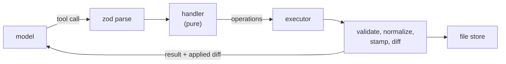

# Tools

Tools are declared as one object carrying a name, a description, a Zod schema and a handler:

```ts
export const tool = <TSchema extends z.ZodType, TOutput>(
  def: ToolDef<TSchema, TOutput>
): Tool<TSchema, TOutput> => {
  const handle: Handler<TOutput> = async (files, args) => {
    const parsed = def.schema.safeParse(args)
    if (!parsed.success) {
      return { status: "error", output: formatZodError(parsed.error), mutations: [] }
    }
    return def.handler(files, parsed.data)
  }
  return { ...def, handle }
}
```

The schema does three jobs from one declaration: it types the handler's arguments, it validates what the model sent, and it is converted to the JSON Schema in the tool definition. A parameter cannot be documented to the model differently from how it is validated, because there is only one description of it.

## Handlers do not write

A handler receives the files and returns a description of what should change. It does not touch the store:

```ts
export type Operation =
  | { type: "write_file"; path: string; content: string; skipBlockValidation?: boolean }
  | { type: "delete_file"; path: string }
  | { type: "rename_file"; path: string; newPath: string }
```

One executor applies every operation from every tool, and everything that must happen on a write happens there once: normalization, block validation, immutability checks, actor stamping, id generation, mutation history, and persistence. A new tool cannot forget any of it, and cannot bypass any of it.

It also makes handlers testable as pure functions. A test supplies a file map and arguments and asserts on returned operations — no store, no mocks, no cleanup.



Mutating tools return the unified diff of what actually landed, not an echo of what was requested. When normalization rewrites a field or an id is generated, the model sees the real result and can correct against it.

## A shell instead of file tools

Reading is one tool. `run_local_shell` implements a subset of POSIX over the in-memory file store:

```text
cat  echo  find  grep  head  ls  rg  sort  tail  true  wc
```

Pipes, `&&`, `||`, `;`, quoting and smart-case matching all work. The usual flags work — `grep -n -A2 -B2 -i -c -l -v -w`, `ls` sorted by date or size, `head -n`, `cat` with offsets and line numbers.

```text
$ grep -rn "proportional" *.md | head -5
$ ls -t | head -10 && cat 2020-03-12-press-conference.md
```

Writes are not available through it. Redirects, command substitution and shell builtins are rejected explicitly, with an error naming the alternative rather than a parse failure, so the boundary between reading and mutating stays where the tool schemas put it.

The reason for a shell rather than a dozen read tools is that models already know this interface extremely well. Composition through pipes means the tool surface does not have to anticipate combinations — filtering search output through `head` needs no `search_and_limit` tool — and one tool's description costs a fraction of the tokens that ten do.

Behaviour is pinned by recorded fixtures, one per case, covering flag parsing, chaining semantics, quoting edge cases and error messages:

```text
scenarios/grep-context-both.json
scenarios/chain-or-skip.json
scenarios/echo-operators-in-quotes.json
```

## Editing

Block edits go through the tools generated from the registry — `patch_callout`, `add_annotation`, `delete_chart` and the rest, described in the [data model](../01-data-model.md). They take typed operations against the record's own fields rather than text:

```json
{
  "path": "codebook.md",
  "block_id": "3kf9m2qp",
  "operations": [{ "op": "set", "title": "Proportionality framing" }]
}
```

Prose is edited separately, by anchored replacement rather than by line number, with fuzzy matching on fields declared tolerant of it. Line numbers in a document the agent has been editing are stale by construction; anchors survive edits made between reading and writing.

Files themselves have the operations one would expect — create, copy, rename, remove. Hidden files are refused, with settings the single exception, so the agent can change a project's tags but cannot touch generated companions or view state:

```ts
const isWritableByAi = (path: string): boolean => !isHiddenFile(path) || path === SETTINGS_FILE
```

Writes aimed at a generated file are redirected to the source it was generated from, rather than failing — the agent addresses what it was shown, and the executor resolves that to what actually stores it.

## Querying

`query` executes SQL against the projected tables, with the generated DDL supplied in the request so the agent writes against a schema it can see. `search` runs the [retrieval cascade](../02-retrieval.md), including the `SEMANTIC()` extension.

The distinction is deliberate: SQL answers questions about structure — how many documents carry this code, which are untagged, what the date range is — and search answers questions about content. Both return file paths that the shell can then read.

## Strict schemas

Providers that support constrained decoding require every property to be required and every object closed. Zod's optional fields do not survive that translation directly, so they are rewritten as nullable unions:

```ts
const wrapOptional = (key: string, prop: unknown): unknown =>
  originalRequired.has(key) ? prop : { anyOf: [prop, { type: "null" }] }

return { ...s, properties: strictProperties, required: allKeys, additionalProperties: false }
```

A compatibility check runs first, and schemas that cannot be expressed strictly fall back to ordinary JSON Schema rather than being silently mangled. Tool authors write ordinary Zod and never think about it.

## Control tools

Several tools exist to move the loop rather than to change anything:

- `start_planning` and `submit_plan` — enter planning, then leave it with a structured plan
- `complete_step` — advance the plan, guarded against the plan's actual state
- `ask` — put a question to the user and suspend
- `cancel` — leave the current mode
- `compact` — collapse history at the current point

They declare schemas like any other tool, but register into a separate handler map that the executor consults before the mutation path — they change the conversation rather than the files, so they have no operations to apply.

Because mode is derived from history, pushing a marker block _is_ the state change. `start_planning` writes the planning marker; `submit_plan` writes the plan and the execution marker. Neither has anything to update afterwards.

## See also

- [The loop](loop.md) — how tools are selected per mode and results are fed back
- [Data model](../01-data-model.md) — where block tools come from
