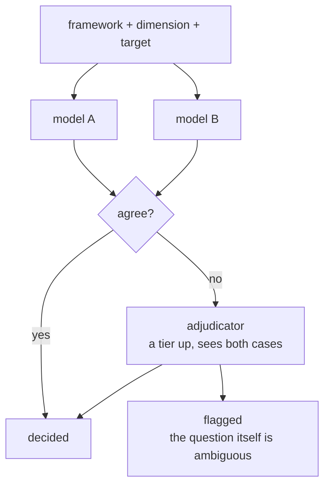

# Consensus

Some judgements are subjective enough that two competent people disagree on a meaningful fraction of them, and research asks for thousands at a time — whether a sentence frames a restriction as proportionate, whether a passage supports a claim, whether a document belongs in a category. One model's answer to any of them is an opinion in the shape of a result.

So every candidate is judged twice, by models of comparable strength from different providers. Agreement settles it. Disagreement goes to a third model a tier above, with both arguments in front of it, which either settles it or marks the case as one the question itself cannot decide.

Both outputs are worth having, and they tell you different things. A decision tells you about a passage. A flag tells you the definition you supplied is ambiguous, which is something you can go and fix.

## What a run takes

Three things, and the distinction between the first two does real work.

**Framework** is the rules and protocol applied as common context to every evaluation — in coding, the method behind the codebook: what counts as evidence, how hedged phrasing is treated, what to do with reported speech.

**Dimensions** are the discrete things being judged, each evaluated on its own. In coding, the codes.

**Target** is what the run may look at: named documents, optionally narrowed to line ranges.

Marking a framework rule as a dimension buys a full evaluation per document and improves nothing, because it was never a question about the text.

One dimension, judged against the framework, inside the target, is one question through the procedure:



Candidates come from retrieval: each dimension runs the [search cascade](02-querying.md) against its own definition text, and the results are cut to the target before any model sees them. A branch that fails is reported as an error alongside the results rather than taking the run down.

## Judged in context

A candidate is never judged alone. It arrives wrapped in the sentences around it:

```text
<target id="4" code="proportionality-framing">
The measures announced today are far-reaching. We have not taken them lightly.
<marked>They are proportionate to the risk we currently face.</marked>
Their necessity will be reviewed every three weeks. The advice remains unchanged.
</target>
```

A span judged on its own is judged on its wording; a span judged in its paragraph is judged on what it means, and this kind of decision turns on meaning.

Spans are packed twenty to a call, with no more than three dimensions mixed into one. Judging twenty spans against a single dimension is a consistent task; asking a model to hold ten of them at once invites it to compare the dimensions against each other instead.

## Two votes

Both models see the identical batch and each returns a judgement and a reason. They are of comparable strength and come from different providers, which is the point — a second opinion is worth having only if it fails differently from the first. Which models fill the two slots, and the adjudicator, is the gateway's business; the pass sends a slot number and never learns what answered.

Both have to agree. Where they do, that is the answer; where they don't, the case escalates to a model that costs more — and how much more is a choice, since the adjudicator is a slot like the other two.

That ordering is what keeps it affordable. Most spans are not close, and two models settle them between themselves, so the expensive judgement is bought only for the residue. Fanning out to a panel on every span buys it everywhere, including for all the spans the first two would have agreed on.

The spans two models split on are very close to the spans two human coders would argue about, which is what makes a disagreement worth preserving instead of resolving.

Both reasons are kept: the keeper's becomes the annotation's justification if the span survives, and the remover's is carried forward as the case against.

## Adjudication

Contested spans arrive at the third model with the argument already made on both sides:

```text
<target id="2" code="proportionality-framing">
...
<marked>They are proportionate to the risk we currently face.</marked>
...
<keep-case>Explicitly weighs the measure against the stated risk.</keep-case>
<remove-case>Asserts proportionality without reference to any cost being weighed.</remove-case>
</target>
```

These are the hard cases by construction: a span arrives here only because two capable models could not agree on it. That is why the strongest model in the run is the one that sees them, and why it can be — it is handed the fraction that split rather than every span in the corpus.

Presenting both cases means its capacity goes on the disagreement itself, rather than on re-deriving what the two voters already established.

It answers one of three ways: `reject` drops the span, `keep` accepts it and clears the objection, and `inconsistent` keeps it with the objection still attached.

## When the definition is at fault

That third answer is the one that is not about the passage. Where a span genuinely sits on the boundary of a dimension, the right output is not a decision but a flag saying the definition is ambiguous here — and forcing a binary answer would make that a coin flip, recorded as though it were a finding.

The same reading holds in aggregate. A run reports, per dimension, how often each model voted to keep and how many contested spans ended up flagged.

A dimension the two models agree on closely is well defined. One where a model votes keep three times as often as the other is not one dimension but two, or a definition nobody has written yet. A cluster of flags says the same thing more loudly.

So a run reports on what was asked as much as on the corpus, and those numbers are what a researcher uses to decide between accepting the results and going back to rewrite a definition.

## Beyond coding

In the current system this drives qualitative coding: the dimensions are codes, the framework is the codebook's method, and surviving spans are written back into the documents as annotations.

The procedure knows none of that. Any judgement that is subjective, repeated across a corpus, and costly to get wrong has the same shape, and a run can hand its findings back rather than write them — which is what a question asked once, rather than applied as a scheme, needs.

## Next: the loop

Consensus is one pass built on the agent's machinery, and [the loop](05-loop.md) is that machinery — how a turn is assembled, how the conversation's own history decides what the agent may do next, and how a hallucinated identifier is caught before a message is ever shown.
