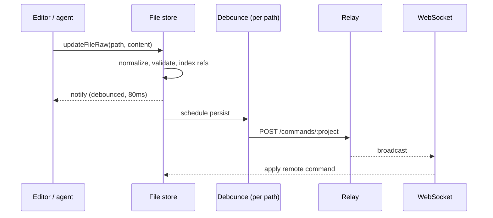

# Sync

The app owns its state. Files live in memory, edits apply immediately, and search, SQL and analysis all run against the local store without a round trip. Persistence is a consequence of an edit rather than a step in it — nothing waits on the server, and losing the connection degrades durability rather than usability.

## Three commands

The store emits three actions, and nothing else:

```go
const (
	WriteFile  Action = "WriteFile"
	DeleteFile Action = "DeleteFile"
	RenameFile Action = "RenameFile"
	SyncMeta   Action = "SyncMeta"
)
```

`SyncMeta` carries a file count for progress reporting and changes nothing. There are no endpoints for annotations, codes or settings, because those are not things the server knows about. They are JSON blocks inside file content, so writing one is writing a file. The server stores bytes at paths; the meaning of those bytes is entirely the client's business.

That is what keeps the [data model](01-documents.md) free to change. Adding a block type does not touch the backend at all.



Writes are debounced per path, so a burst of typing in one document produces one request while an edit to a second document is not held behind it. Deletes and renames cancel any pending write for the path they affect rather than racing it.

The connection reconnects with exponential backoff capped at thirty seconds, and the store is unaffected while it is down.

## Loading

A project starts empty and fills as commands arrive. Two files must exist before the app is usable — settings and preferences — so boot waits for them explicitly rather than rendering against a half-loaded store:

```ts
export const waitForRequiredFiles = (timeoutMs = 30_000): Promise<void>
```

Files that arrive are normalized on the way in, exactly as locally written files are. There is no distinction between a file the user just wrote and one the server just sent, which means a remote change cannot introduce a shape that local code would not have produced.

Structural validation runs on every write, and a write that would corrupt a file throws rather than landing:

```ts
const corruption = new FileCorruptionError(filename, errors)
console.error("[file-store]", corruption.message, { path: filename, errors, raw })
throw corruption
```

## References across files

An annotation refers to a code that lives in a different file. Commands arrive in whatever order the transport delivers them, so a document can reference a code whose defining file has not loaded yet.

Rather than enforcing referential integrity — which would mean rejecting valid data for arriving early — unresolved references are marked as pending and resolved when their definition appears:

- Each file's defining ids are indexed as it arrives.
- References to ids not yet in the index are marked in the content.
- When a file arrives that defines a pending id, every file waiting on it is resolved and re-persisted.
- Markers are stripped before content is sent anywhere, so they never reach the server, the model, or a diff.

After the initial load settles, anything still pending is a genuine dangling reference and is reported:

```ts
export const auditPendingRefsAtBoot = (): void => {
  const orphans = findOrphanPendingRefs(files)
  for (const { file, ids } of orphans) {
    console.warn(`[refs] orphaned at boot in ${file}:`, ids)
  }
}
```

Cross-file existence is deliberately not a schema constraint. A schema check runs against one file and cannot see the corpus, so encoding it there would either reject legitimate out-of-order arrivals or force load ordering the transport cannot guarantee. Resolution happens where the whole store is visible, and the boot audit is the single place that reports failures.

The same mechanism handles a future in which commands arrive from another user rather than from disk. Nothing about it assumes a single writer.

## Backend

Persistence is a Go service that writes files to a directory per project, with an HTTP endpoint for commands and a WebSocket that broadcasts them back. A project on disk is the same markdown a user would see in the app — it can be edited with any editor, put under version control, or copied between machines, because there is no encoding step between the store and the filesystem.

On connect the server sends the project's files sorted by name. Sorting makes the order deterministic rather than correct: an alphabetically earlier document can still reference a code defined in an alphabetically later one, which is why pending references are resolved on the client rather than assumed away by load order.

## See also

- [Data model](01-documents.md) — what the bytes at those paths contain
