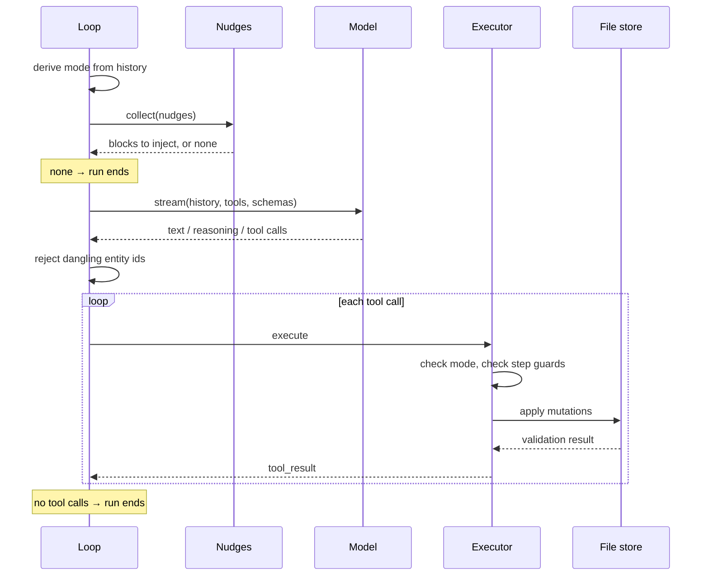

# The loop

A conversation is one chain of blocks, appended in order and never rewritten: what the user typed, what the model said and reasoned, every tool call and every tool result, the errors, and the system markers written between them.

Everything the client needs in order to decide what happens next is computed from that chain rather than held beside it — which mode the agent is in, which tools it may call, what context to inject this turn. Read the chain from the top and you arrive at the same state every time. That is what makes it a state machine, and its transitions are entries in the transcript rather than assignments in memory.

So a conversation can be replayed, a mode change can be diffed, and the agent's state cannot drift from the record of how it got there.



Every request carries the block JSON Schemas and the current database DDL alongside the history, both generated from the registry described in [documents](01-documents.md).

The loop itself knows nothing of modes, prompts or tools. What to resolve per iteration is a parameter, which is what lets the same driver run the main conversation and the sub-agent passes without special cases.

## Nudges

Context is injected per turn by small functions that read the history and usually decline to say anything, rather than by one system prompt carrying every instruction for every situation. Some are unconditional — the current settings, the project memory. Others fire on a condition: after a shell command errors, once when a tool is first used, when a plan step has drifted from what the agent seems to believe.

A nudge can declare an async `context()` whose result is interpolated into its text, which is how live state reaches the model without being restated every turn. Returning no nudges at all ends the run, and that is how an agent with nothing left to do stops rather than being cut off by a turn limit.

Being pure functions of history, they are tested as such: recorded conversations replayed against the nudge set and compared with expected output, so changing a nudge's wording shows up as a diff in a fixture.

## Modes

There are three, and each is a row in a table declaring the tools it exposes, the tool results that switch into it, the route it calls, and the nudges it composes.

| Mode   | Can do                                                                | Entered by        | Route                   |
| ------ | --------------------------------------------------------------------- | ----------------- | ----------------------- |
| `chat` | read, search, query, edit blocks and files, start planning            | default; `cancel` | `/qual-coder`           |
| `plan` | read, search, query, ask, submit a plan                               | `start_planning`  | `/qual-coder.planning`  |
| `exec` | everything in chat except starting a plan, plus completing plan steps | `submit_plan`     | `/qual-coder.execution` |

Planning has no mutating tools at all. The restriction is structural rather than instructed — they are absent from the request, so a plan cannot half-execute itself while it is being written.

Availability is checked again when a call comes back, and the failure distinguishes two cases the model needs to tell apart. A tool that exists but is not available here is reported as not available _in this mode_, which tells the model to change mode. A tool that does not exist at all is reported as unknown, with the available names listed. Collapsing both into one message produces a model that retries a hallucinated tool in every mode.

## The mode is read back out of the chain

There is no mode variable. A `tool_result` whose tool is registered as a trigger sets the mode, the last one in the chain wins, and chat is where the chain falls through to. Nothing about the mode is written into the conversation — it picks which route the next request goes to, and the prompt that tells the model it is planning waits behind that route.

Execution is the one mode no trigger ends. `complete_step` runs on every step and only the last one finishes the plan, which is a distinction a trigger keyed on a tool's name cannot make. So the plan decides: `submit_plan` opens execution and it lasts exactly as long as the derived plan still has a step to do. Completing the last step and cancelling both retire the plan, and the mode falls through to chat on its own.

A transition never consults the mode it is leaving. What keeps the edges sane is the mode table: `submit_plan` can only be called from `plan` because `plan` is the only mode listing it, and `start_planning` can only be called from `chat` for the same reason.

## Guards

**Dangling identifiers.** Entity ids in a final message are checked against the store, and a message referring to ids that do not exist is rejected rather than shown. The model is told which ids were wrong and instructed not to restate them:

```text
Your last message was rejected because these entity IDs do not exist: …
In your next message DO NOT restate any of these identifiers. Continue without them.
```

The loop then continues so the model can answer again, capped at three consecutive rejections before the answer is allowed through. A hallucinated reference is caught mechanically, against the store rather than by another model's judgement, and the correction names the problem instead of asking for more care.

**Step guards.** In execution mode, completing a step is checked against the plan's actual state before the tool runs. The plan is derived from history like everything else, so it cannot be advanced past where it is.

**Cancellation.** Aborting mid-stream discards the in-flight request, cancels pending tool calls and returns the loop to waiting, without unwinding the conversation. The next message resumes from the blocks that did complete.

## Compaction

> [!WARNING]
>
> Not implemented yet. Silent failure.

## Next: tools

Within the loop tools [tools](06-tools.md) can be called to perform a multitude of actions.
