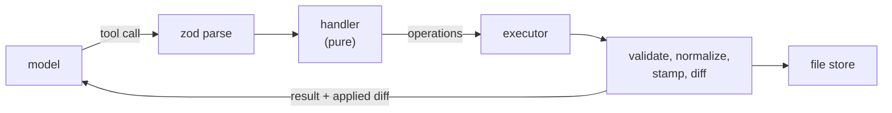

# Tools

A tool is one object: a name, a description, a Zod schema and a handler.

The schema does three jobs from that single declaration. It types the handler's arguments, it validates what the model sent before the handler runs, and it becomes the JSON Schema the model is given — rewritten on the way out where a provider's constrained decoding demands a stricter shape than Zod emits. A parameter cannot be described to the model differently from how it is validated, because there is only one description of it.

## Handlers do not write

A handler receives the files and returns a description of what should change. It never touches the store:

```ts
export type Operation =
  | { type: "write_file"; path: string; content: string; skipBlockValidation?: boolean }
  | { type: "delete_file"; path: string }
  | { type: "rename_file"; path: string; newPath: string }
```

One executor applies every operation from every tool, and everything that has to happen on a write happens there once: normalization, block validation, immutability checks, actor stamping, id generation, mutation history, persistence. A new tool cannot forget any of it, and cannot route around it.

It also makes handlers testable as pure functions — a file map and some arguments in, operations out, with no store, no mocks and nothing to clean up.



Mutating tools return the unified diff of what actually landed rather than an echo of what was asked for. Where normalization rewrote a field or generated an id, the model sees the real result and can correct against it.

> [!WARNING]
> Partly built. Results currently summarize what changed (block, file, generated ids); the applied-diff UX is pending design.

## A shell instead of file tools

Reading is one tool. `run_local_shell` implements a subset of POSIX over the in-memory file store:

| Command         | Flags                                       | Does                                                     |
| --------------- | ------------------------------------------- | -------------------------------------------------------- |
| `grep`          | `-r -n -i -v -w -c -l -o -m -E -A -B -C -S` | search file contents, with context lines and smart case  |
| `rg`            | as `grep`                                   | alias, and says so in its output                         |
| `ls`            | `-l -a -t --show-tags --show-date`          | list files, optionally with each document's tags or date |
| `cat`           | `-n -o -l`                                  | print a file, or a numbered window of it from an offset  |
| `head` / `tail` | `-n`                                        | first or last lines                                      |
| `find`          | `-name -iname`                              | find files by name pattern                               |
| `sort`          | `-n -r -u`                                  | sort lines                                               |
| `wc`            | `-l -w -c`                                  | count lines, words or bytes                              |
| `echo`          | `-n`                                        | write to stdout                                          |
| `true`          |                                             | succeed, for chaining                                    |

Pipes, `&&`, `||`, `;` and quoting work between them:

```text
$ grep -rn "proportional" *.md | head -5
$ ls -t --show-tags | head -10 && cat 2020-03-12-press-conference.md
```

The reason for a shell rather than a dozen read tools is that models already know this interface. Composition through pipes means the tool surface never has to anticipate combinations — filtering search output through `head` needs no `search_and_limit` tool — and one tool's description costs a fraction of the tokens ten would. Behaviour is pinned by one recorded fixture per case, covering flag parsing, chaining semantics, quoting and error messages.

Writes are not available through it. Redirects, command substitution and shell builtins are rejected explicitly, with an error naming the alternative rather than a parse failure, so the boundary between reading and mutating stays where the tool schemas put it.

## Editing

Block edits go through the tools generated from the registry — `patch_callout`, `add_annotation`, `delete_chart` and the rest, described in [documents](01-documents.md). They take typed operations against the record's own fields rather than against text:

```json
{
  "path": "codebook.md",
  "block_id": "3kf9m2qp",
  "operations": [{ "op": "set", "title": "Proportionality framing" }]
}
```

Prose is edited by anchored replacement rather than by line number, with fuzzy matching on the fields declared tolerant of it. Line numbers in a document the model has been editing are stale by construction, where an anchor survives edits made between reading and writing.

Files have the operations one would expect — create, copy, rename, remove — and hidden files are refused, with the settings file as the single exception. So a project's tags can be changed, and generated companions and view state cannot be touched.

A write aimed at a generated file is redirected to the source it was generated from rather than failing. The model addresses what it was shown, and the executor resolves that to whatever actually stores it.

## Querying

`query` executes SQL against the projected tables, with the generated DDL supplied in the request so the model writes against a schema it can see. `search` runs the [retrieval cascade](02-querying.md), including the `SEMANTIC()` extension.

The split is deliberate: SQL answers questions about structure — how many documents carry this code, which are untagged, what the date range is — and search answers questions about content. Both return file paths the shell can then read.

## Control tools

Several tools move the loop rather than change anything:

- `start_planning` and `submit_plan` — enter planning, then leave it with a structured plan
- `complete_step` — advance the plan, guarded against the plan's actual state
- `ask` — put a question to the user and suspend
- `cancel` — leave the current mode

They declare schemas like any other tool but register into a separate handler map, which the executor consults before the mutation path — they change the conversation rather than the files, so they have no operations to apply.

Because [the mode is read back out of the chain](05-loop.md), pushing a marker block _is_ the state change. `start_planning` writes the planning marker; `submit_plan` writes the plan and the execution marker. Neither has anything to update afterwards.

## Next: sync

Tools produce operations and the executor applies them to a store that lives in the browser. [Sync](07-sync.md) is what happens after that — how a write reaches disk, and how a document that references something not yet loaded is resolved rather than rejected.
