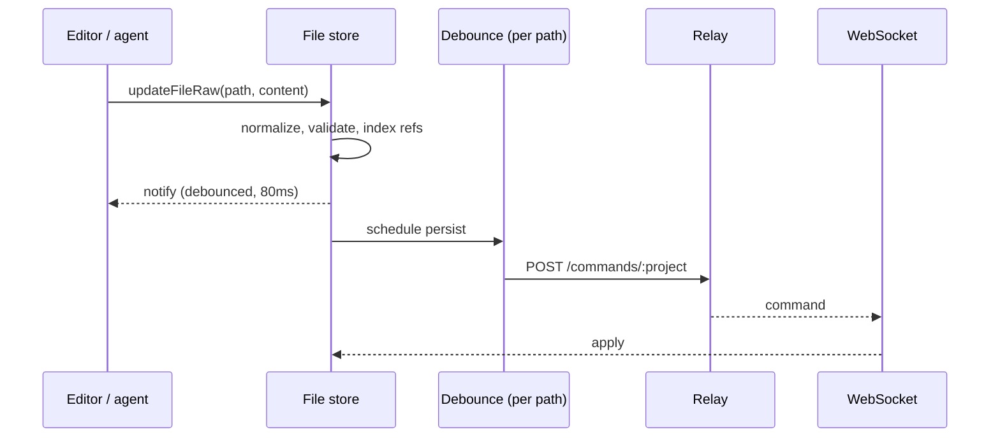

# Sync

Every file is already in the browser. Edits apply as you type, and search, SQL and analysis all run against that local copy without asking the server anything.

## Four commands

The store emits four actions: write a file, delete one, rename one, and a `SyncMeta` carrying a file count for progress.

There are no endpoints for annotations, codes or settings, because the server does not know those exist. They are JSON blocks inside file content, so writing one is writing a file. The server stores bytes at paths, and what the bytes mean is entirely the client's business.

> [!NOTE]
> A write currently carries the whole file. Sending a diff instead is planned, which changes the payload and not the shape — the server would still be applying opaque bytes at a path with no idea what changed inside.

That is what keeps the [data model](01-documents.md) free to change: adding a block type is a client-side change.

Persistence is debounced per path at half a second, so a burst of typing in one document produces one request while an edit to a second document is not held behind it. Deletes and renames cancel any pending write for the path they affect rather than racing it.

The connection reconnects with exponential backoff capped at thirty seconds, and the store is unaffected while it is down.

## Loading

A project starts empty and fills as commands arrive. Settings and preferences must exist before the app is usable, so boot waits up to thirty seconds for them rather than continouing with them.

Arriving files are normalized exactly as locally written ones are, so a file the server sent cannot carry a shape local code would not have produced. Structural validation runs on every write, and one that would corrupt a file throws rather than landing.

## References across files

An annotation refers to a code that lives in a different file. Commands arrive in whatever order the transport delivers them, so a document can reference a code whose defining file has not loaded yet.

Enforcing referential integrity here would mean rejecting valid data for arriving early. Instead, unresolved references are marked pending and resolved when their definition appears:

- Each file's defining ids are indexed as it arrives.
- References to ids not yet in the index are marked in the content.
- When a file arrives that defines a pending id, every file waiting on it is resolved and re-persisted.
- Markers are stripped before content is sent anywhere, so they never reach the server, the model, or a diff.

After the initial load settles, anything still pending is a genuine dangling reference, and the boot audit reports it.

This is deliberately not a schema constraint. A schema check sees one file and cannot see the corpus, so encoding it there would either reject legitimate out-of-order arrivals or force load ordering the transport cannot guarantee.

## Backend

Persistence is [nabu-storage](https://github.com/mdijkstra-oss/nabu-storage), a Go service writing files to a directory per project, with an HTTP endpoint for commands and a WebSocket that streams them back to the client.

A project on disk is the same markdown the app shows. It can be edited with any editor, put under version control, or copied between machines, because there is no encoding step between the store and the filesystem.

> [!NOTE]
> Storage is intended to become git-backed. Since a project is already a directory of markdown, committing it is what would make [history and time travel](../README.md#full-history-of-change) real rather than a session-local view. Not implemented yet.

On connect the server sends the project's files sorted by name. That makes the order deterministic rather than correct — an alphabetically earlier document can still reference a code defined in a later one, which is why pending references are resolved on the client.
