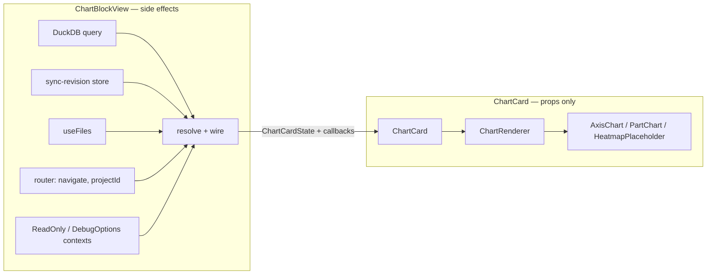

# Charts

The chart area renders a `ChartBlock` in the editor: `ChartBlockView` (`app/lib/editor/chart-blocks/view.tsx`) executes the block's SQL against DuckDB and resolves rows into a `RenderableChart`, and a pure component tree — `ChartCard` → `ChartRenderer` → `AxisChart` / `PartChart` / `HeatmapPlaceholder`, with `ChartTooltip` inside — turns that renderable into pixels. Everything below `ChartBlockView` is data-in, chart-out, which is what makes every piece storyable and testable in the browser without a database. How stories become tests is owned by [harness.md](harness.md); decorators and story conventions are owned by [story-kit.md](story-kit.md).

## Contract

The load-bearing seam is between `ChartBlockView` (all side effects) and `ChartCard` (none).

### ChartBlockView (connected wrapper)

`ChartBlockView` keeps its existing props (`data: ChartBlock`, `onDelete`, `captionType?`, `captionIndex`) and its existing side effects: `executeQuery` against `getDatabase()`, re-run on `subscribeSyncRevision` revision change, `useFiles`, `useNavigate`/`useParams`, `useIsReadOnly`, `useDebugOptions`.

`ChartBlockView` maps its query result into a `ChartCardState`, formats the caption from `captionType`/`captionIndex`/`data.caption.label`, translates read-only into presence of `onDelete`, translates the `showQueryResults` debug option into presence of `queryResults`, and renders `ChartCard` with nothing else.

### ChartCard

`ChartCard` lives in `app/lib/editor/chart-blocks/ChartCard.tsx` (inside the harness's `app/lib/editor/**` story glob) and renders the card chrome the view renders today: rounded bordered container, hover-revealed delete button, one of four body states, optional query-results table, optional caption line.

| Field          | Type in prose                                                 | Consumer that needs it                                                                             |
| -------------- | ------------------------------------------------------------- | -------------------------------------------------------------------------------------------------- |
| `state`        | `ChartCardState` discriminated union, below                   | the card body: picks which of the four states to render                                            |
| `caption`      | optional string, already formatted (e.g. "Figure 1: Revenue") | the italic caption line under the chart; formatting stays in the wrapper so stories set final text |
| `onDelete`     | optional zero-arg callback                                    | the hover delete `IconButton`; absent (read-only) means the button is not rendered                 |
| `onDatumClick` | optional callback taking an entity URL string                 | forwarded to `ChartRenderer` for click-through navigation on datums carrying `_entityUrl`          |
| `height`       | optional number, default 300                                  | the fixed height of every body state (loading/empty/error placeholders and the chart itself)       |

`ChartCardState` is a discriminated union on `status`, the same shape `view.tsx` holds internally today with the resolved render inputs folded into `ready`:

| Variant   | Payload                                                                                                              | Rendered as                                                              |
| --------- | -------------------------------------------------------------------------------------------------------------------- | ------------------------------------------------------------------------ |
| `loading` | —                                                                                                                    | centered "Loading..." placeholder at `height`                            |
| `empty`   | —                                                                                                                    | centered "No data" placeholder at `height`                               |
| `error`   | `message`: string                                                                                                    | the message, centered, in the error text color                           |
| `ready`   | `renderable`: `RenderableChart`; `tooltipContext`: `ChartTooltipContext`; `queryResults`: optional `{ rows, query }` | `ChartRenderer`, plus `QueryResultsTable` when `queryResults` is present |

`queryResults` lives inside the `ready` variant because the debug table is only renderable with rows, making "table without data" unrepresentable.

The boundary is enforced by existing types: `RenderableChart` is the discriminated union from `app/lib/chart/types.ts` (`kind`: `axis` | `part` | `matrix`), and `ChartTooltipContext` is exported from `renderers/ChartTooltip.tsx`.

### Renderers

`ChartRenderer` (`renderers/dispatch.tsx`) keeps its props `{ renderable, tooltipContext, onDatumClick? }` and gains `height?: number`; it switches on `renderable.kind` with `exhaustive()` as the default arm and forwards all props to the matching renderer.

`AxisChart`, `PartChart`, and `HeatmapPlaceholder` each gain the same optional `height` prop; `CHART_HEIGHT` in `renderers/shared.ts` stays exported as the shared default value (300) rather than being read directly at render time.

Renderers stay pure: no hooks beyond render, no stores, no router; navigation intent leaves only through `onDatumClick` via `buildDatumClickHandler` reading `_entityUrl` off the datum.

### ChartTooltip

`ChartTooltip` is a real component in `renderers/ChartTooltip.tsx`, extracted from the body of `buildChartTooltipContent` so a story can mount it with a fake payload.

| Field     | Type in prose                                                                                                                                | Consumer that needs it                                           |
| --------- | -------------------------------------------------------------------------------------------------------------------------------------------- | ---------------------------------------------------------------- |
| `context` | `ChartTooltipContext`: `files` (file store), `projectId` (string or null), `entityMap`, optional `navigate`                                  | entity-link components inside the rendered markdown              |
| `active`  | optional boolean (Recharts-supplied)                                                                                                         | renders nothing unless true                                      |
| `payload` | optional list of Recharts payload items: `name`, `value`, `color`, and `payload` holding the datum's `_raw` row and optional `_tooltipNodes` | fallback list content, and the template path via `_tooltipNodes` |
| `label`   | optional string or number (Recharts-supplied)                                                                                                | bold header line of the fallback content                         |

`ChartTooltip` renders the templated markdown when the datum carries `_tooltipNodes`, otherwise the fallback bold-label-plus-name/value-list markdown, and null when inactive or the payload is empty.

`buildChartTooltipContent(context)` stays as a thin adapter returning a function that renders `ChartTooltip` with the closed-over context plus Recharts' props, so `AxisChart`/`PartChart` call sites do not change.

### QueryResultsTable

`QueryResultsTable` moves out of `view.tsx` into its own exported file beside `ChartCard`, keeping its props: `rows` (list of plain row records) and `query` (the SQL string shown above the table with a copy button).

### Fixtures (`app/lib/chart/test-helpers.ts`)

`test-helpers.ts` already exports `entity`, `stubResolveRadix`, and `buildColorContext`; the story layer adds three builders there so fixtures stay at the spec level and `resolveChartData` stays in the tested path.

| Builder                            | Shape in prose                                                                                                                                                                          | Consumer that needs it                             |
| ---------------------------------- | --------------------------------------------------------------------------------------------------------------------------------------------------------------------------------------- | -------------------------------------------------- |
| `chartFixture(type)`               | takes any `ChartType` member, returns `{ spec, rows, renderable }` where `renderable` comes from `resolveChartData` over a canned spec and canned rows, colored via `buildColorContext` | every renderer story and the dispatch gallery      |
| `sampleTooltipContext(entityMap?)` | a `ChartTooltipContext` with an empty file store, null `projectId`, the given (or empty) entity map, no `navigate`                                                                      | every story that mounts a tooltip-capable renderer |
| `sampleTooltipPayload(overrides?)` | a Recharts-shaped payload item list with `name`/`value`/`color` and a datum carrying `_raw` and optionally `_tooltipNodes`                                                              | `ChartTooltip` stories                             |

`chartFixture` is backed by a record keyed by every `ChartType` member, so the compiler rejects the file when the union grows without a fixture — this record is a named site in the add-a-chart-type flow.

## Prior art

The `exhaustive()` dispatch pattern (`app/lib/utils/exhaustive.ts`) already guards every branch point in this area: `ChartRenderer` on `renderable.kind`, `renderByType` in both `AxisChart` (over `AxisChartType`) and `PartChart` (over the part type union), and `resolveChartData` over `ChartSpec` — the add-a-chart-type acceptance case leans entirely on these existing checks.

`app/lib/chart/test-helpers.ts` already establishes the fixture-builder convention (`entity`, `buildColorContext` with `stubResolveRadix`) that the new builders extend.

Story conventions exist in `app/ui/components/sidebar/**` (e.g. `documents/DocumentItem.stories.tsx`): `Custom/<Area>/<Component>` titles, `Meta<typeof X>`, args-driven `StoryObj` variants — chart stories follow the same conventions, catalogued in [story-kit.md](story-kit.md).

Storying `ChartBlockView` directly behind a mocked DuckDB was rejected: the query/sync/router wiring is exactly the seam `ChartCard` removes, and mocking it would test plumbing instead of rendering.

Hand-writing `RenderableChart` fixtures was rejected in favor of building them through `resolveChartData`: spec-plus-rows is the vocabulary a chart author actually writes, and it keeps resolve covered by the same stories.

## Tests

All chart stories run as Vitest browser tests through the `storybook` project described in [harness.md](harness.md); decorators referenced below come from [story-kit.md](story-kit.md).

### Skeleton

The walking skeleton is one story: `Custom/Charts/AxisChart` / `Bar`, mounting `AxisChart` with `renderable` from `chartFixture("bar")` and `tooltipContext` from `sampleTooltipContext()`, wrapped in `withSize` (Recharts' `ResponsiveContainer` needs a sized ancestor to lay out).

Its play function asserts the rendered SVG contains at least one bar shape, proving the whole chain — fixture builder, resolve, renderer, sized decorator, browser harness — end to end.

The skeleton is done when `npm test` runs this story green as a browser test with no DuckDB and no app shell.

### Contract

Given a developer adds a new member to a chart type union in `app/lib/chart/types.ts` (a new `AxisChartType`, a new part type, or a whole new `kind`), when the typecheck runs, then compilation fails at every site that must change — `resolveChartData` and/or the matching `renderByType` and/or `ChartRenderer` (all via `exhaustive()`) plus the `chartFixture` record — and when a fixture entry and renderer branch are added, the dispatch gallery story renders the new type and runs green with no further edits.

Given the dispatch gallery story, which maps a fixture array covering every `ChartType` member through `ChartRenderer`, when it renders, then each fixture reaches its renderer: six axis charts, pie, treemap, and the heatmap placeholder text "Too cold for heatmap".

Given a bar or pie story with `onDatumClick` set and a fixture datum carrying `_entityUrl`, when the play function clicks that datum, then `onDatumClick` receives the entity URL; given the same story without `onDatumClick`, then no pointer cursor is applied.

Given `ChartTooltip` with an active templated payload (`_tooltipNodes` present), when it renders, then the resolved template markdown appears; given an active payload without template nodes, then the fallback renders the bold label and one name/value line per payload item; given `active` false or an empty payload, then nothing renders.

Given `ChartCard` stories for each of the four states, when each renders, then loading/empty/error show their centered placeholder text (the error state showing `message`) at the configured height, and ready renders the chart; given `ready` with `queryResults`, then `QueryResultsTable` shows the row count summary, the query text, and one column per key of the first row; given `caption`, then the caption line renders verbatim; given `onDelete`, then the delete button is present and invokes it on click, and absent `onDelete` renders no delete button.

Given a renderer story with no `height` arg and one with `height` set, when both render, then the first lays out at 300 and the second at the given value.

Given per-type `AxisChart` stories, when stacked-bar and grouped-bar render from the same multi-series fixture, then stacked bars share a stack and grouped bars sit side by side; and when a bar fixture with vertical orientation renders, then the category axis is the Y axis.

### Isolation

Chart stories mount only the pure tree — `ChartCard` and below — so DuckDB is absent by construction: query execution lives solely in `ChartBlockView`, which has no story.

`sampleTooltipContext` supplies an empty file store and null `projectId` directly through props, so `withSeededFiles` and `withRouter` are not needed; stories that exercise navigation pass a story-local spy as `navigate`/`onDatumClick` instead of a router.

Read-only and debug behavior are plain props on `ChartCard` (`onDelete` presence, `queryResults` presence), so no provider decorator is needed anywhere in this area.

The only decorator chart stories require is `withSize`, for Recharts' measured container.
