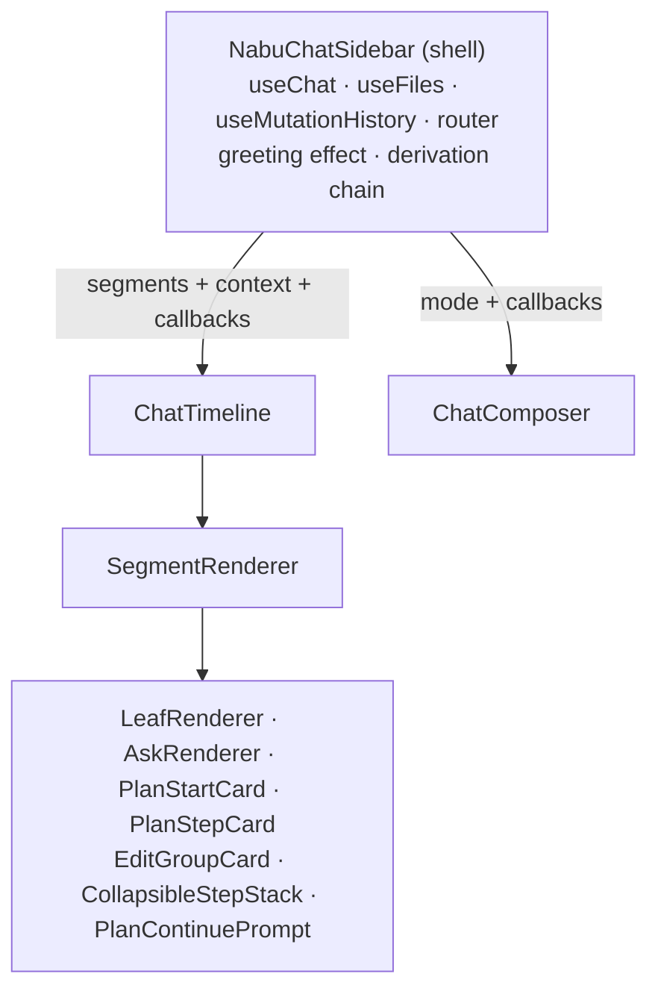

The chat timeline area (`app/ui/components/nabu/`, `app/ui/components/ai/`) splits `NabuChatSidebar` into a store-reading shell and two pure components — `ChatTimeline` and `ChatComposer` — so every timeline card renders from plain fixture data in Storybook stories that double as Vitest browser-mode component tests. How stories become tests is owned by [harness.md](harness.md); decorators and story conventions are owned by [story-kit.md](story-kit.md).

## Contract

### The shell

`NabuChatSidebar` keeps every store read and effect: `useChat`, `useFiles`, `useMutationHistory`, the router (`useNavigate`/`useParams`), the auto-greeting effect (`pushBlocks` + `runChat`), and the derivation chain `derive` → `toGroupedMessages` → `weaveEditGroups` → `toKeyedSegments` → `injectContinuePrompt` → `collapsePendingTail`.

No component below the shell touches a store, a hook that reads one, or the router — everything arrives as props.

### ChatEntityContext

The entity context threads as one object, replacing the five loose fields repeated across seven prop interfaces:

- `files: Record<string, string>` — entity-link and tag resolution in `MessageContent`, `InlineMarkdown`, `TickLabel`
- `projectId: string | null` — link targets built by `createEntityLinkComponents`
- `currentFile: string | null` — `prepareEntityMarkdown` self-reference resolution
- `currentFileContent: string | null` — same consumer as `currentFile`
- `navigate: (url: string) => void` — entity-link clicks; a prop so stories pass an action instead of a router

The shell builds this object with `useMemo`, so its identity only changes when a member changes.

With a stable context object and the already-memoized segment derivation, default shallow `memo` comparison suffices — the four hand-written comparators (`leafPropsEqual`, `askPropsEqual`, `planStartPropsEqual`, `planStepPropsEqual`) are deleted, not replaced.

`TickLabel` receives `context.navigate` like every other markdown surface; this replaces the current wiring that hands it the file-path navigator where a URL navigator is expected.

### ChatTimeline

Pure component in `app/ui/components/nabu/ChatTimeline.tsx`; owns the `AutoScroll` scroll region and the `Connector`/`AnimatedListItem` interleaving.

- `segments: KeyedSegment[]` — one `SegmentRenderer` per entry, keyed, `Connector` between
- `context: ChatEntityContext` — threads to `SegmentRenderer` and `TickLabel`
- `onSelect: (option: string) => void` — `AskRenderer` option click; shell wires to `respond`
- `onSelectFile: (path: string) => void` — `EditGroupCard` rows; shell wires to its file navigator
- `onContinue: () => void` — `PlanContinuePrompt`; shell wires to `respond("Continue to next step")`
- `spinnerLabels: string[] | null` — non-null renders `TickLabel` after the last segment; shell derives via `getSpinnerLabels` while loading and not streaming text, suppressed while waiting for an ask
- `showAbortBox: boolean` — renders `AbortBox` after the last segment; shell derives from the last plan's `aborted` flag
- `showPlaceholder: boolean` — empty-state line when there are no segments; a prop because the "not loading" half of the condition is store state

### ChatComposer

Pure component in `app/ui/components/nabu/ChatComposer.tsx`; owns the input row, its local text state, focus-on-mount, click-to-focus, Enter-to-send/Shift+Enter-newline, trim, and clear-after-send.

- `mode: ChatButtonMode` — forwarded to `ChatSendButton`; also drives the container background and suppresses submit in `cancel` mode (typing during a running turn sends nothing)
- `awaitingAnswer: boolean` — placeholder switch between "Ask a follow-up..." and "Or type your own answer..."
- `onSend: (text: string) => void` — called with the trimmed value; the shell routes it to `respond` or `send` based on ask/checkpoint state
- `onSkipAsk`, `onCancel`, `onCancelPlan: () => void` — forwarded to `ChatSendButton`

In `send` mode the button is disabled and Enter is a no-op while the trimmed input is empty; the composer computes this itself.

### Storyable exports

`SegmentRenderer` is exported from `ChatTimeline.tsx`; its props are `segment: FinalSegment`, `context`, the three callbacks above, and `isLast: boolean`.

`MessageContent` moves to `app/ui/components/nabu/MessageContent.tsx` as a named export with props `content: string` plus `context` (it is the shared markdown pipeline: `prepareEntityMarkdown` → `linkifyTags` → `fixMarkdownUrls` → `Markdown`).

The private card components (`LeafRenderer`, `AskRenderer`, `PlanStartCard`, `PlanStepCard`, `StepStackRow`, `CollapsibleStepStack`, `PlanContinuePrompt`, `TickLabel`, `OptionCard`, `CardBody`) stay private — each is reachable from stories through `SegmentRenderer` with the matching segment fixture, or through `ChatTimeline` props (`spinnerLabels` for `TickLabel`).

### Boundary enforcement

`FinalSegment` is a discriminated union of seven variants — `text`, `ask`, `plan-start`, `plan-step`, `edit-group`, `step-stack`, `continue-prompt` — and `SegmentRenderer` ends in `exhaustive(segment)`, so an added variant is a compile error before it is a rendering gap.

The fixtures module exports its segment fixtures as a `Record<FinalSegment["type"], KeyedSegment[]>`, so the same added variant also fails compilation in the fixtures until a fixture exists, and the all-variants story renders `Object.values(...)` flattened — coverage is enforced by the type system, not by remembering.

### Fixtures

`app/ui/components/nabu/fixtures.ts` sits beside the stories and builds `KeyedSegment` values from the `collapse.ts` and `group.ts` types — all plain serializable data (`AskMessage`, `PlanStepMessage`, `EditGroupMessage` entries are field-only objects), so fixtures are object literals with fixed epoch timestamps and no factories beyond small helpers.

## Prior art

`app/ui/components/nabu/collapse.ts` — the type guards plus `app/lib/utils/exhaustive.ts` are the union-enforcement pattern the renderer and fixtures reuse.

`app/ui/components/nabu/collapse.test.ts`, `group.test.ts`, `messages.test.ts` — existing unit tests already build realistic segment/message literals (`step(...)`, ask objects, history blocks); fixture shapes copy from there.

`app/ui/components/InlineMarkdown.tsx` — the props-not-stores reference: it already takes `files`/`projectId`/`currentFile`/`currentFileContent`/`navigate` as props, the exact fields `ChatEntityContext` bundles.

`app/ui/components/sidebar/documents/DocumentItem.stories.tsx` (and the other sidebar stories) — the conventions: `title: "Custom/<Area>/<Component>"`, `Meta<typeof X>`, args-driven `StoryObj`; chat stories use `Custom/Chat/<Component>`.

Rejected: a React context provider for the entity quad — hides the data path and forces a wrapper decorator on every story where a plain prop takes inline fixtures.

Rejected: keeping the hand-written memo comparators alongside the bundled object — redundant once segment and context identities are stable.

Rejected: storying `NabuChatSidebar` itself with mocked stores — drags `useChat`, the router, and the greeting effect into every card story.

Rejected: extracting the `TickLabel` rotation into a hook for testability — a length-1 `labels` array never schedules the advance timer, so a single-label fixture is already deterministic.

Rejected: seeding the file store per story (`withSeededFiles`) — chat cards read `files` from props, not the store.

## Tests

Stories live beside their components (`ChatTimeline.stories.tsx`, `ChatComposer.stories.tsx`, `TimelineCard.stories.tsx`, `EditGroupCard.stories.tsx`, `CollapsibleGroupCard.stories.tsx`, `ChatSendButton.stories.tsx`, `app/ui/components/ai/StepsBlock.stories.tsx` for `AbortBox`) and run as browser tests per [harness.md](harness.md).

### Skeleton

This area's slice of the walking skeleton is one `SegmentRenderer` story fed a two-segment fixture — a user `text` leaf and an assistant `text` leaf — whose play function asserts both message texts are visible; it passing green in browser mode proves the export, the fixture types, and the harness wiring end to end.

### Contract

Given a segment object cast past the union with an unlisted `type`, when `SegmentRenderer` renders it, then `exhaustive` throws — and the compile-time `never` check catches real additions before runtime.

Given `segments: []` with `showPlaceholder` true, when `ChatTimeline` renders, then the "How can I help you today?" line shows and no timeline rails render.

Given a leaf with `draft: true` and markdown cut mid-construct, when rendered, then the `preprocessStreaming`-sanitized content shows; given a draft whose sanitized content is null, then the card renders nothing at all.

Given an unanswered ask with options, when an option is clicked, then `onSelect` fires once with that label; given an answered ask, then the selected option is highlighted, the rest are dimmed and unclickable; given a `selected` value not among the options (typed answer), then an ANSWER card renders below the question with that text.

Given the plan-step matrix — `status` (completed/active/pending/cancelled) × `checkpoint` × `nested` — when rendered through `SegmentRenderer`, then `checkpoint` forces the `step-checkpoint` marker and speech-bubble glyph, `nested` indents the card, and each status maps to its marker and icon color.

Given a `step-stack` of five pending steps, when rendered, then the summary reads "5 upcoming steps" and expanding lists one row per step with nested rows indented.

Given an `edit-group` with one entry, when the summary is clicked, then `onSelectFile` fires with that entry's path and no expand chevron shows; given multiple entries, then the card expands and each row fires `onSelectFile` with its own path.

Given a `continue-prompt` segment, when its option is clicked, then `onContinue` fires once.

Given the `TimelineCard` matrix — all nine markers × kind named/`null` — then each marker paints its rail color, `kind: null` with no glyph hides the header row, and a timestamp renders only when a header shows.

Given `ChatSendButton` in each of its four modes, then each renders its distinct icon and tooltip, and `disabled` blocks the click; the matrix is 4 modes × disabled.

Given `ChatComposer` in `send` mode, when text is typed and Enter pressed, then `onSend` fires with the trimmed text and the input clears; Shift+Enter inserts a newline without sending; with only whitespace the button is disabled and Enter no-ops; in `cancel` mode Enter no-ops regardless of input.

Given `ChatTimeline` with empty segments and `spinnerLabels: ["Searching documents"]`, then the spinner row shows that label and never advances — single-label arrays are the determinism mechanism for `TickLabel` stories.

Given `CollapsibleGroupCard` with `successTone` and `slateTone`, then each tone's surface and text classes apply; with `expandable: false` and an `onSummaryClick`, clicking the summary fires the callback instead of toggling.

Given `AbortBox` with no props and with a custom `message`, then it renders "Pivoted plan" and the custom text respectively.

### Isolation

Chat stories mount with no store, no router, and no app providers: `context` is an inline object with a literal `files` record, and `navigate`/`onSelect`/`onSelectFile`/`onContinue`/composer callbacks are Storybook actions.

The only decorator chat stories use is `withSize` from [story-kit.md](story-kit.md), constraining the column to sidebar width; `withRouter` and `withSeededFiles` exist for store-reading areas and are deliberately unused here.

Fixture timestamps are fixed epoch values, but `formatHourMinute` renders in the local timezone — tests assert timestamp visibility on hover, never the exact string.
