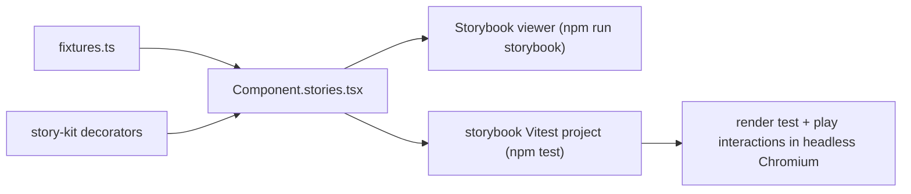

# Component test layer

Nabu-frontend gains a component test layer between the unit suites and the browser end-to-end suite: Storybook stories that double as Vitest browser-mode tests. Every UI component at a composable boundary gets stories that render it from plain fixture data — no app, no DuckDB, no file store — and `npm test` runs those stories headlessly as tests. Where a component today mixes data acquisition with rendering, it is split into a pure inner (props in, render out) and a thin connected wrapper, so the story mounts the inner directly. The hand-rolled design-mockup pages under `app/designs/` are deleted once the stories cover their ground.

## Components

- [harness.md](harness.md) — the Vitest workspace (unit + browser projects), the `@storybook/addon-vitest` wiring, and the stories-are-tests rule.
- [story-kit.md](story-kit.md) — the decorators that fake ambient dependencies, fixture conventions, and story authoring conventions.
- [primitives.md](primitives.md) — stories for the shared primitives and the import flow; the `ActionBar` split; the `FileImportView` orphan deletion.
- [sidebars.md](sidebars.md) — the documents/codes sidebar splits and stories for the sidebar tree.
- [search.md](search.md) — the `SearchBar` and result-card splits and stories for the search page components.
- [editor.md](editor.md) — editor chrome and callout-block stories, the exports and small splits they need, and the seeded Milkdown kitchen-sink integration story.
- [charts.md](charts.md) — the `ChartCard` split, the pure renderer stories, and the add-a-chart-type flow.
- [chat.md](chat.md) — the `ChatTimeline`/`ChatComposer` split and stories for every timeline card.

## How a story flows

One story file feeds both surfaces; the Storybook config is the single story registry, so the viewer and the test runner cannot disagree about what exists.

## Walking skeleton

The thinnest slice touching every layer: wire the harness, then land one new story — `AxisChart` with a bar-chart fixture from `app/lib/chart/test-helpers.ts`, wrapped in `withSize`, with a `play` asserting a bar exists in the SVG. Green means: the addon collects stories as tests, the `app/lib/editor/**` glob extension works, a kit decorator composes, a fixture builder feeds a pure component, and the three pre-existing sidebar stories pass as render tests without modification. Each area file names its own first story as its skeleton piece; this one is the spine.

To run it the builder needs: `npm install` (adds `@storybook/addon-vitest`), one-time `npx playwright install chromium`, and nothing else — no backend, no credentials.

Build order after the skeleton: [primitives.md](primitives.md) (pure, no splits), then [charts.md](charts.md) and [chat.md](chat.md) (small splits, high value), then [search.md](search.md) and [sidebars.md](sidebars.md), then [editor.md](editor.md) ending with the kitchen-sink integration story. The design-page teardown (below) comes last.

## Design-page teardown

`app/designs/subframe/pages/` and the `designs.*` routes are deleted when the area suites above exist: the pages are static zero-prop mockups whose job the stories take over, and they are eagerly bundled into the app. `WelcomeBackLoading` has a real component twin in `app/ui/components/` that stays; anything else a page shows that no story covers gets a story first, in the area file that owns the component.

Given the teardown commit, when `npm run build` and `npm test` run, then both pass and no import of `app/designs/` remains.

## What must not change

- The existing unit suites: every `*.test.ts` that passes today passes under the new `npm test`, pinned by the suites themselves plus the harness contract case for project selection.
- `npm run typecheck` stays clean at every step; each split and export is a pure refactor of an existing component.
- App behavior: no split changes what the app renders or writes. The end-to-end suite in the separate `nabu-e2e` repository pins the documented behaviors and must pass unchanged against the refactored app.
- `npm run storybook` keeps serving the three existing stories throughout; they are pinned as render tests by the harness from the skeleton onward.
- Given the app running with a project open, when a document with annotations, a callout block, and a chart block is viewed, then all three render as before any split lands — pinned by the kitchen-sink story once it exists, and by `nabu-e2e` before that.
