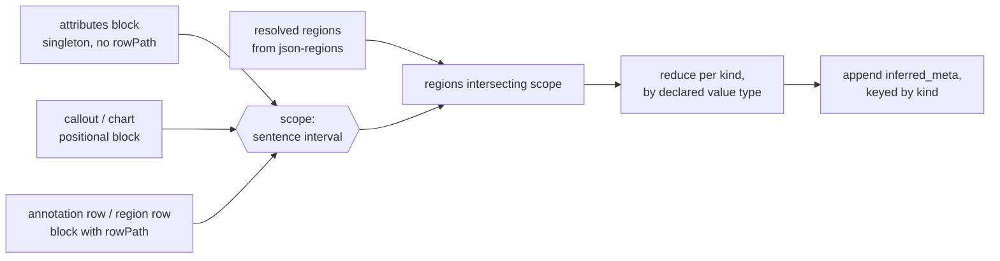

Decoration is the payoff layer: at read time every JSON block in a document is handed the regions it sits inside, as a field named `inferred_meta` appended to the parsed block. Nothing about it is stored — the document keeps only the `json-regions` block [regions-block.md](regions-block.md) defines, and this layer recomputes the join on every read. It owns the `inferred_meta` shape, the scope rule, the reducers, the `inferred_meta_*` columns every decorated table gains, the memo, and the hook in the block-read path that makes the DuckDB projection derive columns for it without any per-block-type wiring. It reads the kind descriptor's declared value type from [kinds.md](kinds.md) and the stored rows from [regions-block.md](regions-block.md); it never writes a file, and knows nothing of how those rows were produced ([detection.md](detection.md), [region-sync.md](region-sync.md)) or how they are drawn ([editor-regions.md](editor-regions.md)).

## Contract

### One axis, one mechanism

Everything here happens on the sentence index of the document — `indexFileSentences(raw)` from `app/lib/text/halo.ts`, the same array regions index into, read as the 0-based array positions [regions-block.md](regions-block.md) pins. A **resolved region** is a stored row carrying a `startSentence`/`endSentence` pair, taken exactly as stored. Decoration never extends, infers or repairs a region's extent; where regions end is [detection.md](detection.md)'s decision and re-deriving them after an edit is [region-sync.md](region-sync.md)'s.

Against that axis the rule is four steps, and there is only one of it:

1. **Scope.** The decorated thing yields a sentence interval.
2. **Regions in scope.** Every resolved region whose interval intersects it.
3. **Reduce.** Group those regions by kind; each group goes through the reducer its kind's value type selects.
4. **Append.** The results become `inferred_meta`, keyed by kind, on a copy of the parsed value.

The diagram exists to prove one thing: the three kinds of decorated thing differ only in how step 1 answers. Steps 2 to 4 are shared code with no branch in them.

### Scope, in full

Three cases, resolved in this order, from configuration that already exists:

| Case                                          | Scope                                                                                             | Which blocks                                        |
| :-------------------------------------------- | :------------------------------------------------------------------------------------------------ | :-------------------------------------------------- |
| The config declares a `rowPath`                | each row separately: the row's own span (below), and no scope at all for a row that has none        | `json-annotations`, `json-regions`                   |
| The config is a `singleton` with no `rowPath`  | the whole document — sentence `0` to the last                                                      | `json-attributes`                                    |
| Anything else                                  | the block's position                                                                              | `json-callout`, `json-chart`                         |

A row's own span comes from whichever of two sources applies. A row that already carries sentence indexes uses them — region rows do, and a region row's scope is therefore its own region. A row that carries text quoted from the document uses that text: it is located in `proseOf(raw)` with `findMatchOffset`, and the character range is widened to the sentences it overlaps, exactly as `formatSelectionContext` in `app/lib/editor/selection-context.ts` does today. Which field holds that text is one new optional field on `BlockTypeConfig` — `spanField` — set to `text` on `json-annotations` and unset everywhere else. A row whose text cannot be located has no span, and a row with no span gets no scope and therefore no decoration.

That last clause is the difference between an absent answer and an invented one, and it is why the block-position case below does not reach down to rows. `json-annotations` is a singleton, and `normalizeSingletonOrder` in `app/lib/data-blocks/normalize.ts` relocates every singleton to the document tail on every write — so the annotations block's position is always the end of the document, and the sentence adjacent to it is always the last one. A row falling back to that position would be handed whichever speaker or date region happens to close the file, every time, for every annotation whose quote an edit has moved out from under it: an attribution the document does not support, written into `inferred_meta_speaker` with exactly the confidence of one that located. Position is used only where it means something: a callout or a chart sits where its author put it and neither is a singleton, so nothing relocates them, and the one singleton without a `rowPath` takes the whole document and never asks for a position at all. No case in the table resolves to the tail.

**Per-row scope is the whole reason the headline query works, and it is an assumption worth naming.** The user's words were "annotations are just a block". Taken literally, the annotations block would be decorated once, at its position — and its position is the singleton tail, so every annotation in the file would carry whichever speaker closes it, and "all annotations in text spoken by John" would return all of them or none. Keying off `rowPath` is the reading that makes the query mean what it says; the literal reading is not merely coarser, it is wrong in a way that reads as detection having failed. Rejecting the assumption is still one line — delete the first row of the scope table and annotations fall into the positional case — but the paragraph above says exactly what that line would buy.

A **block's position** is a point on the prose axis, not a raw offset. Sentence offsets are offsets into `proseOf(raw)`, which is the document with its fenced blocks excised and its markdown stripped; `mapProseOffset` in `app/lib/data-blocks/parse.ts` reverses the excision but nothing reverses the stripping, so a block's raw `start` cannot be mapped after the fact. It is derived forward instead: the same pass that builds the memo walks the document's code blocks in order and accumulates the length of the stripped prose between them, which gives every block the prose offset at which it was excised. The block's scope is then the single sentence adjacent to that point — the one ending at or before it, or the first one after it when the block precedes all prose. A document with a block and no prose at all yields no scope and no decoration.

### Regions in scope

Two closed sentence intervals are in scope of each other when they intersect. A region row with no resolved range encloses no text and therefore intersects nothing; it is silently skipped. Those rows are ordinary traffic rather than a defensive case: a `mark` that fails or comes back unusable leaves its occurrence stored as a hit with no range ([detection.md](detection.md)), which [regions-block.md](regions-block.md) represents as the absence of the range triple, so any document whose detection has hit a bad call carries some. A region whose stored indexes run past the end of the current sentence array is stale, not invalid: it intersects only where it still overlaps, and a region entirely past the end intersects nothing. Decoration never throws on either, and never repairs either — repair is the sync's re-derive, and until it runs the decoration is simply thinner than it will be.

When the decorated thing is itself a region row, regions of its own kind are excluded. Regions of one kind never overlap by [detection.md](detection.md)'s construction, so in a healthy document this excludes only the row itself; stating it as a kind exclusion rather than an identity exclusion means a not-yet-repaired overlap cannot put a second speaker on a speaker row. Across kinds nothing is excluded, which is what makes `SELECT parsed_value FROM regions WHERE kind = 'speaker' AND inferred_meta_date_start >= …` — "which speakers spoke on March 3rd" — an ordinary query. This cross-decoration is a parent-proposed default, not something the user asked for; it costs nothing, because the regions block is decorated by the same rule as every other block with a `rowPath`.

### Reducers

One reducer per value type, never per kind. A new kind picks a value type from the union [kinds.md](kinds.md) exports; it does not bring a reducer with it. The map is total over that union, so a third value type fails typecheck here until it has one — which is the mechanism kinds.md relies on to keep a kind's values reducible.

| Value type | Reduce                                                                   | Appended value                                    | Why that and not something else                                                                                                                 |
| :--------- | :------------------------------------------------------------------------ | :-------------------------------------------------- | :----------------------------------------------------------------------------------------------------------------------------------------------- |
| `string`   | distinct values of the in-scope regions, first occurrence wins, in document order (ascending `startSentence`) | list of strings                                     | A block straddling a speaker change genuinely has two speakers; a list keeps both, and every query against it is containment, so order is presentational only. Document order reads the way the document reads. |
| `datetime` | minimum and maximum of the in-scope regions' values                        | an object of `start` and `end`, ISO-8601 UTC        | Dates in scope are a span, not a set: a document covering three dated entries answers "within March 3rd" by range comparison, which a list cannot do. |

Both reducers are pure functions of a list of regions. The `datetime` reducer emits the `Z`-suffixed form `z.iso.datetime()` accepts, which is what [detection.md](detection.md) normalizes to; a single in-scope date produces `start` equal to `end`.

### The shape

`inferred_meta` is keyed by kind. The design conversation first proposed an array of `{type, value}` objects and the parent overruled it on projection grounds, which the user accepted — **flagged here as an assumption with its reason, because the reason is mechanical and checkable.** `app/lib/db/ddl.ts` skips an array of objects from its parent table and emits a child table whose only link back is a `file` column, with no parent row key; `annotations_inferred_meta` would therefore be joinable to the file and not to the annotation, and the headline query could not be written at all. Keyed by kind, `inferred_meta` is a nested object, which flattens with an underscore prefix onto the parent row — the same path annotations' `vote` already takes to `vote_find_found`. Multiplicity is not lost by the choice: the value under each kind is itself a list or a span, so a block straddling a speaker change still carries both speakers.

| Field                        | Type                                          | Present when                                      | Named consumer                                                                                          |
| :--------------------------- | :--------------------------------------------- | :-------------------------------------------------- | :-------------------------------------------------------------------------------------------------------- |
| `inferred_meta`              | object, optional                               | at least one kind reduced to a value                | The flattener needs a wrapper to prefix with; no code reads the object itself                              |
| `inferred_meta.<string kind>`| array of strings, optional — e.g. `.speaker`   | at least one in-scope region of that kind           | `list_contains(inferred_meta_speaker, 'rutte')` — the headline query, and the agent writing SQL from `getDatabaseSchema()` |
| `inferred_meta.<datetime kind>` | object of `start` and `end`, both ISO-8601 strings, optional — e.g. `.date` | at least one in-scope region of that kind | `inferred_meta_date_start`/`_end` range comparisons — "all charts within March 3rd", and the attributes row's document date span |

The subtractive test removed four candidates. A `count` per kind: nobody asks how many regions a block touches, and `regions` answers it by aggregation. A `quote` or the region's text: the region is already a row in `regions` with its quote, joinable by file and value. A region id: nothing addresses a region by one — [regions-block.md](regions-block.md) deliberately stores none. A confidence or provenance marker: no consumer branches on it, and putting one here would imply a per-block confidence that detection never computes.

### The columns

Because the shape is a nested object of scalars and string arrays, `buildColumns` flattens it and every decorated projected table gains the same set. This table is the only definition of that set — [regions-block.md](regions-block.md) enumerates the columns its stored row owns and links here for these, so there is nothing for the two lists to disagree about:

| Column                     | DuckDB type | Source                                            |
| :------------------------- | :----------- | :-------------------------------------------------- |
| `inferred_meta_speaker`    | `VARCHAR[]`  | the `string` reducer for kind `speaker`             |
| `inferred_meta_date_start` | `TIMESTAMP`  | the `datetime` reducer's minimum for kind `date`    |
| `inferred_meta_date_end`   | `TIMESTAMP`  | the `datetime` reducer's maximum for kind `date`    |

They appear on `annotations`, `attributes`, `callouts`, `charts` and `regions` — every config that is `projected` and not restricted to a non-document file. `json-settings` is projected but declares `allowedFiles: ["settings.hidden.md"]`, a file with no prose and no regions, so decorating it could only ever produce null columns; `json-ux` is restricted to the same file and is not projected at all. Both are skipped, which is the subtractive test applied to columns rather than fields.

`charts` does not exist yet, and creating it is this feature's work rather than a note about someone else's. `json-chart` is `projected: false` today, so "all charts within March 3rd" — one of the two queries the whole feature exists to enable — cannot be written at all. It becomes `projected: true` with `tableName: "charts"`, the override `json-callout` already carries for the same reason: `stripLanguagePrefix` would otherwise name it `chart` alone among plural tables. The scope rule needs nothing new: a chart is a positional block, which is the third case.

Flipping the flag is clean for a mechanical reason rather than by luck. `inferred_meta` is a root-level sibling of `spec`, and `buildColumns` walks root properties independently of one another, so the decorated columns are emitted whatever shape `spec` has. `spec` costs nothing structurally either: it is a `z.discriminatedUnion`, which `z.toJSONSchema` renders as a bare `oneOf` with no `type` key, so `isNestedObject` and `isObjectArray` are both false and `jsonTypeToDuckDb` falls through to a single `VARCHAR` — no `spec_*` column per binding, and no `charts_bands` child table. The union-typed field bindings inside it (`FieldBindingSchema` is a `z.union`) resolve the same way one level further down, if anything ever walks that far.

The honest cost is that single `spec` column. `extractRows` puts the spec object in it and `rowsToArrowTable` builds a `Utf8` vector, so what lands there is the string `[object Object]` — a column that exists, answers every query, and says nothing. It is hidden rather than left as bait: `ProjectionConfig` already carries `hiddenColumns` and `collectExposedSchemas` already honours it — `json-embeddings` hides `hash` and `embedding` through exactly that — so the addition is one optional `hiddenColumns` on `BlockTypeConfig`, passed straight through `toProjectionConfig`. Hiding is cosmetic by design: the column stays in the table and the DDL is unchanged, and what `getDatabaseSchema()` hands the agent for `charts` is `file`, `id`, `caption_label`, `query` and the decorated columns — which is the whole of what a query against charts needs.

The attributes row's span is the document's inferred date span, which is the settled answer to how a document gets a date at all: first region to last, or nothing when the document has no date regions. It sits beside the authored `date` column and does not replace it — one is what a classifier or a human put on the document, the other is what its prose says.

Native temporal columns live here and not on `regions`, for a reason that is a property of the schemas rather than a preference: `regions.parsed_value` is one column shared by every kind and can only be `VARCHAR`, while a reducer's output schema is per value type and can be typed. Honouring "dates native to the DB" therefore has exactly one possible home, and this is it. Three small additions make it real, all outside this component's own files: `jsonTypeToDuckDb` gains a `date-time` case beside the existing `date` one; `DuckDbType` in `app/lib/db/types.ts` gains `TIMESTAMP`; and `ARROW_TYPES` in `app/lib/db/arrow.ts` gains a millisecond timestamp entry with `coerceValue` converting the ISO string to an instant the way its `DATE` branch already does. That map is total over `DuckDbType`, so a type added without an Arrow entry fails typecheck — the enforcement is already in place and needs nothing new.

### How one optional field reaches many schemas

The projection's columns come from the static Zod schema — `getRowSchema` in `app/domain/db/projections.ts` resolves `config.schema().shape[rowPath].element` into the `ProjectionConfig`'s `schema`, and `toJsonSchema` runs `z.toJSONSchema(config.schema, { io: "input" })` over that already row-resolved schema — so a field that is never written to disk still has to be in the schema, or no column exists for it. No block definition restates it. The registry composes it in: the entries of the `blockTypes` map in `app/lib/data-blocks/registry.ts` pass through one wrapper that returns a config whose `schema()` is the declared schema extended with `inferred_meta` — on the row element where a `rowPath` exists, at the root otherwise — and whose `readonly` gains the matching path. Everything reading through `getBlockConfig`, `getProjectedConfigs` and `getBlockSchemaDefinitions` then sees the extended shape with no further wiring, and a new block type is decorated by existing, so long as it is registered.

The fragment itself is built once from `regionKinds()`: one optional property per kind, typed by the kind's value type. The kind registry is a closed, shipped map ([kinds.md](kinds.md)), so this is static in the sense the projection requires — the shape is fixed at module load, never at query time. Adding a kind is a commit that changes the DDL, and since DDL is `CREATE OR REPLACE TABLE`, that is a rebuild rather than a migration. One constraint travels back across the boundary: a kind id becomes a column-name fragment, so it must be a legal one. kinds.md's rule that an id is a lowercase word already satisfies it.

Zod 4 keeps `.extend` and `.shape` available on a refined object, so the annotations element — which carries a `.refine` — extends cleanly and `getRowSchema`'s `.element` access still works; this was verified against the installed version rather than assumed.

Keeping it out of the agent's reach uses the lever that is documented for exactly this: `readonly` is "fields stripped from the schema the model sees — written by us, not by the agent". One change is needed for it to bite at row level, where `json-annotations` needs it: `stripReadonlyFields` in `app/lib/data-blocks/json-schema.ts` strips at the root only, while `stripActorFields` beside it already parses `annotations.*.actor` paths through `parsePath`. The two become one path-aware strip; `parsePath` returns a root path for a bare field name, so every existing `readonly` entry keeps its current meaning. That strip is what `deriveTypedOps` builds patch operations from, so with it in place the agent's `patch_annotations` tool offers no operation that names `inferred_meta` — the guarantee is structural, not a prompt instruction.

### Absence

An empty result is an absent field, never an empty value. A kind with no in-scope region contributes no key; a scope with no in-scope region of any kind contributes no `inferred_meta` at all. `flattenScalars` in `app/lib/db/extract.ts` recurses into a missing nested object as `{}` and writes `null` for each leaf, so absence arrives in SQL as `NULL` on every column, which is the honest reading of "no information". An empty list would claim that detection ran and found nobody, which is a different statement that nothing downstream can act on.

Four specific absences resolve to that same rule. A block sitting in a gap between regions carries no `inferred_meta`. A document with no `json-regions` block at all carries none anywhere — and costs nothing to establish, because the lookup goes through `findSingletonBlock`, served by the document-keyed cache `parseCodeBlocks` already maintains, and the sentence index is never built. A region whose indexes no longer resolve against the current document contributes to nothing, and its absence is indistinguishable from its never having existed until the sync repairs it. And a row whose quoted text no longer appears in the document carries nothing — the one absence that is a decision rather than a consequence, because a position is available there and using it would attribute the row to whatever region closes the file.

### Where it hooks in, and the cache trap

The decorator sits in the block-read path, in `getBlock` and `getBlocks` in `app/lib/data-blocks/query.ts`, after the parse and before the return. Both already receive the whole file's `raw` text, which is everything decoration needs, and both signatures stay as they are. The projection's `buildBlockParser` calls them, so `annotations` rows arrive at `extractRows` already decorated and the columns fill themselves; there is no second code path to keep in step.

The trap is directly underneath. `parseWithCache` caches on `` `${language}:${blockContent}` `` in a capped cache of 3000, and **that key contains no file**. Two documents holding byte-identical annotation blocks — the same annotation text pasted into two transcripts, a duplicated document, a fixture used twice — share one cache entry. Decoration inside `parseWithCache` would therefore serve the first document's speakers to the second, silently and permanently, and the failure would look like bad detection rather than a cache bug. Two rules avoid it, and both are load-bearing:

- **Decoration is a layer around the parse, never inside it.** The cache keeps storing the undecorated parse, keyed as it is today, and that entry stays correct because it depends only on the block's bytes.
- **The decorated value is a copy.** The cached parse is shared across files by construction, so decorating it in place would corrupt every other reader of the same block. Rows are copied as they are decorated; blocks whose scope produced nothing are returned as they are, so a corpus with no regions allocates nothing new.

The decoration's own memo is keyed on the raw document text, which is what the parse cache's key is missing. Keying a capped cache on a whole document is established practice one file over — `parseCodeBlocks` does exactly that, capped at 1000 — and it is exact by construction: a document that changed by one character is a different key, so a file version can never serve another version's decoration, and two files can never collide unless they are byte-identical, in which case their decorations are identical too. Each entry holds what is expensive: the sentence index, the resolved regions, the per-block prose anchors, and the decorated results by block offset, so a block read a second time costs a map lookup.

One recursion has to be cut explicitly. Building the memo means reading the `json-regions` block, and reading a block is what decorates it. The resolver reads that block through the undecorated parse directly, never through `getBlock`; region rows are then decorated by the same rule as everything else, from a region set that is already resolved.

That direct read is a named path rather than a private trick, and it is open to one other kind of caller: code that re-derives stored content rather than consuming it. Such a caller compares what it derived against the bytes on disk, so a field appended at read time is not extra information to it but a permanent difference. The list has exactly two names. The resolver above is the first. [region-sync.md](region-sync.md) is the second: it reads the stored region rows to re-derive the block, and if those rows arrive decorated the derived block is never byte-identical to the stored one, so the sync's write-skip never fires and it pushes a mutation-history entry on every idle pass. In a single-kind document nothing decorates a region row and the bug hides; with two kinds a speaker row carries a date span and it fires every pass. Every other caller reads to consume and takes the decoration — a third name belongs on this list only on the same argument, that it re-derives stored bytes and has to compare them.

### Side effects, and the pure core

Three effects live at this boundary and nowhere deeper. Reading the file's regions block — a parse of text already in hand, no store access, no I/O. Writing the memo — an in-process capped cache. And the cost the projection pays: `startBackgroundSync` debounces a rebuild 200ms after every store notification, and `computeSyncPlan` limits it to changed files, so decoration is paid once per changed file version, plus once per file at boot. The sync writing a regions block changes the file, which invalidates that document's memo and rebuilds it on the next read — intended, and the reason the memo is keyed on content rather than on a path.

Everything else is pure. Scope, regions-in-scope and both reducers are functions of a sentence array, a list of region rows, and a scope; they import no store, no database and no gateway, and they are what the isolation tests exercise.

### Nothing decorated is ever written

`inferred_meta` is a view. If a read-edit-write round trip persisted it, the document would carry a derived value that no invalidation would ever revisit, and detection's later corrections would be invisible behind stale text. Three things prevent it, in order of how much they are relied on:

The write path strips it. A pass in `app/lib/data-blocks/normalize.ts` — composed into `normalizeFile`, so `setFiles`, `updateFileRaw` and `normalizeAsStored` all get it — removes the field at the root and inside each `rowPath` row of every block that has one. It parses a block only when the block's raw text contains the literal `inferred_meta`, and rewrites a block only when something was removed, which keeps it off the hot path and keeps `normalizeAsStored` byte-identical on documents that never had a decoration; stripping is idempotent by nature, which is what `store.test.ts` pins. Note that `normalizeBlockKeyOrder`'s `orderBySchema` preserves keys it does not recognise, and `inferred_meta` is in the schema anyway — nothing else in the pipeline would have dropped it.

The agent has no verb for it, because the path-aware `readonly` strip removes it from `toBlockSchema`, which is what both the system prompt's block schemas and `deriveTypedOps`' patch operations are built from.

And the writers do not carry it today: the agent's block tools resolve a block through `parseBlockJson` on the block's own bytes, and the editor's annotation writers emit JSON-patch operations, so neither ever serializes an object that came from `getBlock`. The strip exists so that stays true by construction rather than by audit — a new writer that does read-modify-write cannot leak.

One place does re-serialize a parsed block into document-shaped text: `formatAnnotationsBlock` in `app/lib/search/extend-annotations.ts` renders included annotations into a hit's text for the model. It serializes the undecorated row, through the same pure strip the write path uses. That keeps the agent's view of raw document text to the regions block alone, with the joined view reaching it through SQL — the settled default — and it keeps `extend-annotations.test.ts` unchanged, which [spec.md](spec.md) requires.

## Prior art

`app/lib/search/extend-annotations.ts` is the closest relative in the repo and the thing this generalizes: it resolves annotations to ranges, grows a search hit's byte range to swallow the ones that overlap, and appends them to the hit's text — overlap-and-attach at a different boundary. What is taken is the shape of the resolve-then-overlap loop and its per-file memo, and the discipline of returning the hit unchanged when nothing overlapped. What is rejected is its axis: it works in byte offsets over `getEmbeddableSource`, which does not line up with the sentence index regions are stored in, so decoration overlaps on sentence intervals instead. Its `formatAnnotationsBlock` also becomes the one place a decorated row could leak into text put in front of the model, which is why the strip is shared with it rather than duplicated.

`vote` on annotations proves the nested-object path end to end, from a Zod object through `z.toJSONSchema` to `vote_find_found` in `ddl.test.ts` and a value in `extract.test.ts`. `inferred_meta` takes that exact path, one level deeper for dates. It is used as evidence, not modified.

`parseCodeBlocks` in `app/lib/data-blocks/parse.ts` keys a capped cache on the entire markdown string; the memo copies it verbatim, including the cap-and-evict helper, because it is the same lookup — "everything derived from this exact document version".

`buildHaloForRows` and `formatSelectionContext` in `app/lib/text/halo.ts` and `app/lib/editor/selection-context.ts` already locate quoted text in `proseOf(raw)` and widen it to sentences. Row-span resolution reuses that rather than writing a second overlap scan; `findOverlappingRange` is module-private in halo.ts and gets exported.

`app/domain/data-blocks/ux/` is the precedent for a block whose data the app writes and the agent never authors — useful as a shape, rejected as a model: `json-ux` is persisted state, and the whole point here is that a decoration is not state. `json-embeddings` is the closer sibling in spirit, being derived and mechanical, but it is persisted in a companion file with a hand-written projection, which is the arrangement this component exists to avoid.

Rejected in this repo's terms: decorating inside `parseWithCache` (the cache key has no file, so it would cross-contaminate documents, which is the single most important constraint on the component); decorating only inside the projection's `blockParser` (safer, but it puts the join in the database wiring instead of the read path and would need per-consumer wiring the moment anything else wanted it); adding the field to each block definition by hand (seven restatements that can disagree); reusing `fuzzyFields` as the row-span anchor instead of a `spanField` — it happens to name the same field on annotations today, but it means "matched approximately when patching", and tying where a row *is* to how a patch *finds* it would break both the day they diverge.

Outside the repo, the framing that fits is a **computed, non-persisted column**: the value is derived from other data at read time and materialized only in the analytical copy, never in the source of truth. SQL's generated columns are the same idea one layer lower — DuckDB has them, and they were not used because the input is not in the database: the regions and the block live in markdown, and only the projection sees both. Materialized-view thinking applies to the whole DuckDB layer here rather than to this component specifically — the tables already *are* a materialized view of the corpus, rebuilt from files with `CREATE OR REPLACE` and refreshed by a debounced sync, so decoration is a new expression inside an existing refresh rather than a new caching problem. The one place that framing pays is invalidation: a materialized view's correctness rests on its refresh trigger, and the memo is keyed on document content so that it can never be staler than the rebuild that reads it.

## Tests

### Skeleton

This component's piece of the walking skeleton is the fifth requirement of the whole run: with one kind (`speaker`) and the two-speaker transcript, an annotation in that document, read through the decorated path, carries its speaker in `inferred_meta` and appears as a value in `inferred_meta_speaker` on the `annotations` table. Green there means the memo resolves regions from the block the sync just wrote, the row's text located a span on the sentence axis, the reducer ran, the registry's schema extension produced the column, and the projection filled it — every surface this component owns, exercised by one `SELECT`.

### Contract

Riskiest first, because the first one is silent when it fails.

Given two different documents holding byte-identical `json-annotations` blocks, and different speakers in their regions blocks, when an annotation is read from each, then each carries its own document's speaker — the parse cache is shared, the decoration is not, and neither read mutated what the other sees.

Given an annotation whose text spans the sentence where the speaker changes, when it is read, then `inferred_meta.speaker` holds both speakers, in document order, with no duplicates; and given two annotations in that same block sitting in different single regions, then each carries only its own — the singleton block did not flatten them together.

Given a callout block placed between two speaker regions with a blank prose gap around it, when it is read, then it carries no `inferred_meta`, and its row projects with `NULL` in every decorated column.

Given an annotation whose `text` no longer occurs anywhere in the document, in a file whose last sentence sits inside a speaker region, when it is read, then it carries no `inferred_meta` and projects `NULL` in every decorated column — it is not attributed to the speaker its block's position sits beside, and no other annotation in the same block loses its own.

Given a document holding a chart and a `date` region covering it, when the corpus is projected, then a `charts` table exists with one row per chart block, its `inferred_meta_date_start` and `_end` compare against a timestamp literal, and `getDatabaseSchema()` describes that table without a `spec` column.

Given a document with no `json-regions` block, when every block in it is read and the corpus is projected, then no block carries `inferred_meta`, every existing column holds what it held before the feature existed, and the sentence index was never built for that document.

Given a region row whose `startSentence` and `endSentence` both run past the end of the document's sentence array, when blocks are read, then it contributes to no decoration and no read throws; and given a region row carrying a `hitSentence` and no range triple — the row a failed `mark` leaves behind — then the same.

Given a document whose regions include three `date` regions, when the attributes block is read, then `inferred_meta.date.start` is the earliest and `.end` the latest of them, and `inferred_meta_date_start` and `_end` on the `attributes` row are `TIMESTAMP` values that compare against a timestamp literal; and given a document with speaker regions but no date regions, then the attributes block carries a speaker list and no `date` key, with both date columns `NULL`.

Given any decorated block, when it is read, edited through the normal write path, and saved, then the file on disk contains no `inferred_meta` anywhere; and given a document that never had one, when it round-trips through `normalizeAsStored` twice, then it is byte-identical both times.

Given the agent's tool definitions, when `patch_annotations` and the block schemas in the system prompt are inspected, then `inferred_meta` appears in neither — not at the block root, and not in the annotation item schema that the add and set operations are built from.

Given the projected schema for a decorated block, when the table projection is built, then `inferred_meta` produces flat columns on the parent table and no `<table>_inferred_meta` child table exists; and given a decorated row extracted for insert, then its values land under the flattened column names with the string kind as a list and the datetime kind as two instants.

Given a region row of kind `speaker` that sits inside a `date` region, when the regions block is read, then the row carries the date span and carries nothing under `speaker` — a region does not decorate itself, and same-kind regions never reach it.

Given a block read twice from the same document text, when the memo is instrumented, then the regions were resolved once; and given one character changed anywhere in the document, then they were resolved again.

### Isolation

The scope-and-reduce core runs with no store, no gateway, no editor and no DuckDB, in the `unit` project: its inputs are a sentence array, a list of region rows built as literals, and a scope, and its output is the appended object. Table-driven cases cover the reducers (one region, several, none, one datetime, several datetimes) and the overlap rule (fully inside, straddling, adjacent-but-disjoint, stale past the end, a hit with no range) with one row each.

One level up, the read path is exercised against fixture markdown strings — a short transcript with a hand-written `json-regions` block and a hand-written annotations block — calling `getBlock` and `getBlocks` directly and asserting on what comes back. The cache-key case needs exactly two such strings differing only in their regions block, read in sequence, which is the whole trap reproduced in two lines and no infrastructure.

The projection half needs no database either: `jsonSchemaToTableProjection` over the extended schema compared against the expected column list and types, and `extractRows` over a literal decorated block, both pure functions. Only the skeleton case needs the real stack, and it needs it for the sync and the gateway rather than for anything in this file.
