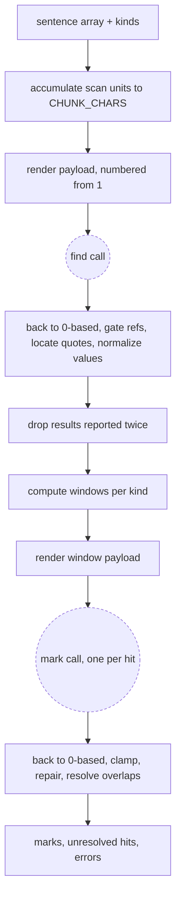

Detection is the two model calls that turn a document into regions: `find` locates every occurrence of a kind inside one scan unit and resolves it to a vocabulary value, `mark` decides how far each occurrence's region reaches. Everything between and around those two calls — sentence coordinates, the scan unit, window computation, value normalization, dedup, and the repair of a hostile response — is pure and runs without a network. This file owns the two call contracts, the accumulation of a document into scan units, and the in-memory hit and mark shapes. It does not decide when detection runs, in what order, how many calls run at once, or what is written to disk; that is [region-sync.md](region-sync.md). The kind descriptor it reads is [kinds.md](kinds.md); the stored row a mark becomes is [regions-block.md](regions-block.md).

## Contract

### Sentence coordinates

Every number this component computes, gates, clamps or hands on is a 0-based position in the array `indexFileSentences(raw)` returns (`app/lib/text/halo.ts`), over the whole document — the stored convention [regions-block.md](regions-block.md) pins, so an index is an array subscript everywhere in the feature and every in-app consumer subscripts the array directly. Not into a scan unit, not into a window, not into a payload. One coordinate system per document, so a hit found in one scan unit and a hit found in the next are directly comparable, a window is a pair of integers, and an out-of-range ref is a range check rather than an inference.

The model is the one exception, and it is absorbed at the boundary rather than into the coordinate system. Payloads number sentences from 1 and responses come back in that numbering, because a model reading "sentence 1" is doing what models do and fighting that costs accuracy for nothing. The conversion is a `+1` when a payload line is rendered and a `-1` when a response entry is parsed, and those two functions — the renderer and the parser sitting either side of `callAndParse` for each call — are the only place in the component where either operation appears. Every gate, window, clamp, repair, hit, mark and test fixture below is 0-based; a 1-based number exists only inside a request body and the raw response that comes back with it.

### The scan unit

A call cannot take a whole document, so the sentences are cut into units, and the unit is cut out of the canonical array itself rather than borrowed from anywhere else. Accumulating them is this component's work: one pure function of the sentence array, exported and called by [region-sync.md](region-sync.md) so the side that schedules and the side that calls draw the same boundaries: rows are taken in array order into the current unit until adding the next one would pass the character budget the embedding chunker cuts on (`CHUNK_CHARS`, `CHUNK_TOKENS * CHARS_PER_TOKEN`, 1000 characters, `app/lib/embeddings/constants.ts`), and a sentence is never split, so a single sentence longer than the budget is a unit of one. The measure is characters, counted over the unit's sentence texts joined by a single space — the same join its hash is taken over. Characters and not tokens because nothing in the repo counts tokens: `CHUNK_TOKENS` reaches the chunker only as `CHUNK_CHARS`, and the one estimator that exists, `estimateTokens`, is private to `app/lib/text/excerpt.ts`. Units are contiguous and do not overlap: every sentence sits in exactly one, and concatenating them in order reproduces the array. A unit's identity is its content hash — `fnvHash` over its sentence texts joined by a single space, the recipe [regions-block.md](regions-block.md) pins along with the `scanned` record that stores it, because the pass that writes a unit's hash and the pass that re-derives it must agree.

The consequence worth naming: a find unit _is_ a scan unit, so the payload of a `find` call is canonical sentences and its first and last array positions are known before a single character is rendered. There is no derived text to locate back in the document, no alignment step, and no second coordinate space anywhere in this file.

`chunkFileForEmbedding` (`app/lib/embeddings/chunk.ts`) remains the only sanctioned chunker for embeddings, and nothing here touches it. Detection units differently because it produces no embeddings and shares no hash space with search or deep analysis, so nothing it computes has to line up with a chunk — and an embedding chunk could not carry these coordinates anyway: that chunker works over `extractProse(content)` while `indexFileSentences` splits `stripMarkdown(extractProse(raw))`, so a chunk's character offsets live in a different space than sentence rows and would have to be matched back into them on every call.

The payload for both calls is rendered from the canonical sentence array itself — one sentence per line, prefixed with its 1-based number — never by re-splitting a joined string.

### The `find` call

One call per kind per scan unit. The shape of that call is this file's: one unit in, that unit's hits out, and nothing about the call knows what else is running. How many run at once, in what order, and whether a kind's calls may overlap in time is [region-sync.md](region-sync.md)'s, because the answer turns on whether a kind's vocabulary must be current for the next call — a property of the pass, not of the call. What is fixed here is that every unit of every kind is called: a document is covered completely rather than sampled until something is found, so there is no early exit and no notion of having found enough.

Input assembled by the caller-facing pure part, before any network:

| Field           | Type                                           | Consumer                                                                                                                                             |
| :-------------- | :--------------------------------------------- | :--------------------------------------------------------------------------------------------------------------------------------------------------- |
| `kind`          | kind id                                        | Stamped on every hit so [region-sync.md](region-sync.md) can route hits per kind and [regions-block.md](regions-block.md) gets its `kind` column      |
| `rules`         | text                                           | Sent as the first system message; the prose of the kind's `rules.md`, from the [kinds.md](kinds.md) descriptor                                        |
| `knownValues`   | list of values, empty for self-contained kinds | The model's reuse instruction, and the post-parse membership check that decides whether a returned value is a reuse or a new one                     |
| `valueType`     | `string` or `datetime`                         | Chooses the response schema's value constraint and the normalizer; from the [kinds.md](kinds.md) descriptor                                          |
| `firstSentence` | absolute index of the unit's first row         | Offset for numbering the payload, and the lower bound of the ref gate                                                                                |
| `sentences`     | the unit's sentence texts, in order            | The rendered payload                                                                                                                                 |

The rules file is call-neutral: it describes what an occurrence of this kind is and how far one reaches, and both calls are handed the same prose. Which half of it applies is the user message's job — `find` asks where occurrences sit, `mark` asks how far one reaches — so the kind's prose stays one file and neither call has to be written twice.

Message stack, most stable content first so the cached prefix is the part that repeats across every unit of every document of this kind:

1. system — the rules text, carrying an explicit prompt-cache breakpoint (`markCacheBreakpoint`, `app/lib/agent/tools/apply-deep-analysis/messages.ts`, exported by this feature — it is module-private today).
2. system — the known-value list, sorted, or a stated "no list, infer from the text" line for self-contained kinds. It sits _after_ the breakpoint because it grows during a run and would otherwise invalidate the cached prefix on every new value.
3. system — the unit, one numbered sentence per line.
4. user — the call to action, naming the question this call asks of the rules: _where does this kind occur here_. Report every occurrence as a quoted phrase, the number of the sentence it sits in, and the value it resolves to; say nothing about how far any of them reaches; reuse a value from the list where one fits, create one only when nothing fits.

Response, wrapped in a `results` object because several providers reject a top-level array as structured output (the same reason `app/lib/search/verdict.ts` and `apply-deep-analysis/messages.ts` wrap theirs):

| Field      | Type                                                                                     | Consumer                                                                                                                     |
| :--------- | :--------------------------------------------------------------------------------------- | :--------------------------------------------------------------------------------------------------------------------------- |
| `quote`    | string                                                                                   | Located in the text to confirm the hit, then carried to [regions-block.md](regions-block.md) as `quote`                       |
| `sentence` | integer ≥ 1, in the payload's numbering                                                   | Decremented at the parse boundary to become `hitSentence`, which is the point from which windows are computed                 |
| `value`    | string; for a `datetime` kind the schema additionally constrains it to an ISO-8601 shape | Normalized into `parsed.value` for [regions-block.md](regions-block.md), and matched against `knownValues` to decide reuse    |

Endpoint: `/region-finder`.

Nothing else is asked for. No confidence field — there is no threshold to apply it to and nothing downstream reads one. No reason string — `apply-deep-analysis` needs reasons because a second call adjudicates them; here nothing adjudicates. No `isNew` flag — the caller supplied `knownValues` and can take the set difference. No echoed kind or value type per hit — the kind is fixed for the whole call and the value type is a property of the kind in [kinds.md](kinds.md).

### From response to hits

A parsed response is still hostile. Between `callAndParse` returning and any hit existing, each result is converted to array positions and passes a fixed sequence of gates, and a result that fails a gate is dropped and counted rather than throwing:

- **Ref outside the unit.** The decremented `sentence` must fall in the unit's absolute range. Outside it, the model invented a location; the result is dropped. (In `find` the ref _is_ the claim, which is why it is dropped rather than clamped — see `mark` below, where it is clamped.)
- **Quote not in its sentence.** The quote is located in the named sentence with `findMatchOffset` in strict mode — `strict: true`, its third argument. Strict still matches on normalized tokens, so a quote differing from the document only in case, punctuation or diacritics still locates; what it refuses is the default's fuzzy fallback, which for a needle of five or more tokens accepts an ordered subsequence scoring 0.9 within a same-size window (`PRECISION_THRESHOLDS`, `MIN_FUZZY_TOKENS`). That fallback would pass a quote the model half-invented, and a stored `quote` that does not occur in the document is a provenance lie. Strict is the only mode this component ever calls `findMatchOffset` in, and this gate is the reason: it decides whether a stored fact is true, so a tolerance that lets a half-invented phrase through buys nothing here. Not in the named sentence but present elsewhere in the unit under the same strict search, the hit retargets to the sentence where it was found — the model got the phrase right and the number wrong, which is cheap to repair. Not present in the unit at all, the hit is dropped.
- **Value normalization, `string` kinds.** Trim, collapse internal whitespace, lowercase, strip surrounding punctuation, then compare against `knownValues`; if the result equals a known value it _is_ that value. The normalizer folds spelling and nothing else. Empty after normalization, the hit is dropped. Anything else is a new value, accepted as such; a list-backed kind cannot reject a value for being absent from the list without making a new value impossible. A value that is genuinely wrong — a real-looking name the text does not support — is not detectable here, and nothing in this component pretends to catch it.
- **Value normalization, `datetime` kinds.** Parsed to an instant. A date without a time resolves to start of day in UTC, because the corpus carries no locale and a shifting boundary would make two identical documents disagree. Unparseable, the hit is dropped rather than stored as a string — [regions-block.md](regions-block.md) declares `parsed.type` as `datetime` and SQL comparisons on it must be real instants.
- **The same occurrence reported twice.** Scan units are contiguous and do not overlap, so a sentence is offered to exactly one `find` call and two calls cannot both report the same mention. What is left is one response naming an occurrence twice, which a model asked for an exhaustive list will do: two results of the same kind with the same `hitSentence` and the same normalized value are one hit, and the first in the response wins. Two mentions genuinely sharing a sentence and a value — "Rutte said it, and Rutte meant it" — collapse to one hit too, which is right: they are one occurrence as far as a region is concerned, and marking them separately would produce two regions over the same passage for the overlap step to take apart again.

Folding "President Rutte" onto `rutte` is semantic, and it is the model's work: the known-value list is in its prompt and the rules file tells it to reuse a value that fits. The normalizer never does it — applied to `"President Rutte "` the rule above yields `president rutte`, and that is what is created when the long form is the first occurrence in a corpus and the known-value list is empty. A later "Rutte" then either comes back as the existing value, because the model was shown it and chose to reuse, or as a second value `rutte`, and nothing in this component merges the two. Running a list-backed kind's calls in order narrows the window in which the split can open — the next unit sees the value the previous one created — but it is a prompt-level pressure, not a guarantee, and this file claims no deterministic fold. The named repair, if drift proves material, is `app/lib/corpus/cluster.ts`.

A hit, the shape crossing to the window computation and to `mark`:

| Field         | Type                                  | Consumer                                                                                                                         |
| :------------ | :------------------------------------ | :------------------------------------------------------------------------------------------------------------------------------- |
| `kind`        | kind id                               | Grouping for windows (windows are per kind), and `kind` in [regions-block.md](regions-block.md)                                   |
| `quote`       | string                                | The `mark` payload, and `quote` in [regions-block.md](regions-block.md)                                                           |
| `hitSentence` | absolute index                        | Window computation, the `mark` payload, and `hitSentence` in [regions-block.md](regions-block.md)                                 |
| `value`       | normalized string or ISO-8601 instant | `parsed.value` in [regions-block.md](regions-block.md), and the corpus vocabulary [region-sync.md](region-sync.md) maintains      |

### Window computation

Pure, no I/O, and the densest table-driven surface in this component. Hits of one kind are sorted by `hitSentence`. For each hit, the window runs from the previous hit of the same kind to the next hit of the same kind, clamped to the document: the first hit's window starts at sentence 0, the last hit's window ends at the final sentence, and a single hit in a document is bounded only by the document itself. The character clamp below then applies to whatever the neighbour bound left. Kinds do not see each other's hits — a `date` hit never bounds a `speaker` window.

Windows of neighbouring regions overlap heavily and that is intended. The window bounds the payload, not the answer; `mark` still chooses exact boundaries inside it.

The neighbour bound alone does not bound the payload, though, and it has to. A document naming one speaker once, or a diary whose first date sits at the top and whose second is forty units below it, gives that hit a window of the whole document — and a `mark` call is issued per hit, so the same document can be sent several times over. So the window is clamped to `MARK_WINDOW_CHARS` of sentence text centred on the hit's own sentence, `8 * CHUNK_CHARS`, and the clamp is applied after the neighbour bound rather than instead of it: whichever is tighter wins. Eight units is a first guess, chosen because it comfortably holds a long diary entry while keeping the payload inside what a `lite` model attends to well, and it is a number to tune once real documents run through rather than a derived constant.

The clamp has a consequence worth stating rather than discovering: a region cannot be longer than the clamp. A diary entry that genuinely runs further than `MARK_WINDOW_CHARS` before the next date is marked as ending at the clamp, not at the next date. That is a truncated region and not a wrong one — it names text that does belong to the date it names — and the alternative, an unbounded payload, fails at the provider rather than degrading. Where a kind's regions routinely hit the clamp, the clamp is the thing to raise.

No lookback or lookahead margin past the neighbouring hits. Trailing attribution — "this is great, said Rutte" — is already inside the window, because content between two hits belongs to one window or the other either way. _This is an assumption the parent proposed rather than a decision the conversation made._ What would disprove it: a real transcript where attribution lands past a neighbouring hit, so the sentence that assigns the region sits outside the window of the hit it assigns.

A unit with no hits produces no `mark` call at all.

### The `mark` call

One call per hit, and nothing else. Not one per scan unit, not one per kind, and never a batch of hits that happen to share a window: what a call is about is the single occurrence, and a payload carries exactly one `quote`, one `hitSentence` and one window. Windows are per hit, so a batch would have to carry the union of its members' windows, which for a dense transcript is the document repeated per member. The consequence is that the number of `mark` calls equals the number of hits handed to this step — the deduped hits of a fresh document, or the set of hits [region-sync.md](region-sync.md) decides need re-marking — which in a dense transcript can exceed the number of `find` calls; that is a number to measure once real documents run through, not a reason to change the shape now.

Input:

| Field                      | Type                        | Consumer                                                                                                                                  |
| :------------------------- | :-------------------------- | :---------------------------------------------------------------------------------------------------------------------------------------- |
| `kind`                     | kind id                     | Carried through to the resulting mark                                                                                                     |
| `rules`                    | text                        | The same `rules.md` prose `find` was handed; the shared system prompt cannot know what a region means for this kind, so the semantics ride in as content |
| `quote`                    | string                      | Names the one occurrence being bounded, in the model's own surface form                                                                   |
| `hitSentence`              | absolute index              | Stated to the model as the sentence the occurrence sits in; also the floor and ceiling of the repair rules below                          |
| `value`                    | normalized string or ISO-8601 instant | Carried through to the resulting mark, never rendered — see below                                                       |
| `windowStart`, `windowEnd` | absolute indices            | Render bounds, and the clamp applied to the response                                                                                      |
| `sentences`                | the window's sentence texts | The rendered payload                                                                                                                      |

The hit's `value` is carried and never shown: the model bounds a passage using the surface phrase, and a vocabulary id it has never seen adds nothing it can act on. It is here because a mark is a hit plus a range and the call returns the mark whole, so the value has to survive the call to be on the far side of it; the alternative — returning a bare range and rebuilding the mark in [region-sync.md](region-sync.md) — would move that reassembly into the component that does not own the shape. What must hold is that no message this call builds contains the value, and that is the assertion, not the absence of the field.

Message stack:

1. system — the rules text, with the cache breakpoint; identical to `find`'s first message, so the two calls share a cached prefix per kind.
2. system — the window, one numbered sentence per line, followed by a line naming the hit's sentence number and quote. The hit is identified by number rather than by wrapping it in markup, because the numbering is one sentence per line and inline markers would break the thing the answer is expressed in.
3. user — the call to action, naming the question this call asks of the rules: _how far does this occurrence reach_. The occurrence is already located and is not in doubt; return the first and last sentence number of the stretch of text it owns.

Response, `results`-wrapped for the same provider reason, one entry:

| Field   | Type                                    | Consumer                                                                                                         |
| :------ | :-------------------------------------- | :----------------------------------------------------------------------------------------------------------------- |
| `start` | integer ≥ 1, in the payload's numbering | Decremented at the parse boundary into `startSentence` in [regions-block.md](regions-block.md), and region ordering in [decoration.md](decoration.md) |
| `end`   | integer ≥ 1, in the payload's numbering | Decremented at the parse boundary into `endSentence` in [regions-block.md](regions-block.md)                        |

Endpoint: `/region-marker`.

### From response to marks

- **Refs outside the window** are clamped to the window rather than dropped. The asymmetry with `find` is deliberate: there, the ref is the claim and a bad ref means there is no claim; here, the occurrence is already established and the ref is only a boundary on it, so the nearest legal boundary is a better answer than none.
- **A range running backwards** (`end` < `start`) collapses to the hit's own sentence. The sentence containing the mention certainly belongs to the region, so a one-sentence region is the truthful minimum; discarding a confirmed occurrence because its boundary came back reversed loses more.
- **A range that does not contain its own hit sentence** expands to include it.
- **Overlapping regions of the same kind** are resolved deterministically, and over the kind's whole current set for the document: [region-sync.md](region-sync.md) hands this step every mark of that kind the document currently has, not only the subset it decided needed re-marking, because a fresh mark can otherwise land across a stored mark this component never saw and the non-overlap [regions-block.md](regions-block.md) keys row identity on would be a claim about half the rows. Resolution runs in `startSentence` order, ties broken by `hitSentence`, in two steps. First, identical ranges collapse: two regions of one kind covering exactly the same sentences are one region, and the one whose hit sentence is lower keeps it — the other keeps its hit and loses its range, which is a state the schema already admits. Ties break on the hit sentence because it is the only thing both sides of a unit seam carry; a hit knows its sentence, its quote and its value, and nothing about which call produced it. Then, where a region's end reaches into the next region, it is cut to end one sentence before that region's start, because the later mark saw the transition sentence in its own window and chose it; if the cut would erase the earlier region, the later region yields instead and starts one sentence after the earlier hit. Regions of one kind therefore never overlap; regions of different kinds may, and must — a sentence sits inside a speaker region and a date region at once, which is the whole point of [decoration.md](decoration.md).

A mark carries its hit's fields plus `startSentence` and `endSentence`, which is exactly what [regions-block.md](regions-block.md) stores minus `rangeHash`; that hash is computed there, by the component that owns it. A hit that came out of this step with no range carries neither, and is the range-less row that file's all-or-nothing triple exists to express.

### The seam, and failure

`callAndParse` (`app/lib/agent/client/call-parse.ts`) is the only place this component touches the network. It builds a strict JSON schema from the Zod response schema, strips code fences, validates, and retries once on a parse failure.

That retry is only real if the second attempt reaches the provider, and today it would not. `callLlm` caches responses by request body, `isCacheable` is `!options.callbacks && !UNCACHEABLE_ENDPOINTS.some(...)` (`app/lib/agent/client/fetch.ts`), and `callAndParse` passes no callbacks. A response that streams cleanly but is malformed JSON carries no error block, so it is cached like any other; the retry then re-issues an identical body and reads the same bad text back, and the one repair the client offers is spent on a guaranteed second failure. Adding `/region-finder` and `/region-marker` to `UNCACHEABLE_ENDPOINTS`, beside `/qual-coder` and `/semantic-filter`, is work this feature does, in the commit that adds the calls. Nothing else is added on top of the retry: a transport failure rejects, and the call's own handling below turns it into an entry in the `errors` list beside the results, which is the whole of the failure bookkeeping this component keeps.

When a call fails after its retry:

- A failed `find` for one (kind, unit) pair contributes no hits. Sibling units and sibling kinds are unaffected; the failure is returned to the caller as a string in an `errors` list beside the hits — the shape `runFind` and `filterEnvelopes` already use in `apply-deep-analysis`. Whether a partial result is worth writing is [region-sync.md](region-sync.md)'s decision, and it cannot make it if detection throws.
- A `mark` that fails after its retry, or comes back with no entry to read, yields its hit with no range, recorded as an error. The occurrence is real — it was located and its quote confirmed against the document — so it survives as an unresolved occurrence rather than being thrown away, and [regions-block.md](regions-block.md)'s all-or-nothing triple is how that is stored: `hitSentence`, `quote` and value present, the three range fields absent. Nothing invents a one-sentence region in its place. A region the model never marked would be indistinguishable in the editor and in SQL from one it did, and it would be the only producer of a state three other files carry rules for. The document is not taken down by one bad call, and the hit does not die with its mark.

Detection is stateless: it holds no cache and no memo, and re-running the same unit issues the call again. Giving up the response cache is what the retry costs, and it costs little, because nothing here was going to re-run an unchanged unit anyway — deciding what needs re-running is invalidation, it is [region-sync.md](region-sync.md)'s, and it is keyed on unit hashes rather than on request bodies. The caching that does survive is the provider's: the per-kind rules prefix sits behind `markCacheBreakpoint`, so the largest repeated part of every call is a cache read rather than fresh input, and the endpoint exclusion does not touch that.

### Enforcement, and where the boundary sits

The gateway call is a side effect, and it sits at the edge: for each call there is one function that renders the payload, awaits `callAndParse`, and converts the response's numbering back into array positions, and everything on either side of it — unit accumulation, payload rendering, ref gating, quote location, value normalization, dedup, window computation, clamping, backwards-range collapse, and overlap resolution — takes values and returns values. Detection can be exercised end to end with `callAndParse` replaced by a stub returning canned responses, and every rule above can be tested without a stub at all.

The contract is enforced by schema before anything downstream sees a model's output. `callAndParse` refuses anything that is not the declared shape, and the gates above refuse anything that is the declared shape but not a possible fact about this document. A hit therefore cannot exist with a sentence index outside its unit, a quote absent from the text, an empty value, or an unparseable instant, and a mark cannot exist with a backwards range, a range outside its window, or a range overlapping another region of its kind. The last of those holds only because resolution runs over the kind's whole current set for the document, which is why that input is stated above as a requirement on [region-sync.md](region-sync.md) rather than left to chance; over a freshly marked subset the same rule would guarantee non-overlap among the rows it happened to see, which is not a guarantee at all. Downstream components have no invalid states to defend against because the values that would express them are never constructed. A hit with no range is not one of them: it is a declared state, [regions-block.md](regions-block.md) admits it by schema, and its readers render nothing for it.

### Cross-repo prerequisite

`/region-finder` and `/region-marker` are two new agents in the sibling `nabu-prompts` repository, a directory each rather than a file: an `index.md` carrying `description` and `model` in its front matter and including the prompt markdown beside it, the shape `config/topic-assigner/` already has. Both hold the shared system prompt for their call, both are shared across every kind — the per-kind rules file is passed as content, never as a per-kind endpoint — and both speak the payload's 1-based numbering, since that is the only numbering a model ever sees. They are two routes and not one with a mode flag because they ask different questions of the same rules and answer in different shapes: a list of located occurrences against a single range. Neither route existing means detection cannot run at all; they land before any of this does.

Both name `model: lite`, and that tier is forced rather than preferred. `chancery validate` runs before the stack starts and refuses an agent naming an alias its selected models table does not define, and the `MODELS` environment variable selects that table out of five — `models.openai.yaml` by default, with anthropic, deepseek, gemini and multi beside it. `lite` is defined in all five, which is what makes it safe to name: a tier present in only some tables takes the stack down for everyone not on the default. It is also where the gateway's other short-answer agents already sit — `topic-assigner`, `corpus-describer`, `file-hyde`, `generic-hyde` and `hyde-generator` — while `scout-filter` is `mid`, `qual-coder`, `semantic-filter` and `refine-code` are `strong`, and `deep-analysis-adjudicate` and both filter voters are `expert`. Volume is why both want the floor rather than a reason to separate them: `find` runs once per kind per scan unit and `mark` once per hit, and neither has anywhere cheaper than `lite` to go.

The gateway reads the prompt directories once, at boot. The dev stack (`make dev` in `nabu-self-hosted`) watches `nabu-prompts/config/` and restarts the gateway when anything under it changes, so adding the two agents — and iterating on their prose afterwards — costs a restart and no rebuild.

### Assumptions carried, not decided

Two of the rules above were proposed rather than settled, and are worth re-reading when detection first meets real documents: no margin past neighbouring hits, and no near-duplicate merge pass over the value vocabulary at the start of a run. On the second, the order [region-sync.md](region-sync.md) runs a list-backed kind's calls in is all the consistency pressure there is, and `app/lib/corpus/cluster.ts` already clusters labels by embedding similarity and is there to bolt on if drift appears.

## Prior art

In this repo:

**Used.** `callAndParse` (`app/lib/agent/client/call-parse.ts`) for both calls — it is the single entry point for structured non-conversational calls and brings fence stripping, strict schema generation, and the one retry. `toSystem`/`toUser` (`app/lib/agent/client/convert.ts`) for the message stack. `indexFileSentences` (`app/lib/text/halo.ts`) as the canonical sentence array, and `fnvHash` (`app/lib/utils/hash.ts`) over its rows for the unit identity, the same function `hashChunk` wraps for embeddings. `findMatchOffset` (`app/lib/text/find.ts`) in one mode only, `strict: true`, for quote location.

**Extended.** `markCacheBreakpoint` in `apply-deep-analysis/messages.ts` is exported, which it is not today. It is a few lines over a message array and the only place in the repo that knows what a breakpoint looks like — the last message's content rewritten as a single part carrying `prompt_cache_breakpoint: { mode: "explicit" }`. Copying that into a second file would be a second definition of one provider fact, so the export is work this feature does.

**Extended.** `UNCACHEABLE_ENDPOINTS` in `app/lib/agent/client/fetch.ts` gains the two new endpoints. Two entries, no change of shape, and the reason is the one `/qual-coder` and `/semantic-filter` are already there for: an endpoint whose caller depends on a second call actually being made cannot be served from a body-keyed cache. The constant is exported at the same time, so the test below can name the two endpoints it must contain; `isCacheable` stays private, because what is worth pinning is the second request reaching the transport and not the predicate that lets it.

**Extended.** `app/lib/corpus/classify.ts` is the closest existing reuse-or-create call and `find` for a list-backed kind is the same shape: hand the model the existing labels, instruct it to reuse where one fits, lowercase the answer on the way out. What it does not have is location — it classifies a whole document into one label — so `find` extends it with numbered sentences, a per-occurrence result, and per-kind rules as content.

**Extended.** `apply-deep-analysis/step-filter.ts` and `messages.ts` set the message shape reused here: stable system content first, target content next, a user call-to-action last, a `results` wrapper on the response, per-call schema construction (`buildFilterSchema` builds an enum from the valid codes the way `find` builds its value constraint from the value type), and an outcome carrying an `errors` list beside its results instead of throwing. `step-find.ts` is the one piece deliberately not followed: it maps text produced by an earlier pipeline stage back onto canonical sentence rows, joining the row texts and matching offsets against them, which is exactly the step scan units remove. A unit is a run of rows already, so there is no derived string to locate and nothing that can disagree about where a sentence starts.

**Partly rejected.** `app/lib/search/verdict.ts` is the closest "numbered sentences in, sentence refs out" protocol in the repo, and its idea is taken while its mechanics are not. `formatNumberedPassage` (`app/lib/text/format.ts`) re-derives sentences from the string it is handed; used here it would number its own re-splitting of the payload rather than the canonical rows, and a ref that cannot be resolved back to a canonical row is worthless to [regions-block.md](regions-block.md). The payload is therefore rendered from the canonical array directly. `toLetter`/`parseRef` (`app/lib/text/prefix-ref.ts`) exist to disambiguate between several passages batched into one call; `find` sends one unit and `mark` sends one window, so the prefix names nothing, and plain integers make the out-of-range check a comparison instead of a parse. Rejecting the string ref also removes an entire failure mode — an unparseable ref — which is why the response schema takes integers.

**Rejected.** `chunkFileForEmbedding` (`app/lib/embeddings/chunk.ts`), for the reason given with the scan unit above, and `processPool` (`app/lib/utils/pool.ts`) with it — not because concurrency is wrong here, but because it is not this component's to choose. A call takes one unit, and how many are in flight is settled where a kind's vocabulary ordering is settled, in [region-sync.md](region-sync.md).

**Rejected.** `dedupOverlapping` (`app/lib/text/spans.ts`) drops any span overlapping a kept one, keeping the smallest. Detection's same-kind regions must tile rather than survive a contest, so overlap is cut at a boundary rather than resolved by deletion, and the only case that deletes anything is two regions over the identical range. The result dedup on the `find` side is an identity match on sentence and value, not an overlap match at all. `triplet.ts`'s `<marked>` wrapper is rejected for the `mark` payload for the reason given above — inline markup fights one-sentence-per-line numbering. `apply-deep-analysis/batching.ts` is rejected because its problem is packing many independent items into few calls, and `mark`'s payload is per-hit by construction. Multi-voter consensus (`FILTER_VOTERS`, `consensus.ts`) is rejected: it triples the cost of the highest-volume call in the feature to raise precision on a task whose errors are visible and correctable in the editor, and the voters it would copy are `expert` agents, so the multiplier would arrive on top of a tier the calls do not otherwise need.

**Rejected.** `scout-filter/` — a `mid` pre-pass that excludes stretches of a document from analysis. Detection has nothing to exclude: a unit with no speaker mention costs one `lite` `find` call that comes back with an empty list, which is less than the `mid` call a scout pass would spend deciding to skip it.

Online, both halves of this are named problems with real prior art:

**Sentence segmentation.** pySBD, syntok, NLTK's Punkt, and spaCy's senter are the standard tools, and `Intl.Segmenter` with sentence granularity is the platform's answer. The repo already committed to the last of these in `app/lib/text/split.ts`, and the question here is not which segmenter is best but which one is _canonical_ — every consumer must index the same array or the refs mean nothing. No library wins that argument against the one already in use.

**Quotation and speaker attribution.** This is a well-studied task: Elson and McKeown's quoted-speech attribution work, Muzny et al.'s two-stage deterministic-plus-statistical attributor shipped as Stanford CoreNLP's `quoteattribution` annotator, and BookNLP's quotation attribution pipeline are the reference implementations. They lose here for three reasons, not one. They attribute _quotations_ — text inside quotation marks with a nearby speech verb — while a transcript's regions have no quotation marks and a `date` region is not speech at all; they resolve speakers to mentions inside one document, while the entire point of the value vocabulary is that `rutte` is one person across the corpus; and they are Java and Python pipelines with model files, in a browser-side TypeScript application whose only heavy dependency is DuckDB-WASM. The generalization from "speaker" to "any kind defined by a rules file" is what makes an LLM call the cheaper implementation, not scepticism about the linguistics.

**Date normalization.** chrono-node is the standard JavaScript natural-language date parser, and Duckling the standard service-side one. Either could do the normalization half of a `datetime` kind. The model already returns a canonical timestamp as part of the call it is making anyway, so adding a dependency to redo that work is unjustified today — but chrono-node is the named bolt-on if the unparseable-date drop rate turns out to be material, and it would slot in exactly where the `datetime` normalizer sits, behind the same gate.

**Speaker diarization** (pyannote and friends) is the audio analogue of this problem and does not apply: the input here is text that has already been transcribed, often with the speaker labels stripped or never present.

## Tests

### Skeleton

Detection's piece of the walking skeleton is the middle of it: one kind (`speaker`), one small transcript whose sentences accumulate into a single scan unit, both real gateway routes. That document produces exactly one `find` call — a document short enough to be one unit is scanned by one call and never by none — whose payload numbers the unit's sentences from 1; hits come back with quotes that locate in the sentences they name, refs land as array positions into `indexFileSentences(raw)`, values normalize into the corpus vocabulary, windows compute over that unit's hits, and one `mark` call per hit returns ranges that tile the document without overlap. Detection hands [region-sync.md](region-sync.md) a list of marks and an empty error list; sync writes the block. Green means both `nabu-prompts` routes exist, the schemas survive a real provider, and the coordinate system holds end to end.

### Contract

Riskiest first.

Given a `find` response naming sentence 1 in the payload's numbering, when it is parsed, then the resulting `hitSentence` is 0 and addresses `indexFileSentences(raw)[0]`; given a `mark` response of `start` 3 and `end` 5 over a window starting at array position 0, then the region is sentences 2 through 4; and given a payload rendered for a unit whose first sentence is array position 12, then its first line is numbered 13. Table-driven in both directions, because a one-sided test passes against an implementation that converts nowhere.

Given a `find` response that is not JSON at all, when the call runs, then the second failure returns an error rather than throwing, the (kind, unit) pair contributes zero hits, and its siblings' hits are unaffected.

That the retry happens at all is a fact about a lower seam, and it is asserted there rather than here: with the fake at `fetch` instead of at `callAndParse`, a `find` whose first response is malformed but well-formed HTTP issues two transport requests and not one, which is false today and is what the endpoint exclusion buys. Pinned beside a direct assertion over the exported `UNCACHEABLE_ENDPOINTS` that it contains both routes. The two cannot be one case: stub `callAndParse` and neither the retry nor the cache is inside the test's reach, so the assertion would pass against any stub that returns an error.

Given a `find` response whose result names a sentence below the unit's first sentence or above its last, when the response is gated, then that result is dropped, the remaining results in the same response survive, and the drop is counted.

Given a list-backed kind supplied with a known-value list containing `rutte`, when the model returns `"Rutte "` with trailing space and title case, then normalization yields `rutte` and the hit reuses the known value rather than creating a second one; when it returns `"President Rutte "`, then normalization yields `president rutte` and a new value is created, because the normalizer folds spelling and not meaning; and when it returns any value absent from the list, then that value is accepted as new — a new region's value must be creatable.

Given a `datetime` kind, when the model returns a value that does not parse to an instant, then the hit is dropped and no row can be built from it; and when it returns a date without a time, then the value is start of that day in UTC — pinned across a table of date-only, date-and-time, and near-midnight inputs so a timezone regression is visible.

Given a `find` result whose quote does not occur in the sentence it names but does occur two sentences later in the same unit, when the response is gated, then the hit retargets to the sentence where the quote was found; given a quote that occurs nowhere in the unit, then the hit is dropped; and given a ten-token quote sharing nine of its tokens in order with a sentence but not occurring in it, then the hit is dropped rather than located — the case the default fuzzy mode would accept and the strict gate must not.

Given one hit in a document of forty short sentences totalling under `MARK_WINDOW_CHARS`, when windows compute, then the window is sentences 0 through 39 — the whole document, because the neighbour bound left it and the clamp did not tighten it.

Given one hit in a document whose sentences total well past `MARK_WINDOW_CHARS`, when windows compute, then the window is the clamp's worth of sentence text centred on the hit's sentence rather than the whole document, and a payload rendered from it stays under the clamp. Given a hit whose neighbour bound is already tighter than the clamp, then the neighbour bound is what survives — the two are not alternatives and the tighter one wins.

Given hits at sentence 0 and at the final sentence, when windows compute, then the first window starts at 0 and the last window ends at the final sentence, with no index below 0 and none past the end. Table-driven with hits at both edges, adjacent hits, hits in the same sentence, and interleaved hits of two kinds asserting that each kind's windows are computed from its own hits alone.

Given a `find` response naming the same sentence and the same value twice, when hits are deduped, then one hit survives with its sentence index and value unchanged; and given a document cut into several units, then every sentence appears in exactly one unit's payload, so no mention is ever offered to two calls and nothing is deduped across a seam.

Given five hits in one unit, when the mark step runs, then five `mark` calls are issued, each carrying exactly one quote, one hit sentence and its own window — the shape is per hit and no batching is possible at any input size.

Given a `mark` call that fails after its retry, when the mark step completes, then that hit survives with no range at all — no `startSentence` and no `endSentence`, so the row it becomes carries the null range triple — the error appears in the returned error list, no region is constructed anywhere for it, and every other hit's region is unaffected. Given a `mark` that returns successfully with an empty `results` array, then the same.

Given a `mark` response whose range runs backwards, when it is repaired, then the region collapses to the hit's sentence; given a range extending past the window, then it is clamped to the window; given a range that excludes its own hit sentence, then it expands to include it.

Given two same-kind marks whose ranges overlap, when overlaps resolve, then the earlier region ends one sentence before the later region starts; given an overlap so large that the cut would erase the earlier region, then the later region yields and starts one sentence after the earlier hit; and given two marks over the identical range, then one region survives — the one whose hit sentence is lower — and the other hit is kept with no range rather than dropped. Table-driven across touching, nested, and identical ranges, and run once over a set mixing marks made this pass with marks handed in from storage, since the guarantee is over the kind's whole current set and not over the fresh ones.

Given a unit producing no hits, when detection runs, then no `mark` call is issued for it.

Given a document whose sentences run well past the character budget, when scan units are accumulated, then no unit's joined sentence texts exceed `CHUNK_CHARS` unless the unit holds a single sentence that does, every sentence appears in exactly one unit, the units concatenate back into `indexFileSentences(raw)` in order, and each unit's hash is `fnvHash` over its own sentence texts joined by a single space. Given a document short enough to be one unit, then exactly one unit is produced and it covers the whole array — a document that fits a single call must be scanned by that call and never by none, which is the difference between a kind finding nothing in a document and a document never being looked at.

### Isolation

Detection runs alone with the gateway faked at one place: `callAndParse`, behind the single function per call that wraps it, replaced by a stub returning canned `find` and `mark` responses — including malformed ones, out-of-range refs, and outright failures — with no HTTP, no `VITE_LLM_HOST`, and no `nabu-prompts`. One case fakes further out, at `fetch`, and it is the retry case above: what it asserts is that the client cache does not swallow the second request, a fact a `callAndParse` stub removes from the test's reach entirely. The canned responses are numbered from 1, exactly as a provider's would be, so the boundary conversion is exercised by every stubbed test rather than bypassed by them. The input side is plain values: a raw document string, a kind descriptor shaped per [kinds.md](kinds.md) with inline rules text, and a value list as an array. Nothing in the test opens DuckDB, reads the file store, or constructs the corpus vocabulary, and nothing writes a file — persistence and scheduling belong to [region-sync.md](region-sync.md) and are exercised there.

The larger half of the suite needs no stub at all, because the parts worth testing densely take values and return values: unit accumulation, payload rendering, ref gating, quote location, value normalization, dedup, window computation, mark repair, and overlap resolution are all called directly with fixture inputs and asserted on their return, which is why the network sits at the boundary and not in the middle.
