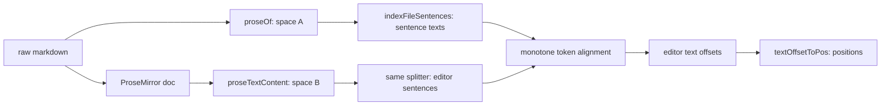

The editor rendering of regions: a ProseMirror plugin that draws one inline label at the start of every region and tints that region's text while its label is hovered. It reads the regions block through a selector and writes nothing — not to the file, not to the document, not to history. Everything it renders is a decoration, so nothing it does can be serialized back into markdown. The stored rows come from [regions-block.md](regions-block.md); the icon and colour behind each label come from [kinds.md](kinds.md); [region-sync.md](region-sync.md) keeps the block current and owns what happens while a re-derive is in flight.

## Contract

The plugin lives in `app/lib/editor/regions/`, mirroring `app/lib/editor/annotations/`: a plugin module, a decorations module, a pure alignment module, and a types module. It is registered in `MilkdownEditorCore` beside the others (`$prose(() => createRegionsPlugin())`) and fed from the same effect that already pushes annotations and spotlights, as one more `setMeta` on the same transaction. A selector in the regions domain module resolves stored rows to the renderable shape below, memoized on `files` and the raw document exactly as `getAnnotations(files, defaultValue)` is today.

### The meta channel

Two messages arrive on one plugin key. The payload is tagged, because one of the two senders is the plugin itself.

| Message   | Payload                                                | Sender                                        | Effect                                                                                                     |
| :-------- | :----------------------------------------------------- | :-------------------------------------------- | :--------------------------------------------------------------------------------------------------------- |
| `regions` | `{ regions: RenderableRegion[], sentences: string[] }` | The React effect in `MilkdownEditorCore`      | Replaces both, recomputes every decoration, and drops the hover if the hovered region is no longer present |
| `hover`   | `{ index: number \| null }`                            | The plugin's own `mouseover`/`mouseout` handler | Recomputes only the tint; regions and their ranges are untouched                                            |

`sentences` is the file's sentence texts from `indexFileSentences(raw)` — the array the stored indexes are 0-based positions into, per [regions-block.md](regions-block.md), which owns that convention — recomputed by the selector from the file's current raw text. It is one array per document, shared by every row, and it is the reason no sentence text has to be stored on disk. See the mapping below for why it is the payload that matters most.

A transaction carrying only `hover` changes no document content, so the Milkdown listener never fires and the file is never marked dirty. It is dispatched with history suppressed and only when the hovered index actually changes, so a mouse crossing a label produces at most one transaction.

### RenderableRegion

What crosses into the plugin, per region. Everything here is already resolved: the plugin knows nothing about kinds, value types, codebooks or files.

| Field           | Type     | Consumer                                                                                                      |
| :-------------- | :------- | :------------------------------------------------------------------------------------------------------------ |
| `index`         | number   | Identity for one render pass: the hover message names it, the label carries it as `data-region-index`, and the tint looks it up. Mirrors `ResolvedAnnotation.index`; never persisted |
| `kind`          | string   | The label's `data-region-kind` hook and the first half of its accessible name ("speaker: Rutte")              |
| `kindOrder`     | number   | The fixed order in which coinciding labels stack, taken from the kind registry's declaration order             |
| `label`         | string   | The text drawn in the chip. Pre-formatted by the selector from the region's value, so a date value's display form is decided where the kind's declared value type is in hand |
| `colour`        | string   | A `BLOCK_COLORS` name; the single hue the chip and the tint are both drawn from                                |
| `icon`          | string   | The chip's icon, as a name from `ICON_NAMES`, copied off the kind descriptor unchanged and resolved in the label component |
| `startSentence` | number   | Mapping input: the first sentence of the region                                                                |
| `endSentence`   | number   | Mapping input: the last sentence of the region                                                                 |

Dropped by the subtractive test, each with the reason nobody here needs it: `quote` (the mark's own text — nothing on screen shows it, and the mapping does not use it), `hitSentence` (only the derivation cares which sentence carried the mark; a region is start through end), `rangeHash` (region-sync's invalidation token — the plugin renders what it is given and never second-guesses it), and any per-region colour (colour is per kind, which is the whole point of the hover).

`icon` is a plain field of the kind descriptor, read and passed through. [kinds.md](kinds.md) carries each kind's icon as a name from `ICON_NAMES`, never a component, so the selector — which runs outside React, on files and raw text — has nothing to resolve and simply copies the string. Resolution happens once, at the far end, inside the label component: `resolveIcon` from `app/ui/theme/icon-map.ts` turns the name into a lucide component, the same call `TagBadge` makes for a tag's icon. That the label can consume a component at all is the point of rendering it as a React widget view rather than assembling DOM by hand.

### Sentence index to editor position

This is the risky part. The stored indexes address a different string than the editor decorates, and their offsets do not correspond:

- Space A, where regions are derived: `proseOf(raw)` — code blocks cut out by `extractProse`, then markdown syntax removed by regex, with headings deliberately kept, so `## Rutte:` still carries its hashes.
- Space B, where decorations live: `proseTextContent(doc)` — text collected from ProseMirror leaves, hidden-renderer code blocks skipped, one `\n` between blocks. Markdown syntax is gone because it became marks, not because it was stripped.

The two strings differ in heading markers, in blank-line runs, in nested list markers that `stripMarkdown`'s line-anchored regexes never reach, in image alt text (present in A, absent in B), and in visible code blocks (absent in A, present in B). `mapProseOffset` does not help: it undoes `extractProse` and nothing else. So the mapping never does arithmetic across the two spaces. **No offset ever crosses.** What crosses is a sentence's identity and its text.

Precisely:

1. The selector recomputes `indexFileSentences(raw)` from the file's current raw text and sends the texts down the channel. A stored index is a 0-based position in that array and is used only to name the entry sitting at it — `sentences[startSentence]` is the region's first sentence — never as an offset into any string.
2. The plugin splits `proseTextContent(doc)` with the same `splitBySentences()` splitter and the same non-blank filter `indexFileSentences` applies, so both streams are segmented by identical rules.
3. The two streams are aligned monotonically by normalized word tokens, using `tokenizeWords` from `app/lib/text/find.ts`, which lowercases and drops everything that is not a letter or digit. That normalization is what absorbs the difference between the spaces: heading hashes, surviving nested list markers, blockquote markers, table pipes and stray whitespace all tokenize to nothing, so a sentence that reads differently in the two strings still compares equal.
4. A row with no counterpart on either side is skipped and alignment resumes at the next agreeing pair. An extra sentence in either stream — a visible code block's lines in B, an image's alt text in A — costs only itself and never shifts the rest.
5. A region's editor text range runs from the start of the editor row aligned to source position `startSentence` to the end of the editor row aligned to source position `endSentence`, both ends inclusive of their sentence. If an endpoint has no aligned row, the nearest aligned row inside the region is used instead: first at-or-after for the start, last at-or-before for the end. A region with no aligned row anywhere inside it does not render.
6. `textOffsetToPos` converts both ends to ProseMirror positions. The label goes at the from position.

Known limitation, stated rather than fixed: a table row is one sentence in space A and one sentence per cell in space B, so a region whose first or last sentence is a table row falls back to the nearest aligned sentence or does not render. Many-to-one alignment was rejected as real complexity for a case transcripts do not contain.

**No new stored field is needed, and none is requested of [regions-block.md](regions-block.md).** The raw file is in hand at render time, `indexFileSentences` is deterministic, and its output is therefore free to reproduce. Storing each region's sentence text instead would copy the document into the block, growing every transcript on disk, and would create a second source of truth that goes stale at exactly the moment the indexes do. The one dependency this creates is worth naming: the derivation and the reader must call the same `indexFileSentences` and count from the same base. The contract between them is a shared function and the 0-based convention [regions-block.md](regions-block.md) pins, not a shared number.

### What is rendered

Per resolved region, always: one label at the region's start position, carrying the kind's icon and the region's `label` text, drawn in the kind's hue — chip background at Radix step 4, icon and text at step 11. Labels are always visible; there is no toggle. If they prove noisy, the per-code selection mechanism that already filters annotations is where a filter would go.

A label sits inline among the document's own words, and a reader must never take it for one of them. So the value is drawn in a heavier weight than the prose around it, on a chip tinted with the kind's hue: the weight and the tinted ground together are what read as chrome, where either alone is something prose can already do. The same treatment is what separates a label from the editor's other inline widget — the annotation lock and review markers are bare tinted icons carrying no text at all, so a chip with a word in it is never one of them and a lone icon is never a label. The two systems share a hue language deliberately; they must not share a silhouette.

While a label is hovered, and only then: one inline decoration across that region's range, background at Radix step 3 of the same hue — the step annotation highlights already use, so the two systems read as one highlight language. Exactly one region is tinted at a time, because there is one pointer. The tint covers the region's assigned text and stops at its end; a nested region of another kind inside it is not tinted.

The label is a **widget** decoration, not an inline one, and this is forced rather than chosen: its text is not in the document, and an inline decoration can only style text that already exists. The widget is a React one, created through `useWidgetViewFactory` from `@prosemirror-adapter/react`. That adapter is not new machinery here: `ProsemirrorAdapterProvider` is already mounted in `MilkdownEditor.tsx`, and its sibling `useNodeViewFactory` already renders callout blocks as React. The factory is obtained in `MilkdownEditorCore` and passed into `createRegionsPlugin`, exactly as `createCalloutBlocksPlugin` already takes `nodeViewFactory`, which keeps the plugin module free of React beyond a type import. Per-widget data rides on the decoration's `spec` — the kind id and the region's resolved value — and the component reads it back through `useWidgetViewContext()`, whose `{ view, getPos, spec }` is the whole of its input. One component therefore serves every label, with nothing captured per region in a closure.

Widgets stay invisible to `proseTextContent`, which reads the document's own leaves and not the decoration set, and the mapping depends on that: a label can never feed back into the alignment that placed it. Being React changes nothing there — a widget view renders into a container the decoration owns, not into a text node of the doc — so the label's own text is outside space B by construction, not by convention. The widget takes no marks, so a region starting inside bold or a link still gets a plain chip. It is inert: not editable, not selectable, not a click target, and it contributes nothing to a copy of the document.

Decisions this file makes, so nothing is left to the implementation:

- **A region whose indexes no longer resolve** is omitted from that recompute, alone — its neighbours still render, and it reappears the moment it resolves again. The plugin never drops it from its input, because the input belongs to [region-sync.md](region-sync.md), whose stale-while-refreshing rule keeps the previous regions on screen until a re-derive lands.
- **A region row with no range** draws nothing at all. [regions-block.md](regions-block.md) makes the range triple all-or-nothing, so a row carrying a `hitSentence` and no range is ordinary traffic rather than corruption: a `mark` call that fails or comes back unusable leaves one behind, and so does the sync deleting a mark whose hit survives. The selector drops such a row before a `RenderableRegion` exists — there is nothing to tint and no first sentence to place a label at, so it contributes neither a label nor a tint nor an index, and the rows beside it in the same block render exactly as they would alone. That drop is why `RenderableRegion` can require both sentence fields.
- **Two labels at one offset** is the normal case, not a collision: every region starts on a sentence boundary, and "John on Friday" carries a speaker mark and a date mark in one sentence. Both labels render at that position, side by side, ordered left to right by `kindOrder`, never merged. Ordering is realized through the widget's `side`, derived from `kindOrder` and always negative so labels precede the sentence's first character — and always more negative than the `side: -1` the annotation lock and review icons use, so region labels sit outside them when both land on the same position. *This placement rule is the parent's default and an assumption: labels at each region's own start, stacking in fixed kind order when they coincide.*
- **A region spanning a hidden JSON block** resolves normally. The block contributes no text to space B and none to space A either, so it can never be a region's start or end; the region's range spans it in position space and the tint covers the prose either side and nothing visible between. The skip is by registered language, not by whether the block is displayed, so debug mode does not change the mapping.
- **A document with no regions block** pushes an empty regions array; the plugin holds an empty decoration set and the editor is indistinguishable from one without the plugin.

### The pure core

The seam is between "regions plus sentences plus doc produce ranges" and "ranges produce a DecorationSet". Everything on the first side is pure and runs in the node project with no editor mounted, no view, and no DOM:

- Alignment takes two arrays of strings — the file's sentence texts and the editor's — and returns, per source index, an editor text offset range. It touches no ProseMirror type at all, which makes the two-text-spaces problem a string-in, data-out test.
- Resolution takes a `doc`, the sentences and the regions and returns each region's `from`, `to` and label position. A `doc` is a data structure, constructible from a hand-rolled schema exactly as `annotations/plugin.test.ts` already does.
- Label ordering takes the resolved regions and returns the widget order for any position where several coincide.

Only the label component and the DecorationSet assembly need a browser — the component also needs the adapter's provider around it — and those are exercised by stories.

### Side effects at this boundary

The React effect dispatching a transaction with the regions meta; `props.handleDOMEvents` for `mouseover`/`mouseout` on the editor DOM, which dispatch the hover transaction; the widget view factory mounting the label component into the container its decoration owns. Nothing else: no file writes, no store writes, no network, no persistence, and no document mutation of any kind. Recomputation happens on a `regions` message and on `tr.docChanged`, the same trigger annotations use. Cost per keystroke is one `proseTextContent`, one sentence split and one tokenization pass over each stream — comparable to the full-document tokenization annotations already pay through `findMatchOffset` on every edit.

## Prior art

In this repo first.

`annotations/plugin.ts` and `spotlight/plugin.ts` are the same plugin twice: a key, a state of `{input, decorations}`, an apply that recomputes on meta or on `docChanged`, and a `props.decorations`. Regions would be the third, and the third occurrence is where a shape stops being a coincidence — so **extract, do not copy**. The extraction is small and covers all three: a factory taking a key, an initial input, a reducer from the previous input and a meta payload to the next input, and a compute from doc and input to a DecorationSet. The reducer parameter is what earns the extraction rather than merely deduplicating it: annotations and spotlight replace their input wholesale, while regions must fold a hover message into an input it does not replace. Both existing plugins are ported in the same change, which [spec.md](spec.md) permits so long as their behaviour is unchanged. The DOM event handlers stay regions-specific and are passed in as extra props; the factory does not learn about hover.

The two ports are not equally safe, and the asymmetry decides the order of work. `annotations/` has `plugin.test.ts` and `merge.test.ts`, so porting it is a refactor under a net that fails if a decoration moves. `spotlight/` has only `serialize.test.ts` and no plugin test at all, so porting it is a refactor with nothing pinning what it does — the `Decoration.node` it wraps a containing callout in, the monotone anchoring of a range, and the fallback inline decoration all currently hold only because nobody has changed that file. **The spotlight port therefore requires a spotlight plugin test to exist first**, written against the plugin as it behaves today and green before a line of it moves onto the factory. That test is this feature's work, not a debt it inherits: spotlight is only being touched because the third copy of this plugin shape is what makes the extraction worth doing, and taking the extraction means taking the cover it needs.

`segmentByOverlap` and `createBackground` are **not used**, and the reason is worth recording: only one region is tinted at a time, so there is nothing to segment and no two colours to blend. Both would be dead weight today. The resolved region shape is nonetheless structurally what `segmentByOverlap` consumes — an index, a from, a to and a colour — so if a later spec ever tints every region at once or hovers by kind, they are the exact tools and take the shape unchanged.

`resolveSpotlightRange` already anchors a range monotonically, by finding the start and then searching only the remainder for the end. The alignment here generalizes that from one range to a whole stream, and stops slicing the content string, because a fresh slice per search misses the content token cache in `find.ts` and would re-tokenize the document once per region.

`findMatchOffset` and `tokenizeWords` are the existing tolerance layer, and their normalization is precisely what makes two markdown-different renderings of one sentence compare equal. `annotations/decorations.ts` is the closest existing thing to the label's placement: widgets at a span's start with `side: -1`, tinted by Radix steps. Its markers are plain DOM built from inline SVG constants, which is the one place the label departs — a widget view is the React form of the same decoration, and `callout-blocks/plugin.ts` already shows the shape a factory-fed plugin takes. Its colour helper is private and hardcodes step 3; regions need steps 3, 4 and 11, so it is generalized to take a step and shared. `annotations/plugin.test.ts` sets the precedent for testing this kind of code against a hand-built schema in the node project. `.storybook/hover.ts`'s `forceHover` is not needed here — the tint is driven by DOM events and plugin state, not by CSS `:hover`, so a synthetic `userEvent.hover` reaches it.

Online: ProseMirror's own guidance is that widget decorations are the mechanism for inline chrome that is not part of the document, which is what a label is. Storing regions as real ProseMirror marks or a custom node type — rejected: regions are derived, read-only, and must never reach markdown serialization. A character-level diff between the two prose strings, `diff-match-patch` style, to build a full offset map — rejected in one line: it buys exact offsets the feature does not need, adds a dependency to do character work where the stored unit is already a sentence, and degrades unpredictably where the two strings differ structurally rather than textually.

## Tests

### Skeleton

This component's piece of the walking skeleton: with the seeded transcript whose `json-regions` block region-sync has just written, the editor shows one chip per speaker region, each reading that speaker's value, at the start of the region's first sentence; hovering the first chip tints that speaker's sentences and no others.

### Contract

Riskiest first.

**The two text spaces.** Given a document containing a heading, bold text, a link, a bulleted list with a nested item, a visible code block and a hidden `json-regions` block, and a regions block whose rows start and end on sentences drawn from the heading, the bold sentence, the link sentence and a list item, when the plugin resolves them, then every region's label lands at the first character of its own sentence and every tint ends at the last character of its own last sentence — with no drift accumulating down the document, which is what a shared-offset mapping would produce and this one must not. Given the same document, when the visible code block is removed from the editor's text only, then the regions after it stay in place, proving the alignment resyncs instead of shifting. Given a document where the same short sentence ("Yes.") occurs five times, when regions start on the second and fourth of them, then each resolves to its own occurrence, because alignment is monotone.

**Alignment in isolation.** Given the two sentence arrays directly, as strings, when they differ only in heading hashes, list markers and blank-line runs, then every source index aligns; when the editor stream has an extra sentence, then exactly one editor row is skipped and the rest align; when a source sentence has no counterpart, then only that index is unaligned.

**Stale indexes.** Given a region whose `startSentence` no longer aligns but whose later sentences do, when it resolves, then the label moves to the first aligned sentence inside the region and the region still renders. Given a region none of whose sentences align, then neither its label nor its tint appears, and the sibling regions around it are unaffected. Given an index beyond the end of the sentences array, then nothing renders and nothing throws.

**A row with no range.** Given a document whose regions block holds one ordinary speaker region and one row carrying a `hitSentence` and no range triple, when the plugin resolves them, then the speaker region renders its label at its own first sentence and tints its own text on hover exactly as it does when it is alone in the block, and the range-less row contributes no label, no tint and no entry in the decoration set.

**Two labels at one offset.** Given a speaker region and a date region both starting on "John on Friday 2nd said", when the document renders, then two chips appear at that position, in kind-registry order, each with its own kind's icon and colour, and the sentence's first character follows both. Given an annotation whose lock icon sits at the same position, then both region labels precede it.

**A label is not prose.** Given one paragraph holding a region label, an annotated span carrying a lock marker, and ordinary words around both, when the document renders, then the label's text is heavier than the prose beside it and sits on a chip tinted with its kind's hue, the lock marker is an icon with no text, and none of the three reads as either of the others — a reader can tell at a glance which characters are the document's own.

**Overlapping kinds.** Given a date region wholly inside a speaker region, when the speaker's label is hovered, then the speaker's whole range is tinted, including the sentences the date region also claims, and the date region's label is untouched. When the date's label is hovered instead, then only the date's sentences are tinted.

**Hover.** Given two speaker regions with the same kind colour, when the first label is hovered, then exactly that region's text carries the tint and the second region's text carries none — the case the whole design rests on, since the two labels are indistinguishable by colour. When the pointer leaves, then the tint clears. When the pointer crosses a label without stopping, then at most one transaction is dispatched. When any label is hovered, then `onChange` never fires and the document is unchanged.

**Bold, and marks.** Given a region starting inside a bold run, when the label renders, then it is not bold and carries no mark from its surroundings.

**Hidden block.** Given a region whose sentence range spans a hidden `json-regions` block, when it is hovered, then the prose either side is tinted and the block stays invisible. Given the editor in debug mode, where hidden blocks are displayed, then the mapping produces the same positions as outside debug mode.

**Spotlight survives the port.** This is the extraction's cover, and it is written before the port, against the plugin as it stands. Given a single-text spotlight whose text is in the document, when the plugin computes decorations, then one inline decoration spans exactly that text and carries `data-spotlight`; and given text that is absent, then the decoration set is empty. Given a range spotlight, when its `from` and `to` both match, then the range runs from the start of the first match to the end of the first `to` match found after it, so a `to` phrase that also occurs before the `from` is not the one anchored on. Given a spotlight whose range falls inside a callout-rendered block, when decorations are computed, then two decorations are produced — a node decoration marking the whole callout and an inline decoration over the range — and given a range that starts inside a callout and ends past its end, then the callout is not decorated and the plain inline form is used. Given a document change with no new meta, then the decorations are recomputed against the new doc rather than left stale. Every one of these assertions is made once before the port and re-run unchanged after it; that they are identical either side is the whole point.

**Empty cases.** Given a document with no regions block, then no labels, no tints, an empty decoration set, and an editor that behaves exactly as it does today. Given an empty document with a non-empty regions payload, then nothing renders and nothing throws.

### Isolation

The pure core runs in the `unit` project with nothing mounted: alignment against literal string arrays, and resolution against a hand-built ProseMirror doc as `annotations/plugin.test.ts` already constructs one. The new `spotlight/plugin.test.ts` sits in the same project and is built the same way, from the same hand-rolled schema plus a callout-rendered code block node. No editor, no view, no DOM, no store — which is where every mapping case above belongs, because they are the cases most expensive to stage in a browser.

The rendered layer runs as one Storybook story under `app/lib/editor/regions/`, a location the story glob in `.storybook/main.ts` already collects. It follows the conventions the shared harness in `.storybook/` sets — `StoryKit`, `matrix` and the decorators — as the "Tests" section of `AGENTS.md` requires of new or changed UI. It seeds a single markdown file with `withSeededFiles` — prose plus a `json-regions` block written by hand — and mounts `MilkdownEditor` on that content with `withRouter`, which `AnnotationHover` needs. Mounting the whole editor rather than the plugin alone is also what puts `ProsemirrorAdapterProvider` around the labels, without which a widget view has no React root to render into. That is the whole fixture: no LLM, no gateway, no DuckDB, no sync. The block being part of the file's text is exactly what makes this isolatable, and the story incidentally proves the selector-to-meta-to-decoration path end to end. Story variants cover one region, two coinciding labels, two kinds overlapping, a stale region, and a label sharing a paragraph with an annotation marker; each asserts on `data-region-kind` and `data-region-index`, and the hover variants drive `userEvent.hover` over a label and assert the tinted range.
