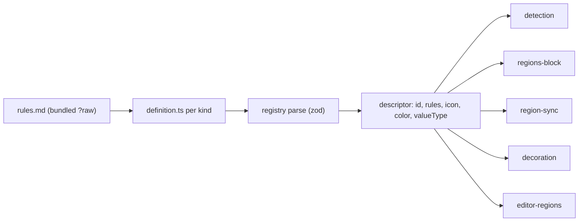

The kind registry is the closed, shipped list of what a region can be about. A kind is a folder holding a prose rules file plus a few lines of config; the registry is the hardcoded map from kind id to descriptor, and the small set of lookups the other five components read. Researchers cannot add a kind — adding one is a commit, the same as adding a block type. Two ship first, `speaker` and `date`, and nothing about the mechanism knows that number. The registry holds no state, calls no gateway, touches no file store: it is data plus lookups, which is why every other component can depend on it and it depends on none of them.

## Contract

Layout mirrors the block-type registry exactly. The generic piece — the descriptor type, the parse, the lookups — lives in `app/lib/regions/kinds/registry.ts`. Each kind is a folder under `app/domain/regions/kinds/<id>/` holding `definition.ts` and `rules.md`, and the registry imports those definitions the way `app/lib/data-blocks/registry.ts` imports `jsonAnnotations` and friends. The file is `rules.md`, not the design sketch's `find_rules.md`, because [detection.md](detection.md) sends the same prose to both of its calls — as `find`'s first message and again as `mark`'s — so a name borrowed from either one would name half the job; the kebab case is what every other file in `app/` uses. One file answers both questions because both are answered by the same thing: a description of what the kind *is* tells the model where an occurrence shows up and how far one reaches. Two files would say that twice and drift.

A descriptor is five fields. Each is here because a named consumer would break without it.

| Field       | Shape                                                                | Read by                                                                                                                                                                                                        |
| :---------- | :------------------------------------------------------------------- | :------------------------------------------------------------------------------------------------------------------------------------------------------------------------------------------------------------ |
| `id`        | lowercase word, equal to the folder name, unique across the registry | [regions-block.md](regions-block.md) stores it in every row and enumerates it in the schema; [decoration.md](decoration.md) keys `inferred_meta` by it; [region-sync.md](region-sync.md) compares stored ids against it at boot; [detection.md](detection.md) labels its hits with it |
| `rules`     | the prose of the kind's `rules.md`, inlined at build time             | [detection.md](detection.md), which passes it as the first message of both calls — the `find` and `mark` prompts are shared across kinds, so what the kind means rides in as content                             |
| `icon`      | a name from `ICON_NAMES`                                             | [editor-regions.md](editor-regions.md), which resolves it through `resolveIcon` inside the label widget at each region start                                                                                     |
| `color`     | a radix token from `BLOCK_COLORS`, distinct per kind                  | [editor-regions.md](editor-regions.md), for the label chip and the hover tint                                                                                                                                   |
| `valueType` | `string` or `datetime`                                                | [decoration.md](decoration.md) picks its reducer by it; [detection.md](detection.md) picks its normalizer strategy by it; [region-sync.md](region-sync.md) picks a kind's runner by it                          |

Applying the subtractive test, five fields were considered and dropped. A human `label`: nothing renders it — a region's label shows the value ("Rutte"), and the ids are already display-ready words. A `normalizer` function or a declared flavour: the flavour follows the value type by decision, so a second field is a second source of truth that can disagree with the first; a consumer reads it off the value type instead, as a total function of it that no kind can contradict. A `version` or prompt hash: rules improving deliberately does not re-derive the corpus, and nothing records which prompt version produced a region — recording it here without a consumer would only imply otherwise. An `appliesTo` or `enabled` gate: every kind runs on every document, and a kind that finds nothing costs one cheap call per scan unit. An endpoint: the two gateway prompts are shared across all kinds, so the endpoint constants stay in [detection.md](detection.md) beside their calls, the way `ENDPOINT` sits in `app/lib/corpus/classify.ts`.

The value type is the join between kinds and the behaviours keyed off it. The registry owns the union and this table; what the other columns name is other components' work, written here only so the table reads whole. Whether a kind needs a corpus-wide vocabulary at all follows from its value type, and that much is this file's to say; how a pass is scheduled around one is [region-sync.md](region-sync.md)'s.

| Value type | Normalizer flavour                                                                            | Shared vocabulary                                          | Reduces to                        |
| :--------- | :--------------------------------------------------------------------------------------------- | :--------------------------------------------------------- | :-------------------------------- |
| `string`   | List-backed — the corpus-wide set of known values goes into the call, which picks one or coins one | Needed, so an occurrence can reuse a value another found    | A distinct set of values          |
| `datetime` | Self-contained — the value is inferred from the text alone to a canonical timestamp, a date-only phrase resolving to start of day | None                                                       | Min and max                       |

Because the union is exported from here, a consumer keyed by value type declares its table as a total map over it. Adding a third value type then fails typecheck at [decoration.md](decoration.md)'s reducers and [detection.md](detection.md)'s normalizers until each is filled in, which is the only mechanism preventing a kind whose values nothing can reduce. The compiler is the whole of that enforcement — a runtime assertion over the shipped kinds would only restate what the maps' types already require.

The two shipped kinds, each folder holding a `definition.ts` and a `rules.md`:

| Id        | Folder                             | Icon                            | Colour   | Value type |
| :-------- | :--------------------------------- | :------------------------------ | :------- | :--------- |
| `speaker` | `app/domain/regions/kinds/speaker/` | `mic`                           | `indigo` | `string`   |
| `date`    | `app/domain/regions/kinds/date/`    | `calendar-days`                 | `amber`  | `datetime` |

The lookups, mirroring the derived helpers around `blockTypes`. Each has a consumer; nothing else is exported.

| Lookup                 | Returns                                                  | Consumer                                                                                                             |
| :--------------------- | :------------------------------------------------------- | :------------------------------------------------------------------------------------------------------------------- |
| `regionKinds()`        | every descriptor, in declaration order                    | [detection.md](detection.md) runs each kind over each scan unit; [region-sync.md](region-sync.md) schedules that pass      |
| `getKind(id)`          | the descriptor, or nothing for an unknown id              | [editor-regions.md](editor-regions.md) resolving icon and colour for a stored row; [decoration.md](decoration.md)      |
| `REGION_KIND_IDS`      | the ids as a non-empty tuple, in declaration order         | [regions-block.md](regions-block.md), as the enum of its `kind` field — the same role `BLOCK_LANGUAGES` plays          |

Declaration order is part of the contract: `regionKinds()` iterates the map in the order kinds are written and `REGION_KIND_IDS` lists the ids in that same order, so a serial pass and any test that snapshots a document's regions are stable across runs. It is one order under two names — [regions-block.md](regions-block.md) pins its stored rows in `REGION_KIND_IDS` order, which is this declaration order — and that is what makes a re-scan finding the same regions serialize to the same bytes, which is what [region-sync.md](region-sync.md)'s write-skip rests on.

Rules files are bundled at build time, not read at runtime. Each `definition.ts` imports its neighbouring `rules.md` with Vite's `?raw` suffix, so the prose is a string constant in the bundle by the time any code runs. Three consequences are the reason for the choice. There is no runtime read, so no I/O failure mode and no async in the registry's surface. There is no path into `app/lib/files/store.ts`, so a rules file can never appear in a researcher's project, be synced to nabu-storage, or be edited as a document. And a missing rules file is a build failure at the import, not a silent empty prompt — `npm run build` and `npm test` both fail naming the unresolved path, which is the intended surface for a mistake only a developer can make; the resolver is the whole check, and a suite in which the absent file could be observed is a suite that does not compile. The cost is a few kilobytes of prose in the JS bundle per kind, which is smaller than one document.

The contract is enforced by parse, not validation. The registry is not the literal object: it is the result of parsing the literal through a Zod schema at module load, and the parsed type is what every consumer sees. The schema takes the colour through an enum built here over `BLOCK_COLORS` (`app/ui/theme/colors.ts`), the icon through `z.enum(ICON_NAMES)` (`app/ui/theme/icons.ts`), the value type through a two-member enum, and the rules through a non-empty-after-trim string; registry-level invariants — ids unique, colours distinct — are checked in the same pass. A parse failure throws at import, naming the kind and the field: shipped data is a build defect, and failing at boot in dev, test, and CI is preferable to a kind that silently detects nothing. The parse is exported separately from the shipped table so it can be exercised on hand-built input.

Every field the parse touches is closed at the type level, the icon included, and that is what the name form buys. An icon is a member of `ICON_NAMES` or the build fails; markup would have been any non-empty string, passing the parse and rendering a broken glyph at runtime. A name also keeps the icon out of the registry's import graph: the descriptor holds a string, never a component, so the module that owns kinds imports no React and the import-graph assertion in Isolation still holds — the component is resolved where the drawing happens, by [editor-regions.md](editor-regions.md), not here. No downstream code can hold a kind with a colour that has no CSS variable, an icon that resolves to nothing, or a value type with no reducer.

Adding a kind is a folder plus one line in the map. Removing one is deleting both — the id lives nowhere else in the app, and the regions already written into documents become unknown: `getKind` yields nothing for that id and `regionKinds()` stops listing it, which is the plain behaviour of a map lookup. Nothing here reports on a removed id, because the component that cares compares against the registry it was handed: [region-sync.md](region-sync.md)'s boot sweep deletes the regions of every kind id absent from its injected `getKinds()`, which is what lets a test run the sweep with a kind removed.

## Prior art

`blockTypes` in `app/lib/data-blocks/registry.ts` is the same shape of problem solved in this repo already: a hardcoded map of id to config, per-item definitions living in `app/domain/data-blocks/<type>/definition.ts`, and a spray of one-line derived lookups (`getBlockConfig`, `isKnownBlockType`, `getSingletonLanguages`) plus a tuple export (`BLOCK_LANGUAGES`) feeding a Zod enum. This component mirrors it — same file placement, same naming, same lookup style — rather than extending it. Kinds are not block types: they key a different namespace, are read by different consumers, and adding region fields to `BlockTypeConfig` would make every one of the seven block definitions carry fields it can never use. Extracting a shared generic registry helper was rejected too: the genuinely shared part is an object lookup and an `Object.keys`, and every interesting helper on either side is field-specific.

`TagDefinition` in `app/domain/data-blocks/settings/schema.ts` is the existing per-item colour-and-icon pair, and the descriptor follows it on both halves: a radix token parsed against `BLOCK_COLORS` and turned into a CSS variable at render, and an icon name parsed against `ICON_NAMES` (`app/ui/theme/icons.ts`) and turned into a lucide component at render through `resolveIcon` (`app/ui/theme/icon-map.ts`), which falls back to `Hash` for a name it does not know. `TagBadge` and the documents sidebar already draw a tag that way, and a region label draws itself the same way. Both enums are built here rather than imported as `radixColor` from `app/domain/data-blocks/attributes/schema.ts`, because that module also exports `annotationIcon`, a `ComponentType` held directly, and importing anything from it drags React and `lucide-react` into the kind registry and therefore into detection, sync and decoration, none of which render anything — besides pointing `app/lib` at `app/domain`, against the layering in AGENTS.md. `app/ui/theme/colors.ts` and `app/ui/theme/icons.ts` are both bare lists of strings with no imports of their own, and `app/lib/chart/color.ts` already reads the colour list from `lib`. The review and lock markers in `app/lib/editor/annotations/decorations.ts` hardcode SVG string literals instead, because those are plain DOM widgets with no React around them; a region label is a React widget view, so it takes the component `resolveIcon` returns and needs no markup form of it.

`app/lib/corpus/classify.ts` is the model for what stays out of here: a module-level `ENDPOINT` constant, a Zod response schema, and a call that formats the corpus-wide list of existing values into the prompt — the list-backed flavour already exists there, for a document's type and its auto-classified subject, which is a different thing from a region and the reason this feature does not use that word. Its endpoint constant stays with the call in [detection.md](detection.md); `app/lib/agent/env.ts` keeps owning the host.

Outside the repo: Vite's `?raw` import is the documented way to inline a text asset into the bundle, which is what makes "rules ship with the app, not with the project" a build-time fact rather than a convention. The parse boundary follows Alexis King's "Parse, don't validate" — the schema's output type is the only kind representation in the app, so invalid states are unrepresentable downstream rather than re-checked. A per-kind JSON or YAML manifest fetched at runtime was rejected: it buys reconfigurability the settled decisions explicitly do not want, and adds a network failure mode to a closed set.

## Tests

### Skeleton

The registry's piece of the walking skeleton is the `speaker` kind existing and parsing: its folder holds a `rules.md` with real prose, `getKind("speaker")` returns a descriptor whose rules string is the file's content, whose icon name and colour token are both present, and whose value type is `string`, which the value-type table above makes list-backed. That single descriptor is what [detection.md](detection.md) builds both of its prompts from and what [editor-regions.md](editor-regions.md) draws with, so the skeleton exercises every field of the contract with one kind and no second kind to hide behind.

### Contract

Given a kind whose rules file exists but is empty or whitespace only, when the registry module loads, then the parse throws naming the kind and the `rules` field, and no consumer ever sees the descriptor.

Given a descriptor whose colour is not in `BLOCK_COLORS`, when the registry parses, then it throws naming the kind and the field, rather than producing a region tinted by a CSS variable that does not exist.

Given a descriptor whose `icon` is a name outside `ICON_NAMES`, when the registry parses, then it throws naming the kind and the field, instead of every region of that kind quietly rendering `resolveIcon`'s fallback glyph.

Given two kinds declaring the same colour, when the registry parses, then it throws — two kinds rendering identically in the editor defeats the point of a per-kind colour, and this is a registry-level invariant no per-field schema catches.

Given two kinds declaring the same id, when the registry parses, then it throws — the second would otherwise shadow the first, and [regions-block.md](regions-block.md)'s enum would offer one kind that resolves to another's rules.

Given the shipped registry, when `REGION_KIND_IDS` is compared against the map's keys, then they agree in content and order — the drift that would let [regions-block.md](regions-block.md)'s enum reject a kind the registry serves.

Given the shipped registry, when each kind is inspected, then its id equals its folder name and its rules string is the content of that folder's `rules.md` — the mistake of a copied definition importing its neighbour's prose.

### Isolation

The registry runs alone in the `unit` Vitest project, node environment, with no LLM, no file store, no editor, and no DuckDB. Its only imports are Zod, the shared colour and icon name lists, and the `?raw` rules text that Vitest resolves through the same Vite pipeline the app build uses, so the isolated test proves the bundling decision as a side effect. The shipped-kind cases are one table-driven test over `regionKinds()`, asserting per kind what the contract claims. The failure cases never touch the shipped table: they call the exported parse on hand-built entries — a bad colour, an icon name outside `ICON_NAMES`, blank rules, a duplicate colour, a duplicate id — one row each, since the parse is the whole enforcement surface. An import-graph assertion keeps it honest, failing if the registry module ever reaches `~/lib/files/store`, the agent client, or a React component; that assertion is what keeps the five consumers able to import kinds without dragging the app in behind them.
