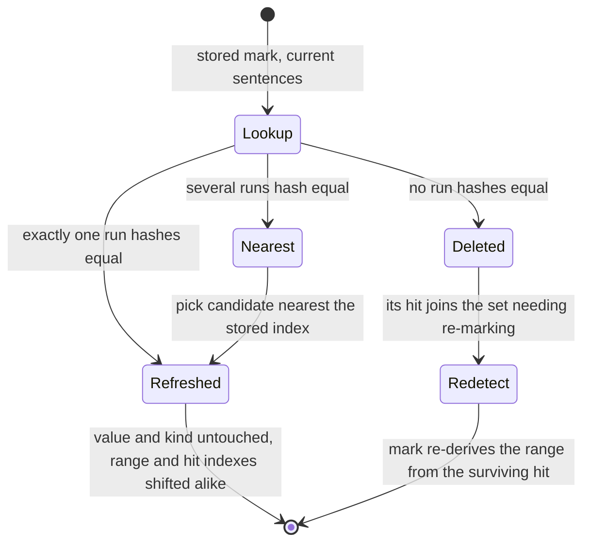

The lifecycle layer: a debounced background sync that watches the file store, decides which scan units need a `find` and which hits need a `mark`, drives [detection.md](detection.md) for both, and writes the block [regions-block.md](regions-block.md) defines. It is the only component in this feature that writes files. It owns triggering, ordering, how many calls run at once, invalidation, relocation, and the boot-time cleanup; it owns nothing about how a kind is described ([kinds.md](kinds.md)), what a detection call looks like, or how the result is read back ([decoration.md](decoration.md), [editor-regions.md](editor-regions.md)).

## Contract

`startRegionSync(deps)` lives at `app/lib/regions/sync.ts` and returns a handle, in the same family as `startEmbeddingSync` and `startCorpusSync`. It is started once per project from `app/domain/regions/init.ts` (mirroring `startTopicAssignment`) and wired into the boot sequence in `app/routes/project.tsx`.

### Deps

| Field | Shape | Why it exists — named consumer |
| :--- | :--- | :--- |
| `getFiles` | `() => FileStore` | The pass diffs this against its own snapshot to find changed documents, exactly as the other three syncs do. |
| `getFile` | `(path: string) => string \| undefined` | Read back at write time. A pass that has been running for minutes must see the current raw before patching it, and `undefined` is how it learns the document was deleted mid-pass. |
| `subscribe` | `(listener: () => void) => () => void` | Bound to `subscribeContentChanges`, not the raw store: the embedding sync's companion writes must not wake this sync. The returned unsubscribe is what `stop` calls. |
| `getKinds` | `() => KindDescriptor[]` | The registry from [kinds.md](kinds.md), read once per pass and once by the boot sweep. Injected rather than imported so a test can run one kind, or run the sweep with a kind removed. Every comparison this component makes against the registry is against the ids this returns; nothing here reaches into the registry for a lookup of its own. |
| `detect` | `{ find, mark }` | The two calls owned by [detection.md](detection.md), bound to the real gateway in production. `find` takes one scan unit — its sentence texts and the index of its first sentence — together with the kind and the known values to reuse from, and returns that unit's hits; `mark` takes one hit and its window and returns that hit's range. Each is the shape of a single call and nothing more: how many run at once is this component's decision, stated below, and detection issues none of them. This is the only network reachable from this component, and it is reachable only through this field. Detection's pure parts — window computation over a kind's hits, overlap resolution over a kind's marks — are imported rather than injected, because they take values and return values and there is nothing in them to fake. |
| `writeRegions` | `(path: string, next: RegionsBlock) => "written" \| "unchanged" \| "failed"` | The only write, and it reports which of the three outcomes happened. Production binds it to a wrapper that runs `patchBlockContent` first and calls `executeFileAction` with `skipPendingRefs: true` only when the patch applies — the same write path topic classification already uses, with the same "user" actor stamp and the same mutation-history entry. Three-valued rather than boolean because `patchBlockContent` answers `{ok: false, error: "No changes"}` when the rewritten block is byte-identical to the stored one, which is the ordinary outcome of a document nothing moved in and not a failure at all; the wrapper maps that answer to `"unchanged"` and every other non-applying patch to `"failed"`. The wrapper exists at all because `executeFileAction` returns `void` and logs-and-continues on a patch that does not apply, which would leave a failed write indistinguishable from a successful one here. Injected so isolation tests never touch `updateFileRaw`. |
| `onProgress` | `(processed: number, total: number) => void`, optional | The boot status line in `app/routes/project.tsx`, weighted beside embeddings and topics. |

There is no `deleteFile`. Regions live inside the document, so a deleted document takes its regions with it — the companion-cleanup branch that `startEmbeddingSync` needs has no counterpart here.

There is no clock dep. The only clock this component touches is the ambient `setTimeout` inside `debounce`, at the boundary, in `startRegionSync` itself; tests control it with fake timers. Everything below the boundary — the hit diff, the mark reconcile — is pure and takes no time, no store, and no gateway.

### Handle

| Field | Shape | Why it exists — named consumer |
| :--- | :--- | :--- |
| `ready` | `Promise<void>` | `project.tsx` awaits the first pass during boot before clearing the loading screen, the way it awaits `startTopicAssignment`. |
| `tick` | `() => Promise<void>` | A forced run, under the same serialization as the debounced ones. Consumers: the boot sequence (`ready` is the first `tick()`), and every test that needs a pass without waiting out a debounce. |
| `stop` | `() => void` | `project.tsx`'s effect cleanup on project switch or unmount. Unsubscribes, cancels the pending debounce, clears any pending re-run, and aborts the in-flight pass. Unlike the existing syncs, which leak their subscription harmlessly because they write companions and attributes, a pass surviving a project switch would write documents belonging to a project the app has left. |

### Trigger

`subscribe` feeds a `debounce(tick, 5_000, { maxWait: 30_000 })`, and `tick` is `serialize`d so two passes can never overlap.

`serialize` alone drops what it cannot run: a call arriving while a pass is active gets the in-flight promise back and never runs on its own. That is the same drop the `syncing` boolean in `startEmbeddingSync` performs, and it is wrong here, because the fire that was dropped may be the only signal that a document changed under a running pass — a pass can run for minutes, the change may be to a document the pass has already passed over, and nothing else in the project need ever change again to produce another fire. So `tick` is `serialize` plus a rerun-requested flag: a fire that lands during a pass sets the flag, and the flag is checked when the active pass settles, running exactly one more pass however many fires it absorbed. That flag is new work — a dozen lines in `sync.ts`, not an extracted primitive, until a second caller wants one.

Five seconds is `EMBEDDING_SYNC_DEBOUNCE`, and this sync is the embedding sync's neighbour: the same size of work per call — one bounded stretch of a document, measured in characters — and the same "one network call per unit" cost. The 200ms used by BM25 and DuckDB is for local index work and would put a model call behind every pause in typing. The 30s of `CORPUS_SYNC_DEBOUNCE` is tuned to one whole-document classification whose answer is worthless mid-edit; regions are user-visible chrome in the editor and a half-minute lag after every edit reads as broken. The 30s `maxWait` bounds the other end: a long uninterrupted typing session on a transcript would otherwise never sync at all. The cost of the ceiling is a pass fired mid-edit whose results are partly invalidated by the next keystroke; the user sees no flicker for it, because stale regions stay on screen (below).

### What a pass does

Changed documents are those where `getFiles()[path]` differs from the snapshot and `isEmbeddableFile(path)` holds — the same filter the embedding and corpus syncs use, so hidden files, companions, `preferences.md`, and `settings.hidden.md` are never scanned.

For each changed document the pass computes `indexFileSentences(raw)` — the canonical sentence array [regions-block.md](regions-block.md) indexes into and computes `rangeHash` over — and cuts it into scan units with [detection.md](detection.md)'s accumulation function, the same pure function the calls themselves are built from, so the side that schedules and the side that calls draw identical boundaries. A unit is a contiguous run of canonical rows, so it is a pair of array positions plus the content hash [regions-block.md](regions-block.md) stores, and a hit belongs to the unit whose range contains its `hitSentence` — a comparison of two integers, with nothing to align and nothing to map. Units accumulate to `CHUNK_CHARS`, a thousand characters of joined sentence text; nothing here counts tokens.

The stored block is read through the undecorated parse — the one exemption [decoration.md](decoration.md) grants, and it grants it to its own resolver for the same reason it is taken here. Decoration hangs `inferred_meta` on region rows of every kind, so a decorated read of a document carrying two kinds hands back rows this component never wrote; the block it derives from them is no longer byte-identical to the stored one, the write-skip below never fires, and because `patchBlockContent` compares before `normalizeFile` strips the field, the wrapper reports a real write and `executeFileAction` pushes a mutation-history entry on every idle pass — `pushEntries` runs before `updateFileRaw`'s no-op check, so the entry lands whether or not the raw changed.

Nothing here splits its own sentences, accumulates its own units, or restates either recipe. The writer and the re-deriver must hash identical rows, and a second derivation of nearly-the-same prose is a hash that never matches and a region set deleted on every pass.

Then, per registered kind:

1. **Hit diff.** The block's `scanned` record holds, per kind id, one entry per scan unit `find` has already run over: the unit's hash, and the index of its first sentence at the time it was scanned ([regions-block.md](regions-block.md) owns both fields). A current unit whose hash is in that kind's entry is not found again; a unit whose hash is absent needs a `find`. A surviving hash sitting at a different first-sentence index is a unit that moved without changing, so its stored hits are kept and every index on them shifts by that delta — that is the narrow case the stored index exists for, because accumulation is greedy and an upstream sentence insertion re-cuts every unit below it, but a re-cut resynchronises as soon as a boundary falls where one fell before, and past that point the old hashes reappear whole at new positions; a hash no current unit carries is a unit whose text changed, so its hits are dropped and the unit is re-found. That is the whole rule, and it is computable from the stored hits, the `scanned` record and the current units alone — no detection call, no gateway, and nothing detection has to tell it.
2. **Mark reconcile.** Stored marks are relocated or deleted against the current sentence array (below), independent of the hit diff. A mark's lifetime is the content inside its own range, so it survives a re-find of the unit its hit was originally located in.
3. **Mark work.** Steps 1 and 2 are rejoined here: a hit and a mark are the same occurrence when they agree on kind, value and `hitSentence` once both have been refreshed onto the current sentence array. A hit needs a `mark` when this pass found it and no surviving mark answers to it, or when step 2 deleted its own mark. A re-found hit that lands on a relocated mark inherits it and costs nothing, and a hit already stored with no range — the row [detection.md](detection.md) records when `mark` failed — is left alone until its unit changes, so a failing occurrence is retried when there is new text to retry it on rather than on every pass forever. Windows come from [detection.md](detection.md)'s pure computation over the kind's full hit set for the document, because a window is bounded by the neighbouring hits of its kind and the survivors are what place a re-marked hit's window. This component issues the calls, one per hit needing one. When they return, the kind's complete mark set for the document — every relocated survivor together with every mark this pass produced, never only the new ones — goes through [detection.md](detection.md)'s overlap resolution, and what comes back is what is written. Handing over the whole set is what makes its guarantee that same-kind regions never overlap a fact about the document rather than about one pass's output, and that guarantee is what [regions-block.md](regions-block.md) rests row identity on. This is also what makes deleting a mark cheap: the hit that produced it survives step 1, so re-marking costs no second `find`.
4. **Write.** One `writeRegions` per document, once, after every kind for that document has finished. Not one write per kind and not one per mark: `updateFileRaw` re-normalizes and structurally validates the whole file on each call, and its per-path persist debounce would coalesce them anyway. The written block carries a `scanned` entry for every registered kind, holding the entries that kind already had whose hash a current unit still carries — each at that unit's current first-sentence index — plus one entry per unit this pass found over. An entry whose hash no current unit carries leaves the record with the hits that sat under it, so the record cannot outgrow the document. A document whose derived block is byte-identical to the one on disk is not written at all: the wrapper reports `"unchanged"` and the pass moves on. That comparison is meaningful only because [regions-block.md](regions-block.md) fixes the canonical order of rows inside the block, so two passes over an unchanged document derive the same bytes rather than the same set.

Every kind runs on every document. A kind that finds nothing costs one `find` per unit the first time it sees those units, produces no `mark` call, and is never asked again until they change — a kind whose current units are all in its `scanned` entry is not re-found, which is the whole difference between a document a kind found nothing in and a document that kind has never seen.

### Ordering and concurrency

How many calls run at once is this component's, and only this component's: [detection.md](detection.md) fixes the shape of one call and issues none of them. Parallelism runs on the kind axis. Different kinds are independent and run concurrently, each over its own queue of (document, unit) work items.

Within a kind, the runner follows from the `valueType` on the descriptor `getKinds` already handed over, read like any other field on it. There is no lookup by kind id, here or anywhere else in this component: a fixture kind a test invents gets the same reading as a shipped one, because the descriptor in hand is the whole input.

- **List-backed** (`speaker`) — a `valueType` whose values are entries in a vocabulary every call has to agree on: fully serial, down to the unit, across the whole pass. One work item at a time, so every `find` is handed the values every earlier `find` returned.
- **Self-contained** (`date`) — a `valueType` whose values are derivable from the text alone: no shared vocabulary, so it fans out through `processPool` at the pool's default concurrency.

The mechanism is one `createKeyedQueue` keyed by kind id for the list-backed kinds — same key chains, different keys interleave — with self-contained kinds going through `processPool` instead. Both run inside the same serialized `tick`.

What makes that serialization worth anything is an in-pass vocabulary accumulator, one per list-backed kind, owned here and by nothing else. It is seeded at the top of the pass from the values the file store already holds for its kind, every value a `find` returns is added to it as that call settles, and the next call is handed the result — so the store is the seed and the accumulator is the truth for the length of the pass. It has to be, because the block is written once per document after every kind has finished: a value coined over unit 2 of a transcript is not on disk when unit 7 of the same transcript runs, and a speaker recurring across a transcript is exactly the case the serialization exists for. Two units meeting an unseen name with only the store to go on would each invent a value and the corpus would carry `rutte` twice, which is the drift the shared vocabulary exists to prevent.

**Assumption, flagged.** Serial list-backed kinds mean a first pass over a large corpus does `speaker` one unit at a time, and the wall-clock is linear in units. The escape is the one the repo already took for topics: fan out anyway and merge near-duplicate values afterwards with `app/lib/corpus/cluster.ts`. Serial ordering and the absence of a merge pass are a single trade and flip together; if the first-pass wall-clock proves unacceptable, both change in one edit.

### Two artifacts, two lifetimes

A hit belongs to a scan unit and dies when that unit's content changes. A mark belongs to an occurrence and dies when the content inside its range changes. The two lifetimes are genuinely independent in both directions: deleting a mark never deletes the hit that produced it, and re-finding a unit never deletes a mark whose range content is still there — the re-found hit inherits it.

Invalidation is destructive, not clever: when a mark's range content has changed, the mark and its range are deleted outright and whatever the re-run produces stands on its own. There is no attempt to patch a range's edges.

Relocation is what keeps that rule from being ruinous. A mark stores a hash of its range content ([regions-block.md](regions-block.md) owns the field and the recipe). On re-derive, the current sentence array is indexed by the hash of each consecutive run whose length matches a stored mark's run length — a map keyed by content hash, the same shape as `diffChunks`. Then:

A relocated mark's `hitSentence` shifts by the same delta its range moved. It has to be stated because it does not follow from the hash, which covers the range and nothing else, and because `hitSentence` may legitimately sit outside its own range — the trailing-attribution case, where the sentence naming a speaker follows the text attributed to them. Under the shift relocation is built for, the hit sentence and the range travel together, so the range's delta is the right answer for both. When the hit sentence's own text changed rather than merely moving, the delta is no longer evidence about it: its unit's hash changed, so step 1 has already dropped the stored hit, the refreshed mark meets nothing at step 3, and an orphaned mark is dropped rather than written — the re-found unit's hits are marked afresh.

The one thing that diagram proves: a position change is not an invalidation. Inserting two sentences near the top of a document shifts every index below by exactly two, which is a pure shift the hash sees straight through — every mark below relocates and not one `mark` call is issued for them. Only the sentences that actually changed lose their marks. Ambiguous runs are the transcript case: twenty identical "Yeah." sentences all hash the same, and the tie-break is the candidate whose start is nearest the stored index, with an exact tie resolving to the earlier candidate so the result is deterministic.

**Assumption, flagged.** This relocate-on-shift rule was proposed from the shape of `diffChunks` rather than settled in the design conversation. If it proves wrong — for instance if ambiguous runs relocate to visibly wrong places in real transcripts often enough to matter — the fallback is to delete on any index change and re-mark, which is correct and merely expensive.

Note the asymmetry between the two artifacts under an upstream insert. Units accumulate greedily to `CHUNK_CHARS`, so sentences inserted near the top re-cut the units below them: the rows fall into different units, their hashes change, and they are re-found however untouched their prose. No stored index rescues them, and none is meant to — the index earns its place on the narrower case above, where the re-cut resynchronises and a unit comes back with the hash it had at a new position. Marks are indifferent to the whole question: they relocate on `rangeHash` over their own range, which knows nothing of unit boundaries, so the expensive call is spared either way — the re-found hits land back on the relocated marks and not one `mark` follows. That is the cheap call paying for the expensive one, which is the arrangement worth having.

Stale regions stay on screen while a re-find is in flight. Nothing blanks the block: no write happens until the pass has results, so the previous block stays on disk and the editor keeps rendering the previous regions, matching what annotations already do.

### The pure seam

Both rules are pure functions over prior state and new content, in `app/lib/regions/reconcile.ts`, beside the sync and imported by it:

- `reconcileHits(storedHits, scanned, units)` returns kept hits (indexes refreshed by their unit's shift), dropped hits, the units needing a `find`, and the kind's next `scanned` entry. Everything it needs is the stored state and the units this pass derived: it issues nothing, waits for nothing, and knows nothing about detection.
- `reconcileMarks(storedMarks, sentences)` returns kept marks (indexes refreshed) and deleted marks, where `sentences` is the array `indexFileSentences` produced for this pass.

Neither takes a clock, a store, a gateway, or a dep object. `sync.ts` holds the subscription, the debounce, the queues, the calls, and the writes; every decision about what survives an edit is testable as data in, data out. This is the same split `startEmbeddingSync` has with `diff.ts`, and it is where the bulk of the contract tests below sit.

### Failure, concurrency with the editor, and edge cases

**A write fails.** `writeRegions` can throw `FileCorruptionError` from `updateFileRaw`, or report `"failed"` because the patch did not apply. Both are failures, both are caught per document, logged with the path, and the pass continues with the next document. `"unchanged"` is neither, and the distinction is the whole reason the wrapper is three-valued: a derived block byte-identical to the stored one is the ordinary outcome for a document nothing moved in, and counting it would quarantine healthy documents — the idle pass after a self-write, a document whose edit changed no unit hash and no range, and an edit inside a fenced block all land there, and a quarantine meant for corrupt files would swallow all three. The failing document's snapshot entry is not advanced, so the next tick retries it. Because a failed write also means the pass's hits were never persisted, a document that fails forever would re-issue every `find` and `mark` on every tick; so consecutive failures are counted in memory per path, and after three the document is skipped until its content changes again or the page reloads, with one error logged when the quarantine engages.

**The document changes while its own pass is in flight.** The pass runs to completion against the content it started from. At write time it re-reads with `getFile` and compares the sentence array it derived from against the current one; if they differ, the freshly derived marks are put through `reconcileMarks` against the current array before writing, so a mark whose text moved is refreshed and a mark whose text is gone is dropped rather than written at a stale index. The document's snapshot entry is not advanced, so the next tick re-diffs it and re-finds whatever actually changed. The snapshot is therefore a per-document map updated as each document completes, not the single whole-store snapshot the existing syncs advance at the top or bottom of the pass — a pass here can run for minutes, and a whole-store snapshot would swallow every edit made during it.

**A pass is abortable.** `stop` aborts between work items; a call already in flight is not cancelled, but its result is discarded and no write follows. Writes already committed for earlier documents stand — they are complete, correct blocks, and the next session's diff picks up from them.

**A document is deleted mid-pass.** At write time `getFile` returns `undefined`; the results are discarded, the path is dropped from the snapshot map and from the failure counters, and nothing is written. Writing would resurrect the document in the store and push it back to the server.

**A fresh document with no block at all.** Identical to a document with an empty `scanned` record: every unit gets one `find` per kind. Nothing about "no block yet" is special-cased.

**A document where every kind finds nothing** still gets a block written, holding no regions and a `scanned` record carrying every unit under every kind. Without that record the next boot has no evidence the document was ever scanned and re-scans the entire corpus every session, which is far more expensive than one small block per document written once.

**Self-write termination.** The block lands in the visible document, so the write does wake the subscription — `subscribeContentChanges` filters hidden-file churn, which is not this. Termination comes from the sentence array instead: `indexFileSentences` removes fenced blocks before splitting, so the `json-regions` block is invisible to it and writing the block shifts no sentence index and changes no unit hash — [regions-block.md](regions-block.md) calls that exclusion load-bearing, and this is what it is bearing. The woken pass re-derives the same units, every hash is already in the kind's `scanned` entry at the same first-sentence index, no `find` runs, no mark loses its hash, the derived block is byte-identical to the one on disk, and the write is skipped as `"unchanged"`. That last step holds however many kinds are registered only because the block was read undecorated: a decorated read would hand back rows carrying `inferred_meta` for every kind but the one being derived, and the byte comparison would fail forever. Exactly one idle pass per write, with zero calls and zero writes, then quiet.

### Boot sweep

A kind removed from the registry has its regions deleted from the documents at boot. The sweep runs once per session at the existing boot-pass slot in `app/routes/project.tsx`, beside `auditPendingRefsAtBoot`, after the file load settles and before the first `tick`. It reads every embeddable document's block, and for each document carrying regions or a `scanned` entry under a kind id absent from `getKinds()`, writes the block back without them — or writes no block at all when nothing survives. Documents with no unregistered kinds are not written. This is the first boot pass in the repo that mutates documents rather than logging, and it says so out loud: it goes through the same `writeRegions` path, and therefore the same per-path 500ms persist debounce, so a corpus-wide removal is a burst of writes at startup. Projection-time filtering was considered and rejected by the user in favour of the sweep, on the understanding that the burst can later be batched onto save.

The comparison is by kind id only, against the ids the injected `getKinds()` returned and never through a registry lookup of its own — which is what lets a test run the sweep by handing it a smaller registry than the one the pass ran with. A kind that is still registered but whose rules file or shared prompt was edited triggers nothing.

### Rules changes do not re-derive

Improving a rules file or a shared prompt does not invalidate anything. New and edited documents pick up the better rules when their own prose changes; existing regions persist. Known and accepted: the corpus holds results from a mix of prompt versions, and nothing records which version produced which region.

### Progress

`onProgress(processed, total)` counts completed work items against the total for the pass, where a work item is one (kind, document, unit) `find` plus any `mark` it triggers. The boot pass is the one that matters to the UI; later ticks report to the same callback, which the route ignores once loading is done.

## Prior art

**In this repo.**

`startCorpusSync` is the closest model and the one mirrored: same deps shape minus the language callback, `serialize`d `tick`, `ready` as the first tick, `subscribeContentChanges` rather than the raw store, and writes into the document's own blocks through `executeFileAction` with `skipPendingRefs: true`. Four things are taken further: the snapshot is per-document rather than whole-store, because a pass here is long; `serialize` gains a trailing re-run, because a dropped fire here can be the last one; the handle gains `stop`, because this sync writes documents; and write failures are counted rather than only logged, because a failing document here re-issues model calls rather than one classification.

`startEmbeddingSync` supplies the shape of the work — one bounded stretch of a document per network call — `isEmbeddableFile` as the file filter, and `processPool` for the fan-out kinds. Its chunker is not used and could not be: `chunkFileForEmbedding` measures offsets into `extractProse(content)`, which is not the string the canonical sentence rows index, so a chunk hash could never name a run of rows and no fuzzy match rescues it in either direction. [detection.md](detection.md) accumulates units out of the canonical array instead, and this sync calls that. Its `syncing` boolean is rejected, but not in favour of bare `serialize`: the two have the same drop semantics and differ only in what they hand the caller back. Dropping is fine for embeddings, whose snapshot is not advanced on the dropped path and whose next notification is one keystroke away. It is not fine for a sync whose pass outlives several edits to documents it has already passed over, which is what the rerun flag above buys.

`diffChunks` is the model for both reconcile functions, and for the rule that makes this feature affordable: it builds a map keyed by content hash and, on a hit, keeps the existing entry while overwriting its offsets from the new chunk. Position changing is not invalidation there either. `reconcileHits` is nearly that function over scan units, with the embedding-width check swapped for a kind's `scanned` entry and the stored first-sentence index supplying the shift; `reconcileMarks` is the same idea applied to consecutive sentence runs.

`shouldReclassify` and `contentHash` from the topics selectors are the existing skip-if-unchanged pattern and are rejected here: a document-level hash written into the document's own attributes would work, but this sync already has per-unit and per-range hashes, and a document-level gate would only re-derive the whole document for a one-sentence edit.

`startBm25Sync` is rejected as a model: it is synchronous, touches no network, writes no files, and its 200ms debounce and whole-index rebuild answer none of the questions this component has.

**Should a common part be extracted rather than a fourth copy written?** Not yet. What the three existing syncs share — a `previousFiles` snapshot, a debounce, a `ready` handle — is about fifteen lines, and what they disagree about is the substance: snapshot advanced at the top (corpus) versus the bottom (embeddings) versus not at all (bm25), sync versus async, drop-on-overlap versus a trailing re-run, delete-handling present or absent. A base extracted today would grow an option for each. The honest sequencing is to write the fourth, then extract, because this one introduces the per-document snapshot and the re-run flag that the other two probably want; if that turns out to be right, the extraction has real shared behavior to carry rather than only bookkeeping.

**Online.** The W3C Web Annotation Data Model pairs a `TextQuoteSelector` with a `TextPositionSelector` and treats the quote as the truth and the position as a hint; Hypothesis's anchoring implementation resolves an ambiguous quote by choosing the candidate nearest the recorded position. That is precisely the relocation rule and the tie-break above, arrived at independently, and it is reassuring that a system anchoring millions of annotations against edited documents settled on the same two rules.

## Tests

### Skeleton

This component's piece of the walking skeleton: with one kind registered (`speaker`) and one small transcript document that fits a single scan unit, a store change wakes the debounce, the debounce fires one serialized pass, the pass issues one real `find` and one real `mark` through the gateway, and a `json-regions` block appears in the file. Green here means the subscription, the debounce, the unit accumulation, the kind registry, both detection calls, and the write path are connected. The editor label, the `regions` table, and `inferred_meta` are the other components' pieces of the same run.

### Contract

Riskiest first.

Given a long document with marks throughout and a stored hash on each, when two sentences are inserted at the very top and a pass runs, then every mark below the insertion is kept with its range and its `hitSentence` both shifted by exactly the inserted length — including a mark whose hit sentence sits outside its own range — their values are byte-identical to before, and not one `mark` call is issued — the re-cut units below the insertion are re-found, and every hit that comes back lands on the mark that relocated to it. This is the case the whole hash rule exists for; if it fails the feature is unaffordable.

Given a document containing bullets, bold runs, links and a table, when a pass writes marks and a second pass re-derives them with the document unchanged, then every stored hash matches a run and not one mark is deleted — the writer and the re-deriver split the same array, and a document whose markdown survives one splitting but not the other is where that would show.

Given a transcript with twenty identical "Yeah." sentences each carrying its own mark, when an unrelated paragraph elsewhere is edited and a pass runs, then each mark relocates to the candidate nearest its stored index rather than all twenty collapsing onto the first, and an exactly equidistant tie resolves to the earlier candidate on every run.

Given a document with three marks, when a word inside the second mark's range is changed, then the second mark is deleted and its hit joins the set needing a `mark` call, while the first and third are kept with refreshed indexes and no `mark` call is issued for their hits.

Given a kept mark and a re-marked hit of the same kind whose new range runs across it, when the pass resolves the kind, then every mark that kind has in the document — the kept one included, not only the one this pass produced — is handed to [detection.md](detection.md)'s overlap resolution, and the written block holds no two same-kind regions over the same sentence.

Given a document of four scan units whose hashes are all in the kind's `scanned` entry, when a word inside the second unit changes without changing the sentence count, then only that unit is sent to `find`, the other three units' hits are kept, the departed hash leaves `scanned` and the new one enters it, and marks outside the changed unit survive — deleting a mark does not delete its hit, and changing a unit does not delete marks elsewhere. Given instead an insertion after which the re-cut resynchronises, so a later unit's rows are cut at the boundaries they were cut at before and its hash comes back unchanged at a new position, then that hash keeps it out of `find` and its hits are refreshed by the difference between its stored first-sentence index and its current one, which is the half of the `scanned` entry a hash alone cannot supply.

Given two kinds registered whose descriptors differ only in `valueType`, one list-backed and one self-contained, when a pass runs over several documents, then the list-backed kind's `find` calls never overlap in time and each is handed every value the previous calls returned, while the self-contained kind's calls are handed no values and overlap freely — and neither kind's values appear in the other's call.

Given a list-backed kind and a corpus of many units all containing an unseen value, when a pass runs, then exactly one value is created, not one per unit — including for units of the same document, whose block is not written until every kind has finished, so only the accumulator can carry the value between them.

Given a pass in flight, when two store notifications arrive before it settles, then no second pass starts while the first runs, exactly one further pass runs when it settles, and that pass sees the writes the first made; and given no notification during a pass, then no further pass runs at all.

Given a document whose write throws `FileCorruptionError`, when the pass runs, then the error is logged with the path, the remaining documents in the pass still complete and write, and the failing document's snapshot entry is not advanced so the next tick retries it; after three consecutive failures the document is skipped with one error logged, and it becomes eligible again when its content changes.

Given a document whose write reports `"failed"` because the patch did not apply, when the pass runs, then it is treated exactly as the throw is — logged with the path, snapshot entry not advanced, counted toward the same quarantine — and no block is recorded as written for it. Given instead a document whose derived block is byte-identical to the stored one, when the pass runs, then the write reports `"unchanged"`, nothing is logged, the failure count stays at zero however many passes run, and the document is never quarantined.

Given a document deleted from the store after its `find` returned but before the pass writes, when the pass reaches the write, then nothing is written and the store still has no entry for that path.

Given a document edited while its own pass is in flight, when the pass reaches the write, then the derived marks are reconciled against the current sentence array first — marks whose text moved are written at the new indexes, marks whose text is gone are not written — and the document is still considered dirty on the next tick.

Given a stored block carrying regions and a `scanned` entry for a kind that is no longer in the registry, plus a sibling document carrying only registered kinds, when the boot sweep runs, then the first document is written without that kind's regions and without its `scanned` entry, and the second is not written at all.

Given a kind whose rules file has changed but whose id is unchanged, when the boot sweep and the first pass run, then no document is written and no detection call is made.

Given a document carrying existing regions under two registered kinds — two, because one kind is the one shape in which a decorated read of the block would go unnoticed — when the sync writes its block, then the pass woken by that write re-derives units whose hashes all sit in `scanned` at their stored first-sentence indexes, issues zero detection calls, derives a block byte-identical to the stored one and therefore performs zero writes, and no mutation-history entry is pushed for the idle pass. The self-write loop terminates after one idle pass, and the skip follows from the byte comparison rather than from a rule about writes that only this test knows.

Given a document where no kind finds anything, when the pass completes, then a block is still written holding no regions and a `scanned` record covering every unit under every kind, and a second pass over the unchanged document issues no `find` calls.

Given a re-find in flight for a document, when the block is read during the pass, then the previous regions are still present — nothing blanks between invalidation and the new write.

Given `stop` called during a pass, when the in-flight call resolves, then its result is discarded, no further work items start, no write follows, and a fire absorbed by the rerun flag before `stop` does not start a pass afterwards.

### Isolation

The sync runs alone, with no editor, no DuckDB, no gateway, and no real file store.

`detect.find` and `detect.mark` are fakes honouring [detection.md](detection.md)'s contracts, each taking one unit and one hit respectively: table-driven, returning canned hits per unit text and a canned range per hit, and recording call order, call timing, the known-value list each `find` was handed, and which hits each `mark` was issued for. Ordering and serialization tests assert against that recording — that a list-backed kind's calls never overlap is a property of the recorded intervals, not of a sleep.

The file store is a plain object behind `getFiles`/`getFile` with a manual `subscribe` the test fires by hand, and `writeRegions` is a spy that records `(path, block)` pairs and can be told to throw or to report any of the three outcomes. The `FileCorruptionError`, patch-did-not-apply, unchanged and quarantine cases need nothing more than that spy.

`getKinds` returns a fixture registry, so the boot sweep test is "run with two kinds, then run the sweep with one" and the concurrency test is "one descriptor of each `valueType`" — fixture ids the shipped registry has never heard of, which is only workable because nothing here resolves a kind by id.

Time is controlled with fake timers: the debounce interval and its `maxWait` are asserted by advancing the clock, and every other test calls `tick()` directly and awaits it, so no test waits on a real 5 seconds. The rerun test needs one more handle on time — a fake `find` whose promise the test resolves by hand, so a notification can be fired at a moment when a pass is provably still active.

The two reconcile functions need none of that scaffolding. They are exercised as plain table-driven unit tests — prior state and new content in, kept and deleted out — which is where the relocation, ambiguity, and destructive-invalidation cases are pinned; the sync-level tests above only need to prove those results reach the calls and the write.
