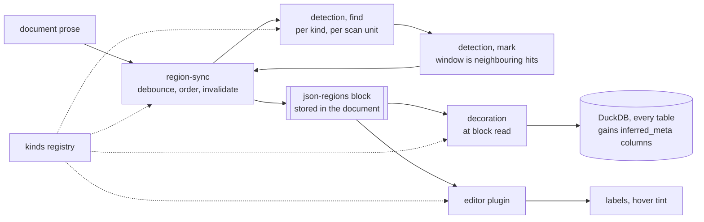

# Region finder

Nabu documents carry annotations — short spans marked with a code. They carry nothing that says *who is speaking here* or *what date this passage is from*, so a transcript is a flat wall of coded spans with no way to ask which ones are Rutte's, and a diary is one document with no way to order its entries. The region finder adds a second layer of markup that cuts a document into **regions** rather than spans. A region has a **kind** — `speaker`, `date` — and a **value** drawn from a vocabulary shared across the whole corpus, so `rutte` is one person in every file rather than four spellings. Detection is entirely automatic and cheap: one model call finds the occurrences in one stretch of the document, a second marks out which sentences each occurrence owns, and the result is written into the document as a `json-regions` block. Then at read time every JSON block in that document is decorated with `inferred_meta` naming the regions it sits inside — which is the point of the whole thing, because it turns "all annotations in text spoken by John" and "all charts within March 3rd" from a reading exercise into a SQL query.

## Components

- [kinds.md](kinds.md) — the shipped registry of kinds: what a kind consists of, where its rules and config live, and what happens when one is added or removed.
- [regions-block.md](regions-block.md) — the `json-regions` data block: schema, registry entry, stored row shape, the sentence coordinate system every other component indexes against, and the `regions` table it projects to.
- [detection.md](detection.md) — the two gateway calls, `find` and `mark`, the windows they run over, and the normalization between them.
- [region-sync.md](region-sync.md) — the debounced watcher: when detection runs, in what order, what survives an edit, what dies, and the boot cleanup.
- [decoration.md](decoration.md) — the read-time `inferred_meta` layer: scope, regions in scope, reduce, append — and where it hooks in so the projection sees it.
- [editor-regions.md](editor-regions.md) — the ProseMirror plugin drawing region labels and hover tints.

## How data flows

What this proves: every consumer reads the stored block, never the pipeline that produced it. Detection could be replaced wholesale — a different model, a regex, a human — and neither the editor nor the database would notice.

The dotted edges are lookups rather than flow, and no two of them ask for the same thing. Detection reads a kind's rules; region-sync reads its declared value type to decide whether the kind needs a shared vocabulary and therefore how to schedule it; decoration reads the same value type to pick a reducer; only the editor reads its icon and colour. [regions-block.md](regions-block.md) reads the registry too, for the list of kind ids its `kind` field is an enum over — that one is a schema-time dependency rather than a runtime lookup, which is why it is not an edge here.

That last split is load-bearing. Because icon and colour are read in exactly one place, the registry itself stays free of React, and the four components that render nothing can depend on it without dragging the UI in behind them.

## Walking skeleton

Build this first, through the real stack, before deepening any component.

One kind — `speaker`. One small transcript document with two speakers, short enough to fit in a single scan unit, in a real project against the real backend. Open it, let the debounced sync fire, and require all five of these at once:

1. A `json-regions` block appears in the document holding at least two regions with distinct values.
2. The editor renders a label at each region start, carrying the kind's icon and colour.
3. Hovering a label tints that region's text and no other.
4. `SELECT * FROM regions` returns the rows.
5. An annotation in that document, read through the decorated path, carries its speaker in `inferred_meta` — visible as a column on the `annotations` table.

Green on all five means the kind registry resolves, both gateway calls round-trip and parse, the window computation runs, the block passes structural validation and file normalization, the projection derives columns from the decorated shape, the sentence-index-to-editor-position mapping works, and the decoration cache is keyed correctly. Those are every integration surface in the feature, and they are all cheap to fix at this size.

Worth watching on the skeleton but deliberately not a gate: whether a document saying "President Rutte" once and "Rutte" twice yields one value rather than two. Nothing deterministic folds a long form onto a short one — the normalizer only trims, lowercases and strips punctuation, and the semantic fold is the model's judgement against a list that is empty when the long form happens to come first. [detection.md](detection.md) states that limit precisely. Treating it as a red/green gate would make the whole skeleton hostage to one model's behavior on one phrase.

Each component file names its own piece of this as its skeleton test.

**What the builder needs to run it.** `make dev` in the sibling `nabu-self-hosted` repository. It runs every service as a native process that rebuilds on a change to its own source — storage on 8080, the gateway on 8081, embeddings on 8082, dragoman on 8083, and this app on 5173 — so an edit to a prompt and an edit to this repository both take effect without restarting anything by hand. It needs `OPENAI_API_KEY` and `PROJECT_DIR` in that repository's `.env`, and a checkout of every Nabu repository alongside chancery and dragoman; `make check` reports what is missing and which ports are taken. Plus a browser, because the editor and the hover are half the skeleton.

**One cross-repo prerequisite.** The two shared system prompts — one for `find`, one for `mark` — live in the sibling `nabu-prompts` repository, one directory per agent under `config/`. The gateway reads them once at boot and the dev stack watches that directory, so adding them restarts the gateway on save rather than needing a rebuild.

Both must name the `lite` model tier. That is not a preference: `chancery validate` runs before the stack starts and refuses an agent naming an alias its selected models table lacks, and `MODELS` selects one of five tables. `lite` is defined in all five, so naming it keeps the stack startable for everyone; a tier present in only some would break the stack for anyone not on the default. `lite` is also where the existing `topic-assigner` sits, which is the reuse-or-create classifier `find` is modelled on. [detection.md](detection.md) names both routes and specifies what each receives.

**Build order after the skeleton.** [kinds.md](kinds.md) and [regions-block.md](regions-block.md) first — both are pure data with no model call and no editor, and everything else depends on their shapes, including the sentence coordinate system. Then [detection.md](detection.md), which is testable against a faked gateway. Then [region-sync.md](region-sync.md), which is where the invalidation subtleties live. Then [decoration.md](decoration.md) and [editor-regions.md](editor-regions.md) in either order — they are independent readers and cannot break each other.

## Behavior claims and the end-to-end tier

The sibling `nabu-e2e` repository backs `../frontend-behavior-claims.md`, where every user-observable claim this repository's README and `docs/*.md` make is written as a labelled when/then and tested with Playwright against the self-hosted stack. Each claim carries a tier: 💾 needs the stack alone, 🎭 answers model and embeddings calls from fixture files, 🔌 needs a real provider because the claim is about model output rather than app mechanics. Changing behavior means keeping that file true, so this feature adds claims to it.

- 🎭 **R1.** When a document's prose names recurring speakers, then the app detects them without being asked and shows a label at the start of each speaker's text.
- 🎭 **R2.** When the user hovers a region label, then the text assigned to that region is tinted and no other text is.
- 🎭 **R3.** When regions are detected, then they are written into the document as a `json-regions` block, so the document stays the only source of truth and a reload re-runs no model call.
- 🎭 **R4.** When a document holds regions, then every JSON block in it carries `inferred_meta` naming the regions it sits inside when read, and that field appears nowhere in the file on disk.
- 🎭 **R5.** When annotations sit inside a speaker's text, then a SQL query returns the annotations for that speaker.
- 🎭 **R6.** When the user edits prose inside one region, then that region is re-derived and the document's other regions keep their extents.
- 💾 **R7.** When a kind is no longer registered, then its regions are removed from every document at boot.
- 💾 **R8.** When the agent lists its block tools, then none exists for `json-regions`.
- 🔌 **R9.** When a real model runs `find` over a transcript naming one person several ways, then one corpus value results rather than several.

R9 is 🔌 for the same reason the vocabulary check is not a skeleton gate: at 🎭 the fixture dictates the answer, so a stub would prove only that the app stores what it was handed.

One existing claim goes stale rather than staying true. D2 enumerates the registered block types the editor renders as a visual form; `json-regions` joins that list, and — being a hidden renderer with no visible block — is the first member whose visual form is a decoration rather than a rendered block. The claim's wording has to absorb that.

The walking skeleton above is pinnable at 🎭 with two fixtures, one per new route, matched on endpoint plus a `contains` substring of the request and replying with json. The suite journals which fixture served each call and asserts that none went unstubbed, which is what stops a fixture quietly drifting from the prompt it stands in for. Running the skeleton against a real gateway stays the 🔌 check that the two prompts work at all.

## What must not change

The feature adds a block type, a sync, a read-time decoration and an editor plugin, and it changes two existing pieces of configuration. Each of those touches machinery that other features depend on. The following behavior is forbidden to break, and where a test already pins it, that test is the check.

**Embedding chunking is untouched, and unused.** `chunkFileForEmbedding` in `app/lib/embeddings/chunk.ts` carries an explicit comment saying it is the only sanctioned chunker because hashes and offsets across sync, search and deep analysis only line up when every producer goes through it. The region finder does not go through it and does not need to: it produces no embeddings and joins no hash space with search or deep analysis, so it derives its own scan units from the canonical sentence array instead. That is a stronger guarantee than leaving the chunker alone — there is no shared surface to break. Pinned by `app/lib/embeddings/chunk.test.ts`, `diff.test.ts` and `hash.test.ts`.

**Sentence indexing is untouched.** `indexFileSentences` and the splitter beneath it are shared with the halo machinery that deep analysis depends on. Pinned by `app/lib/text/halo.test.ts` and `app/lib/text/split.test.ts`.

**Existing projections keep their tables and columns.** Decoration adds fields to block schemas; it may not remove, rename or retype an existing column. [decoration.md](decoration.md) also flips `json-chart` to projected so the chart query can run at all — that adds a `charts` table where there was none, which is a different thing from changing one that exists. Pinned by `app/domain/db/projections.test.ts`, `app/lib/db/ddl.test.ts`, `app/lib/db/extract.test.ts` and `app/lib/db/sync.test.ts`.

**Annotation rendering behavior is unchanged.** [editor-regions.md](editor-regions.md) extracts a shared plugin factory and ports the annotations and spotlight plugins onto it, rather than adding a third copy of a shape the repo already has twice. That is a refactor, and what must survive it is behavior, not structure: pinned by `app/lib/editor/annotations/plugin.test.ts` and `merge.test.ts`. The spotlight side has no plugin test at all — only `serialize.test.ts` — so one is written before the port lands, or that half of the refactor is unpinned. That test is work this feature takes on, because the extraction is what makes it necessary.

**Block reading stays correct for every existing caller.** Decoration hooks into the block-read path, which the patch and write pipeline also uses. A caller that expects a raw parsed block must still get one. Pinned by `app/lib/data-blocks/query.test.ts`.

**File writing keeps its structural floor and its idempotence.** `updateFileRaw` rejects corrupt markdown and `normalizeAsStored` is idempotent; a new singleton block must survive round-tripping without drift, or the editor resets the cursor mid-typing. Pinned by `app/lib/files/store.test.ts`.

**Search's annotation extension is unchanged.** Pinned by `app/lib/search/extend-annotations.test.ts`.

**`npm test` and `npm run typecheck` stay clean at every step.** Every end-to-end test that exists in the sibling `nabu-e2e` repository before this feature still passes after it, unchanged — it pins the documented behavior of the app this feature sits inside. The suite gains the tests for the claims above and D2's wording absorbs the new block type; nothing else in it is edited, and a test that has to be changed to keep passing is a behavior regression rather than a test that needed updating.

Three behaviors are worth preserving that no existing test covers, because nothing like this block existed before. They get their cases here.

Given a document with no `json-regions` block — every document in every existing project, before the sync has ever run — when it is opened, edited, projected and queried, then it renders, saves and projects exactly as it does today, and every existing table returns the same rows. A brand-new block type needs no migration entry, so an untouched corpus must behave as though the feature were absent until the sync writes something.

Given the agent is asked to patch or create a `json-regions` block, when it inspects its available block tools, then no tool for that language exists at all — the language is absent from the list block tools are generated from, the way the embeddings block already is, so there is no verb to invoke rather than a verb that refuses. Regions are derived output; an agent that can write them can fabricate provenance a researcher will read as detection.

Given any document, when a block is read, decorated, edited through the normal write path and saved, then no `inferred_meta` appears anywhere in the file on disk. The decoration is computed on every read and is never storage; a round trip that persists it turns a derived view into stale content that nothing will ever invalidate.
