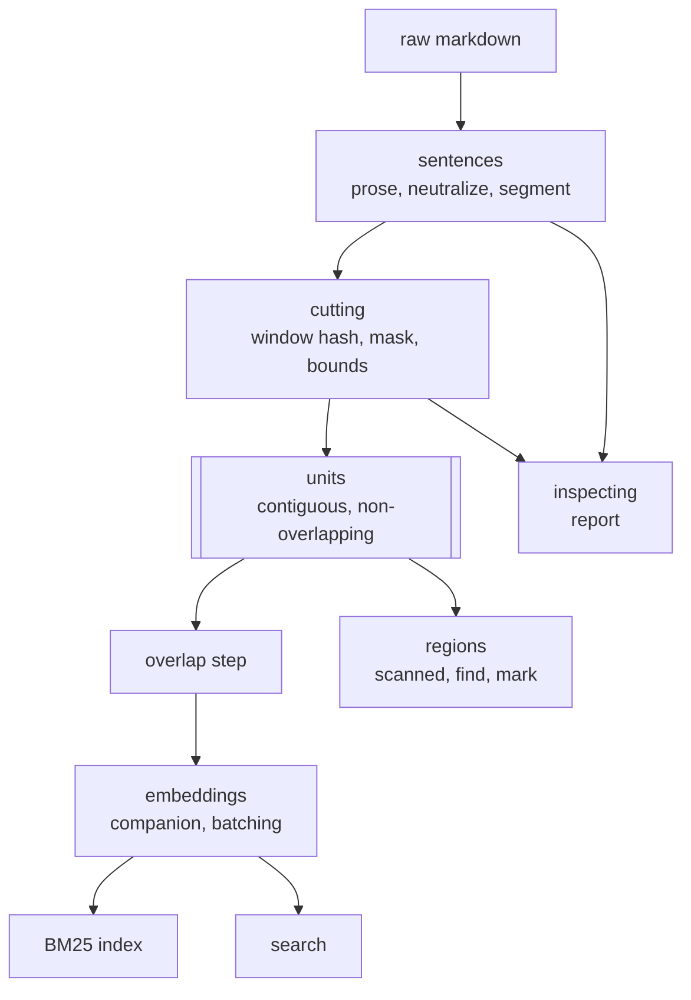

# Content-defined chunking

Every text feature in Nabu works on pieces of a document rather than the whole of it: embeddings vectorise a chunk, BM25 indexes a chunk, region detection scans a unit. Today those pieces are cut by counting — start at the beginning of the prose and take 1000 characters, again and again. Counting makes a boundary depend on everything before it, so adding a sentence near the top of a document slides every boundary below it. Their text changes, their hashes change, and the work is redone for paragraphs nobody touched: the corpus re-embeds, the BM25 index rebuilds, and region detection re-runs every model call in the document.

This feature cuts on the content instead. A boundary may only fall between sentences, and whether a given gap becomes a boundary is decided by hashing the characters immediately before it and testing the low bits. Because the test reads only nearby text, a boundary travels with the text it sits in and nothing upstream can move it. An edit then costs work proportional to the edit: one unit changes, or two where a boundary was created or destroyed, and everything else hashes identically and is skipped.

The same change unifies two coordinate systems that had drifted apart. Region detection built its sentence array over markdown-stripped prose while embeddings chunked unstripped prose, so a chunk and a sentence row could not be mapped to one another and the two features could share no bookkeeping. Stripping is dropped. One sentence array, built by blanking markdown to same-width spaces so the segmenter is protected without any text being destroyed, serves both — and both take their boundaries from one cutter.

## Components

- [sentences.md](sentences.md) — the canonical sentence array: prose extraction, length-preserving markdown neutralization, the segmenter, and the one bridge back to raw-file positions.
- [cutting.md](cutting.md) — the boundary rule and the units it produces: the hashed window, the mask, the size bounds, and the overlap embeddings adds afterwards.
- [embeddings.md](embeddings.md) — what changes in the embedding path: chunks arrive from the cutter, and batching stops assuming a fixed chunk size.
- [regions.md](regions.md) — what changes in region detection: units arrive from the cutter, and payloads start carrying inline markdown, which moves the quote gate.
- [inspecting.md](inspecting.md) — the runnable report that turns a directory of sample documents into observed sentence lengths and unit sizes, so the mask and bounds are set from measurement.

## How data flows

What this proves: every consumer takes its boundaries from one place. A change to the cut rule reaches embeddings, search and regions without any of them naming another, and no consumer can drift into cutting its own way.

The overlap step sits between the units and embeddings, and only there. Region detection needs contiguous units so a sentence is offered to exactly one `find` call, and overlapping ones would report the same occurrence twice from two calls that cannot see each other. Embeddings want the overlap so a concept spanning a boundary is still captured by a vector. Both are served because the overlap is applied after cutting rather than built into it.

BM25 and search hang off embeddings rather than off the cutter. Neither reads a boundary: BM25 rebuilds itself from the companion files, and search slices displayed text out of `extractProse(content)` using offsets the companion carries. They are on the diagram because they are where a mistake in the cutter becomes visible to a user.

## Walking skeleton

Build this first, through the real stack, before deepening any component.

One small markdown document in a real project, holding a link with a dotted URL, a bullet list, an inline code span and a fenced code block, and long enough to cut into three or four units. Open it, let both syncs fire, and require all five of these at once:

1. The report from [inspecting.md](inspecting.md) run over that file lists sentences carrying their inline markdown, no sentence cut inside a URL, and units whose sizes vary rather than all landing on the budget.
2. The embeddings companion is rewritten with new hashes, and its entry count matches the report's unit count.
3. A search for a phrase in the document returns a hit whose displayed text reads correctly — markdown intact, no mid-sentence truncation.
4. The `json-regions` block is rewritten, and a speaker label in the editor lands on the same words it did before the change.
5. Insert a sentence into the _first_ unit, wait for the debounce, and only the units touching the edit are re-embedded. The rest keep their hashes.

Item 5 is the feature. The first four are the proof that unifying the coordinate space broke nothing on the way there.

Green on all five means the neutralizer covers the constructs in the document, the segmenter behaves on neutralized text, the sentence slice recovers markdown the trim would otherwise cut, the boundary test fires at a workable rate, unit hashes reconcile against stored ones, the companion round-trips, the region block's stored indexes address the new array, and the editor's quote-to-position mapping still resolves. Those are every integration surface in the feature.

**What the builder needs to run it.** `make dev` in the sibling `nabu-self-hosted` repository, with `OPENAI_API_KEY` and `PROJECT_DIR` in that repository's `.env`, plus a browser for items 3 and 4. No new service, no new prompt, no cross-repo prerequisite: this feature adds no model call and changes no endpoint.

**Build order after the skeleton.** [sentences.md](sentences.md) first — everything indexes against the array it produces, and it is pure. Then [cutting.md](cutting.md), also pure, and [inspecting.md](inspecting.md) immediately after it, because the report is how the mask and bounds get their real values. Then [embeddings.md](embeddings.md) and [regions.md](regions.md) in either order; they are independent consumers and cannot break each other.

## Nothing migrates

Every hash in the corpus changes once. That needs no migration code, because each consumer's existing invalidation already does the work when nothing matches:

- `diffChunks` keys on the chunk hash. No stored hash matches, so every chunk lands in `needed` and each companion is rewritten whole.
- The BM25 index rebuilds from companion files on any companion change, so it follows without being told.
- `reconcileHits` matches stored `scanned` entries against current units by hash. None match, so every unit is re-found and every stored hit is dropped.
- `reconcileMarks` matches a stored `rangeHash` against runs of the current sentence array. The array changed, so no run matches and every mark is deleted and re-marked.

One stored thing that looks like a candidate is not one. A saved search carries an `embeddings` cache, but those are the resolved HyDE query vectors for that search, not chunk hashes, so they neither go stale nor need clearing.

The cost of the first boot after this ships is a full re-embed and a full re-detect of the corpus. That is accepted rather than mitigated: the project has no real users yet, so there is no staged rollout, no dual-write and no version marker on the stored shapes.

## What must not change

The behavior below is pinned by tests that exist today. Each must still pass, and where this feature changes the numbers a test asserts, the test is rewritten to the new rule rather than relaxed.

- **Search displays the right text.** `app/lib/search/merge.test.ts`, `trim.test.ts` and `extend-annotations.test.ts` cover slicing a hit's text out of `extractProse(content)` by character offsets. Those offsets stay in the same string, so these tests are untouched by this feature and failing one means the cutter is emitting offsets in the wrong space.
- **Region index arithmetic.** `app/lib/regions/detect/overlap.test.ts` and the `decorate/` tests operate on sentence indexes and never on sentence text. They must pass unchanged.
- **A block written into a document moves no index.** `app/lib/regions/stale-hit.test.ts` and `boot-sweep-shipped.test.ts` depend on it. `extractProse` deletes fenced blocks before anything else runs, which is what makes it true, and this feature keeps that step first.
- **Hash-keyed diffing.** `app/lib/embeddings/diff.test.ts` covers keeping an entry whose hash matches at the current width. The rule is unchanged; only the hashes it sees are different.

Two tests are expected to change: `app/lib/embeddings/chunk.test.ts`, which pins the counted-window behavior being replaced, and `app/lib/regions/detect/units.test.ts`, which pins the greedy accumulation being replaced.

**One behavior deliberately does change.** The scout filter in `app/lib/search/scout.ts` chunks the raw file while the search hits it filters carry offsets into the extracted prose, so its excludes match only by coincidence. Removing `chunkText` forces it onto `chunkFileForEmbedding` and the two sides into one coordinate space, and scout will begin excluding chunks it used to let through. [cutting.md](cutting.md) states the change; it is named here because it is a visible difference in search results and does not belong hidden in a component file.

One behavior worth preserving is not pinned anywhere, so it is stated here as a case before any component is specced:

> **Given** a document with regions detected and a fenced code block in it,
> **when** the text inside that fenced block is edited,
> **then** no chunk hash changes, no unit is re-found, and no region's stored sentence indexes move.

## Behavior claims and the end-to-end tier

The sibling `nabu-e2e` repository backs `../frontend-behavior-claims.md`, where every user-observable claim this repository's README and `docs/*.md` make is written as a labelled when/then. Tiers: 💾 needs the stack alone, 🎭 answers model and embeddings calls from fixture files, 🔌 needs a real provider.

- 🎭 **H1.** When the user edits one paragraph of a long document, then only the parts of the document near that edit are re-embedded, and the rest keep their stored vectors.
- 🎭 **H2.** When the user edits one paragraph of a long document, then region detection re-runs only over the parts near that edit, and regions elsewhere keep their extents.
- 💾 **H3.** When a document contains links, lists, code spans or tables, then no sentence boundary falls inside that markup.
- 💾 **H4.** When the text inside a fenced code block is edited, then nothing about the document's embeddings or regions changes.

H1 and H2 are the claims this feature exists to make true. H3 and H4 are the properties it must not lose while making them.
