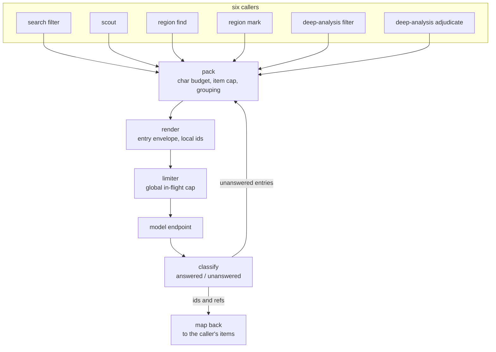

# Batched model calls

Six features ask a model to judge many pieces of text at once: the search filter, the scout pre-filter, region find, region mark, the deep-analysis filter and its adjudication. Each invented its own payload — a tag name, an id scheme, a numbering convention — and three invented their own batching, while region detection never got any: it fires one request per unit and one per hit, and the speaker kind fires them strictly one at a time. This feature draws the shared machinery once. One envelope wraps every entry a model is shown. One packer closes a call on characters rather than on a count that stopped meaning anything when chunk sizes became content-defined. One call lifecycle tells a failure apart from an empty answer, returns unanswered entries to the work list, and caps how many calls are in flight across the whole app. The six features become callers, and what stays per-site is what genuinely differs: the answer schema, and whether an answer addresses a whole entry or reaches inside it.

## Components

- [envelope.md](envelope.md) — the entry payload: the `<entry>` tag, call-local ids, numbered sentences, refs like `3.7`, and the map back to what each entry was.
- [packing.md](packing.md) — filling a call: the character budget, the item cap, grouping, and the per-site numbers with their derivations.
- [calling.md](calling.md) — the call lifecycle: classifying outcomes, acknowledgment, requeue rounds, the miss ceiling, the barren fix, and the global in-flight limiter.
- [search.md](search.md) — the search filter and scout as callers, and the cache key that stops baking batch position into itself.
- [regions.md](regions.md) — find and mark as callers: units batched across documents, mark stretches carrying several occurrences, the speaker vocabulary rule kept serial.
- [deep-analysis.md](deep-analysis.md) — the filter batches move to the shared packer, and adjudication stops being one unbounded call.
- [prompts.md](prompts.md) — the shared payload fragment and the six prompt edits in the sibling `nabu-prompts` repository.

## How data flows

What this proves: six callers share one path from a work list to routed answers. A caller supplies its entries, its preamble, its answer schema, and its budget numbers; everything between packing and the map-back is the same code, so a fix to outcome classification or the limiter reaches every site without any of them naming another.

The loop from classify back to pack is the requeue: entries a call failed to answer go back on the work list and are packed with whatever else is pending. Only the callers whose silence is recorded durably use it — [regions.md](regions.md) says which and why.

## Walking skeleton

Build this first, through the real stack, before deepening any component.

One project on the dev stack holding two small markdown documents. Each is written to cut into two or three units and to be unambiguous about its regions: explicit speaker labels (`Mrs Devlin:`), explicit dates, so a competent model has no room to differ between runs. One session, three actions, all five checks required at once:

1. Let region sync run. Find fires at most one call per kind for the whole project — both documents' units in one payload — and mark fires calls whose payloads carry more than one occurrence. Verified from the browser's network log.
2. The `json-regions` blocks are written with the same values at the same extents that the current one-call-per-unit code finds on the same documents. Record that baseline before switching branches.
3. Run one search with a semantic filter. The returned spans read correctly in the results panel, and the request payload in the network log shows `<entry id="1"` with refs in the `1.2` form.
4. Run one coding pass (deep analysis) over a selection. Annotations land, and the filter request in the network log shows `<code>` as a child element inside `<entry>`.
5. At no point does the network log show more model calls in flight than the global cap.

**What the builder needs to run it.** `make dev` in the sibling `nabu-self-hosted` repository with `OPENAI_API_KEY` and `PROJECT_DIR` set in that repository's `.env`, a browser with its network panel open, and the sibling `nabu-prompts` checked out — the prompt edits in [prompts.md](prompts.md) ship with this feature and the stack mounts that config, so the two repositories change together or the payloads and the prompts describe different shapes.

**Build order after the skeleton.** [envelope.md](envelope.md) and [packing.md](packing.md) first — both pure, everything else consumes them. Then [calling.md](calling.md), which owns the pool change. Then [regions.md](regions.md), because it is the feature's reason to exist and exercises every shared piece including rounds. Then [search.md](search.md) and [deep-analysis.md](deep-analysis.md) in either order. [prompts.md](prompts.md) tracks alongside whichever caller is being moved.

## What must not change

The behavior below is pinned by tests that exist today. Each must still pass, and where this feature changes what a test asserts, the test is rewritten to the new rule rather than relaxed.

- **Search displays the right text.** `app/lib/search/merge.test.ts`, `extend-annotations.test.ts`, `fusion.test.ts` and `paging.test.ts` never see the filter payload; they must pass untouched. `trim.ts` has no test of its own today; it consumes `matchRanges` as 0-based sentence indexes, and [search.md](search.md) keeps that shape byte-for-byte, so trim is untouched code rather than a pinned behavior.
- **Region index arithmetic.** `app/lib/regions/detect/overlap.test.ts`, `normalize.test.ts`, `repair.test.ts`, the `reconcile.test.ts` suite and the `decorate/` tests operate on indexes and values, not on payloads. Untouched.
- **Deep-analysis consensus.** `consensus.test.ts` and `envelope.test.ts` pin how votes merge and how contested envelopes carry their cases. Untouched.
- **Embeddings batching.** `batchBySize` generalizes into the shared packer; for its current inputs it must produce byte-identical batches, and the existing behavior moves into the packer's tests.

Tests expected to change because they pin the payloads, batchers and seams being replaced: `search/scout.test.ts`, `search/semantic.test.ts` where it renders prefixed passages, `regions/sync.test.ts` (its fake moves to the new list-in/outcomes-out seam, and its assertion that speaker mark runs at concurrency 1 pins the serialization this feature deliberately removes), `regions/detect/find.test.ts`, `mark.test.ts`, `hits.test.ts`, `payload.test.ts`, `retry.test.ts`, `window.test.ts` (stretches), `apply-deep-analysis/batching.test.ts` (absorbed by the packer), `triplet.test.ts` (segments), `format.test.ts` and `trace.test.ts` where they render targets, and the scout-filter message tests.

Two behaviors worth preserving are pinned by no test, so they are stated here as cases before any component is specced:

> **Given** a document whose units have never been scanned, **when** a find call covering ten of them fails or returns unreadable JSON, **then** none of the ten enters the `scanned` record, and all ten are offered to a later call.

> **Given** two documents that both quote the same person under different variants, **when** one region pass covers both, **then** both documents' regions carry one shared value for that person.

## Deliberate changes

Named here because each is a visible difference, not a slip:

- **Failures stop impersonating emptiness.** The barren stop is deliberate and stays: hits arrive ranked by embedding distance, so consecutive empty batches mean the rest of the list is worse, and the search rightly ends as exhausted. What changes is that a _failed_ call no longer counts as one of those empty batches — failures get their own stop (three in a row), which ends the search as incomplete with the remainder kept, instead of dressing a dead gateway up as "nothing else found". [calling.md](calling.md) owns the rule.
- **The search filter cache goes cold once.** Its key stops including the batch position, so every stored entry under the old key is unreachable. The cache prefix bumps and the old entries age out.
- **Scout's concurrency drops from 10 to 5**, in line with every other pool, and its payload gains the envelope.
- **Adjudication becomes several bounded calls.** Contested envelopes are judged with only their batch as company rather than every contested envelope in the pass.
- **Mark stops being serial for speaker.** Only find feeds the vocabulary; mark answers never invent values, so mark runs at pool concurrency for both kinds.
- **The filter payload loses paragraph breaks.** Sentences render one per line; the previous renderer preserved paragraph gaps inside a hit. The filter judges sentence spans, and no consumer reads the gap.

## Nothing migrates

No stored shape changes. `json-regions` rows, `scanned` entries, `rangeHash`, embeddings companions and saved searches are all untouched — the batching is invisible to everything on disk. The one stored thing that dies is the search filter's localStorage cache, by prefix bump, as above.

## Behavior claims and the end-to-end tier

No new user-observable claim: batching changes how many requests carry the same work. One existing claim leans on this feature not regressing it — H2 in `../frontend-behavior-claims.md`, an edit re-runs region detection only near the edit. Batched find must still pack only the units reconciliation marked as unscanned, never the whole document. [regions.md](regions.md) carries the case.
