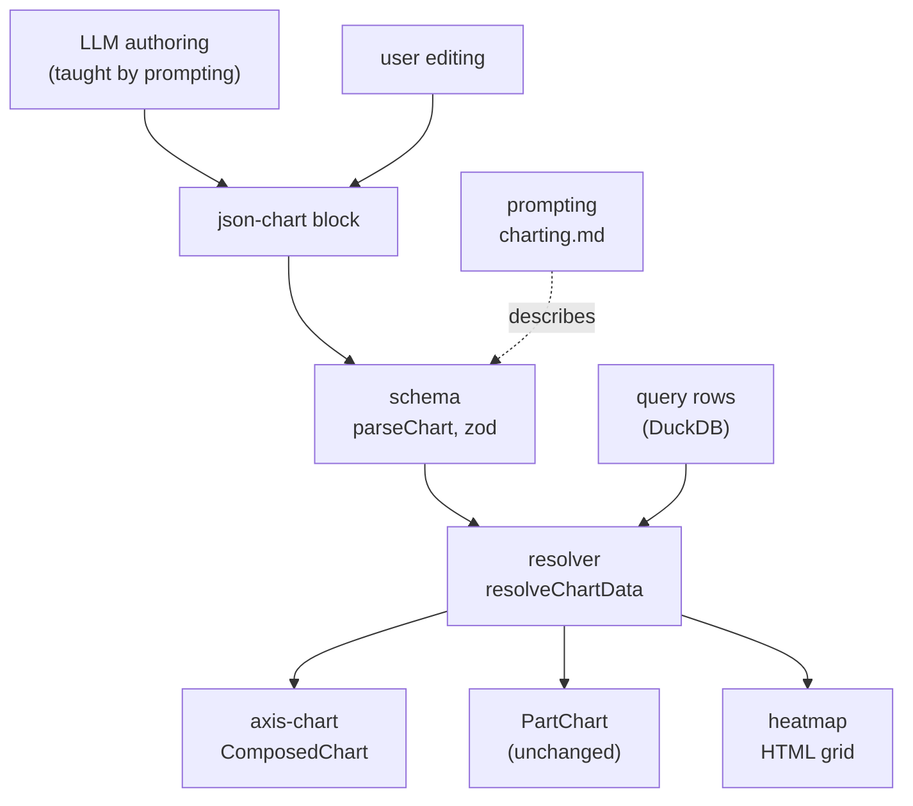

# Layered charts

A chart block today names one of nine types, binds one value column, and fakes everything richer through a `series` column: two measures from one query means UNPIVOTing in SQL, a line over bars cannot be said at all, and `stacked-bar` / `grouped-bar` / `bar` are three types for one mark. This feature replaces the axis family's spec with one shape: chart-level fields that all marks share — `x`, `orientation`, `bands`, `tooltip` — and a required `layers` array where each layer is one mark (`bar`, `line`, `area`, `scatter`) binding its own value column, optional series column, color, stack flag, and y-axis side. A plain bar chart is a one-layer chart. The four axis renderers collapse into a single Recharts `ComposedChart`, which is what makes mixed marks and a second y-axis possible, and which fixes multi-series scatter — today every scatter series redraws the first series' values because the y-axis is bound to one key.

The same round makes the matrix family real. `heatmap` currently parses and renders a placeholder; it becomes an HTML grid — the code × document co-occurrence view qualitative coders expect — with cell color mapped from the value onto one Radix token's shade scale and entity axis labels rendered as the same clickable pills tooltips already use.

The old flat spec dies without ceremony: no desugaring, no translation layer, `parseChart` validates only the new shape. The system has no users yet, so the only specs to migrate are this repository's own fixtures and stories, which are rewritten. The prompt that teaches the LLM to author these blocks — `charting.md` in the sibling `nabu-prompts` repository — is rewritten against the new schema in the same change, because a schema the prompt contradicts is worse than either alone.

## Components

- [schema.md](schema.md) — the new spec shape and its zod schema: the top-level type union, the axis family's chart/layer split, orientation's new meaning, and what `parseChart` accepts. Owns the shape every other component consumes.
- [resolver.md](resolver.md) — `resolveChartData` rebuilt for layers: one pass grouping rows by x, each layer contributing uniquely-keyed series, producing the renderable shapes the renderers draw. Owns the renderable contract.
- [axis-chart.md](axis-chart.md) — one `ComposedChart` replacing `renderBar` / `renderLine` / `renderArea` / `renderScatter`: mark per series, stack groups, left and right y-axes, legend, orientation.
- [heatmap.md](heatmap.md) — the matrix renderable made drawable: an HTML grid with a value→shade ramp, pill axis labels, and the existing tooltip and datum-click machinery.
- [prompting.md](prompting.md) — the `charting.md` rewrite in `nabu-prompts`: the layers-vs-series query rule, combo and second-axis guidance, a real heatmap section with co-occurrence recipes, and the repair of the broken horizontal-bar example.

## How data flows

What this proves: the spec shape is defined once and everything downstream derives from it. The prompt teaches the same schema the parser enforces, the resolver is the only reader of the spec, and the renderers see only renderables — so a shape change is a schema edit plus a resolver edit, and no renderer or prompt can hold a private copy of the spec.

`PartChart` is on the diagram because the resolver still feeds it, and to say that pie and treemap are untouched: their spec shapes, resolution, and rendering do not change in this round.

## Walking skeleton

Build this first, through the real story harness, before deepening any component.

Two stories, both driven by a spec JSON parsed through the real `parseChart` — not a hand-built renderable — so the schema, resolver, and renderer are exercised as one path:

1. A two-layer axis chart: a bar layer (`count`) and a line layer (`ratio`, `axis: "right"`) over the same `month` x, from a wide fixture result. Green means: the new schema accepts a layers spec, the resolver merges two layers into one row set without key collisions, `ComposedChart` draws a bar mark and a line mark together, and the right-hand axis exists with its own scale.
2. A heatmap: a 3×2 code × document grid from long fixture rows. Green means: the matrix renderable carries labels and cells, the ramp maps values to shades, and the grid renders in the story runner.

Both run under `npm test` (the storybook vitest project, headless chromium). **What the builder needs:** the repository's own dev dependencies and the playwright chromium already used by existing stories — no backend, no database, no model call; skeleton fixtures are plain row arrays.

**Build order after the skeleton.** [schema.md](schema.md) first — every other component compiles against its types. Then [resolver.md](resolver.md), pure and unit-testable. Then [axis-chart.md](axis-chart.md) and [heatmap.md](heatmap.md) in either order — independent consumers of the renderable contract. [prompting.md](prompting.md) last, because the prompt describes a schema that must be final by then.

## Nothing migrates

The old spec shape is deleted, not translated. `parseChart` returning `null` for an unrecognized shape is already how invalid blocks render (as raw blocks), so an old-shape block in a stray file degrades, it does not crash. The fixtures in `app/lib/chart/test-helpers.ts` are rewritten to the new shape along the ownership split: spec-and-row fixtures as part of [schema.md](schema.md)'s work, the renderable literals and the stories consuming them under [axis-chart.md](axis-chart.md) and [heatmap.md](heatmap.md). The tests that pinned `stacked-bar` / `grouped-bar` as types are rewritten to pin the same pictures expressed as layers.

## What must not change

Pinned by tests and stories that exist today. Where a test names the old spec shape, it is rewritten to say the same behavior in the new shape, never relaxed.

- **Template language and entity resolution.** `app/lib/chart/template.test.ts` and `app/lib/chart/entities.test.ts` — `{field}`, `{field:format}`, `{field:name}` / `{field:label}` / `{field:color}` resolution, entity pills in markdown. One deliberate exception: the `icon` template property is removed, see [schema.md](schema.md).
- **Color resolution.** `app/lib/chart/color.test.ts` — hex passthrough, Radix token at shade 9, entity color lookup, grey fallback. The heatmap's ramp is a new consumer of Radix scales, not a change to this rule.
- **Tooltips.** `ChartTooltip.stories.tsx` — template markdown, pill rendering, the fallback list. The tooltip stays chart-level in the new spec precisely so this component is untouched.
- **The card and its states.** `ChartCard.stories.tsx` — loading, empty, error, caption, delete, query-results table.
- **Part charts.** `PartChart.stories.tsx` — pie and treemap render as today.
- **Query validation.** `app/domain/data-blocks/chart/schema.test.ts` (the `SEMANTIC()` and color refinements carry over) and the `rejectSqlPatterns` / `validateChartQuery` pipeline — the prompt/validator/error-message agreement documented in [prompting.md](prompting.md) is a property to preserve, not just a file.
- **Block registration.** `definition.ts` — table name `charts`, caption type `Figure`, hidden `spec` column, id prefix `chart`.
- **`app/ui/components/BarChart.tsx`** is a separate UI component with its own stories, not part of the chart-block system. It is out of scope and must not be swept into the rename.

One behavior worth preserving that no test pins, stated here before any component is specced:

> **Given** a chart whose query returns rows in which an entity id appears in some column,
> **when** a datum is clicked,
> **then** navigation goes to that entity's URL — for the new axis renderer and the new heatmap grid both, exactly as `AxisChart.stories.tsx` `DatumClick` pins it for bars today.

## Behavior claims

`../frontend-behavior-claims.md` claims D2 (registered blocks render as their visual form) and D3 (a chart stores the query, not the numbers, so the figure follows the corpus) hold unchanged — this feature changes the spec inside the block, not the block lifecycle. No new claim is added: layering and the heatmap are chart capabilities, and the claims file tracks user-observable contracts of the block system, which are the same. If the README or `docs/` gain prose about chart types during this work, the claims file moves with them per that file's own rule.

## Parked

Named here so the next spec decides them by judgement instead of missing them: coding stripes as a chart (only the cross-document overview — the editor gutter already covers the within-document case), code co-occurrence networks, and sankey/alluvial flows. Each would be a new top-level family in the schema's union, which is the extension point this spec leaves behind. Word clouds were considered and rejected outright.
