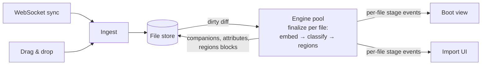

# One engine for load and import

Files reach the project two ways: streamed from nabu-storage over WebSocket at boot, and dropped into the browser by the user. Today only the boot path runs migrations, and the three content fixers (embeddings, topic classification, region detection) are three separate phase-scoped reconcilers that boot awaits one after another, corpus-wide. This spec unifies both: every file enters through one ingest function, and one engine processes dirty files through a per-file stage chain — `finalize(doc)` — run concurrently through a pool. The engine emits per-file, per-stage events; the boot loading screen and the import queue are two projections of that one stream. Dropped files therefore get the exact same treatment as boot files, and the user watches each file move through the stages.

## Components

- [Ingest](ingest.md) — the single entry point a file takes into the store: migrate, normalize, validate, write. Used by the WebSocket sync path and the import path.
- [Engine](engine.md) — the unified reconciler: watches the store, diffs dirty files, runs `finalize(doc)` per file through a pool, and owns the [event stream contract](engine.md#events) both views consume.
- [Import UI](import-ui.md) — the drop overlay and queue rows; each dropped file advances through the engine's stages with a label, plus failure states.
- [Boot view](boot-view.md) — the project loading screen, changed from one sequential phase label to concurrent per-stage counters.

## Data flow

## Decisions carried in from the conversation

- Uploaded files run migrations before landing in the store, exactly like synced files. Today they skip them (`lib/import/process.ts` writes straight to the store); that is a bug this spec fixes.
- Import never executes fixer work. It writes files through ingest and listens to engine events. There is no import-side pool or finalize call.
- The three phase reconcilers (embeddings, topics, regions) are replaced by one engine whose unit of work is the file, not the phase. Boot is the engine's first run with every file dirty; an import is the same engine noticing new files.
- Stage order inside `finalize(doc)` is embed, then classify, then regions — two `await`s, no scheduler. Code reading during spec work showed classification does not consume the file's vectors (it is an LLM call over a prose excerpt plus a snapshot of existing labels), but language statistics and description sync do read companion data, so the order stays.
- Embeddings lose cross-file chunk batching: each file embeds its own chunks. More, smaller API calls; accepted deliberately to spread endpoint load and enable per-file completion.
- BM25 stays a separate reconciler. Its index is in-memory, rebuilt from scratch, cheap, and has no per-file completion to report — folding it into the engine would add a stage no view shows. Same for description sync and language statistics: they are corpus-scoped and run as an engine tail step after the pool settles, not per file.
- Status is event-driven only. The engine reports each file's lifecycle per stage, and "settled with nothing to do" is an explicit event, never silence — so the UI works for stages that leave no persistent mark. No timeout machinery: a stage that never reports is a bug and belongs in the console.
- A file that fails before the store (unreadable, not markdown, corrupt structure) was never imported: red "Could not import". A file that fails in a fixer stage is already in the project and stays there: warning state "imported, processing incomplete"; the engine retries on its next pass.
- The boot screen shows all stage counters concurrently (stages interleave under per-file processing), replacing the sequential single label.

## Walking skeleton

Boot the demo project against the new engine, then drop one small markdown file.

1. Open the app with the dev stack running. The loading screen shows the concurrent stage counters, driven by engine events, and dismisses when the engine's first pass settles.
2. Drag one `.md` file containing a heading and two sentences onto the project. The queue row appears, runs migrate/normalize through ingest, then advances Embedding → Classifying → Finding regions → Added as the engine reports.

That slice threads every component through the real stack: ingest (both callers), engine (all three stages plus events), boot view, import UI. Build and verify it before any breadth: it is where the store-echo loop (engine writes companions → store notifies → engine diffs) either converges or runs away.

Needed to run it: the dev stack (`make dev` in `nabu-self-hosted`; frontend 5173, storage 8080, embeddings proxy 8082), a browser, and a project with a handful of files.

## What must not change

- `normalizeFile` idempotence — pinned by `app/lib/files/store.test.ts`. The editor's cursor stability rests on it.
- Companion diffing by chunk hash: an unchanged chunk is never re-embedded — pinned by `app/lib/embeddings/sync.test.ts` and `diff.test.ts`.
- Reclassification skip on matching content hash — pinned by the `shouldReclassify` cases in `app/domain/data-blocks/attributes/topics` tests.
- Region reconciliation (hits and marks survive edits; `scanned` with rules hash) — pinned by `app/lib/regions` tests.
- A migration that rewrites a synced file persists the rewritten form back to the server, and initial load otherwise never echoes files back (`withoutPersist`) — pinned by `app/lib/server/sync` tests.
- Unsupported dropped files show "Not supported" and are never written to the store — pinned by import stories and `lib/import` tests.
- Boot gating: the app does not leave the loading screen before required files exist and the engine's first pass settles — covered by the behavior claims in `../frontend-behavior-claims.md` and their e2e tests; those claims must be kept true, and the claims file updated where this spec changes observable loading behavior.

One behavior worth preserving that no test pins today:

- **Given** a project whose files are already fully processed (companions current, hashes matching, regions scanned), **when** the app boots, **then** the engine's first pass makes no model or embedding calls and the loading screen settles without stage work. This is the reconcilers' current no-op boot; a test pins it against the engine before the refactor starts.
