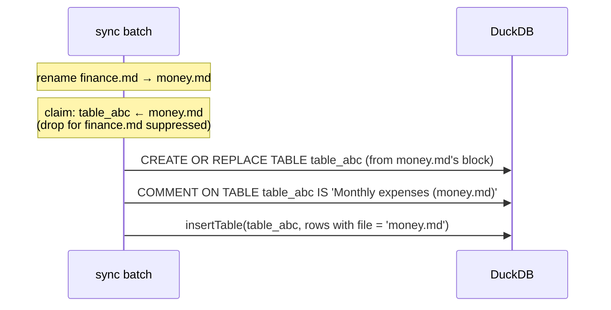

# Projection

Doc tables are the second projection path. The static path — registry configs through `projections.ts`, all DDL generated once in `startDatabase`, sync only ever deleting and re-inserting rows into fixed tables — cannot carry them, because a `json-table` block declares its own columns and two blocks never need the same schema. So doc tables get their DDL at sync time: one real DuckDB table per block, created, replaced, and dropped as the documents holding them change. The block shape and key rules are [table-block.md](table-block.md)'s; how a string cell becomes a typed value is [cell-types.md](cell-types.md)'s; this file owns everything between a parsed block and a queryable table.

## Contract

### The table

One DuckDB table per `json-table` block. The name is derived from the block's immutable id ([table-block.md](table-block.md)) by one rule, owned here: **every hyphen becomes an underscore**. Ids are `table-<shortid>` (the existing prefixed short-id convention), so a block `table-3k2j9x1a` owns the table `table_3k2j9x1a` — the prefix supplies the leading letter, the shortid may start with a digit, and the result is a valid unquoted identifier. The name carries no file or document part — a query written against `table_3k2j9x1a` survives every move and rename of the file that holds the block, which is the property chart queries and agent-authored SQL depend on. Two hand-authored ids that collide after derivation (`table-a-b` and `table-a_b`) degrade to the duplicate-id rule below.

Columns, in order:

| Column               | Type                                         | Justified by                                                                                          |
| :------------------- | :------------------------------------------- | :---------------------------------------------------------------------------------------------------- |
| `file`               | VARCHAR, stamped on every row                | The agent's query tool joins doc tables to `files` the way it joins every projection                  |
| one per block column | text → VARCHAR, number → DOUBLE, date → DATE | Chart queries aggregate DOUBLE and order by DATE without casts; the agent sees real types in DESCRIBE |

The DuckDB column name **is** the column's stored `key`, verbatim. [table-block.md](table-block.md) already guarantees keys are snake_case, deduped, and never `file`; re-normalizing here would create a second naming authority and the two would drift. Sync never rewrites an identifier — it only refuses one (below).

### The comment

`COMMENT ON TABLE` is the discovery channel: doc tables never appear in the prompt's schema string, so the agent finds them by querying `duckdb_tables()` and reading `comment`. The comment format, settled:

- Clean table: `<caption> (<file>)` — e.g. `Monthly expenses (finance/2026.md)`
- With failing cells: `<caption> (<file>) — <n> cells fail their column type` (singular: `1 cell fails its column type`)
- Empty caption: the file alone — `finance/2026.md`

The dirty-cell count is how one typo stays visible without removing the table from SQL: the failing cell inserts as NULL per [cell-types.md](cell-types.md), the table still syncs, and the comment tells the agent its aggregates may be undercounting. The comment text is single-quote-escaped through the same `escapeString` the sync deletes already use — it is the only place a doc-table string ever enters SQL text.

### How values get in

Row values never touch SQL text. Cells are parsed per [cell-types.md](cell-types.md) — a number cell arrives as a finite JS number, a date cell as its canonical `YYYY-MM-DD` string (the parser never returns a `Date` object), and empty, missing, or failing cells as `null` — and inserted through the existing `conn.insertTable` path (`query.ts` → `arrow.ts`), which builds Arrow vectors and hands them to DuckDB as data. The string→DATE conversion point is `doc-tables.ts` at the insert boundary: it hands the strict ISO string onward, and strictness is what makes that conversion engine-independent — date-only ISO is the one form every JS engine parses identically, which is exactly why cell-types accepts nothing looser. A cell containing `'); DROP TABLE files; --` is a VARCHAR value like any other, because there is no statement for it to escape from. This is the same posture the static projections already hold; doc tables inherit it by using the same door.

Identifiers are the one thing that must enter SQL text, and they are user/agent-authored, so they are checked before use — against `app/lib/db/identifier.ts`, the same module [table-block.md](table-block.md)'s schema uses, because two copies of "is this usable" would drift. The check is the charset `^[a-z][a-z0-9_]*$` **and** the reserved set: DuckDB's keywords are a syntax error unquoted, so `when DATE` fails to parse and takes the whole table with it.

A table name and a column name are not quite the same rule, and the difference lives in one place: `isUsableColumnName` in `ddl.ts`, beside the `fileColumn` it exists for. `file` is a perfectly good table name and an unusable column one, because sync stamps that column itself and a second would be unreachable.

**Blocks are read strictly here, the same way the grid reads them.** The registry's ordinary reader recovers — a block failing its schema comes back with the offending array items deleted — which would silently drop a column from SQL while [grid.md](grid.md)'s `parseTable` rejected the same block outright, so the document's own two readers would disagree about what it holds and the comment's damage count would be taken over a subset of the declared columns. `getBlocksStrict` gives both consumers one answer: a block that does not parse yields nothing, the grid shows its raw fence, and any table previously standing under that id is dropped by the ordinary departed path. A block failing either check is **skipped whole** — its table dropped if one exists, a console error logged — never quoted or further rewritten into place. The hyphen→underscore derivation is the naming rule, not a repair; anything still invalid after it is refused.

### Ownership: the tracked map

The sync lifecycle needs to know which doc tables belong to which file — a deleted file must drop its tables, a changed file must drop tables for blocks that vanished from it. The mechanism, settled: an **in-memory map, file → set of derived table names**, held in `app/domain/db/database.ts` beside `previousFiles`, updated as each sync pass runs. The derived name, not the block id, is the key everywhere in this lifecycle — the map, the claim set, and every drop — because the derived name is what a DuckDB table is actually called: two hand-authored ids that collide after derivation (`table-a-b`, `table-a_b`) are then one entry, one claim, one table, and the duplicate rule below applies to them exactly as it does to two identical ids.

Why not the alternatives: querying `duckdb_tables()` and parsing the file back out of the comment makes a display string load-bearing, and the comment format above would freeze into an unchangeable wire format. A bookkeeping table inside DuckDB would be one more table the agent can see and query — schema noise that exists only for the projector. The map costs nothing to keep correct because the database and the map have exactly the same lifetime: DuckDB here is in-memory, rebuilt every app start, and the first sync after start treats every file as changed (`previousFiles` starts empty), so the map is rebuilt from scratch by the same pass that rebuilds the tables. There is no persistence to drift from.

### Sync lifecycle

The claim set is built once per **pass**, before any batch runs: `runSync` holds the whole `SyncPlan`, so every changed file's blocks are parsed (via the registry's per-block-projected configs) up front into one claim set, derived name → file — a duplicate resolving here, last-synced file winning. Then, per batch, after the static `syncFiles` call, on the same connection:

1. **Create**: for each name claimed by a file in this batch, `CREATE OR REPLACE TABLE`, then `COMMENT ON TABLE`, then insert rows; retrack under the claiming file. A file whose block derives a name the pass awarded to a _different_ file builds nothing and tracks nothing — letting the loser build too would record both files as owners, and the loser's stale entry would later drop the winner's live table. A name no file claims is uncontested and builds normally.
2. **Drop**: every name tracked under one of this batch's deleted files, or tracked under one of its changed files and no longer present there, is dropped and untracked — **unless the pass's claim set claims it**. A claimed name is (or will be) rebuilt by `CREATE OR REPLACE`; dropping it would destroy the new table.

Consulting pass-level claims from every batch is what makes the guarantee unconditional within a pass, however `batchSyncPlan` slices it: a rename's delete lands in batch 1 and its changed half may land in a later batch, but the name is already claimed, so batch 1's drop is suppressed and the later batch's create does all the work. The same rule keeps a block cut from one doc and pasted into another — both files in the same debounced pass — alive: the old file's batch finds the name missing, the claim set says the new file owns it, no drop fires, and the table simply carries the new `file` stamp:

`CREATE OR REPLACE` is what makes a column-type change between syncs just work: the table is rebuilt from the block's current declaration every time its file changes, so the DDL follows the block with no diffing. A move whose two files land in _different_ passes (the user pastes much later) behaves as delete-then-recreate, which is simply true.

Degenerate shapes, settled:

- **Zero rows**: the table is still created with its declared columns. `DESCRIBE table_<id>` must work and a chart query against it must return an empty result, not a missing-table error — an empty table is a real, present thing.
- **Zero columns**: the table is created with only the `file` column and no rows. Rows without columns are unrepresentable, but the block still owns its name, so the table exists the moment the block does.
- **Duplicate derived name across files** — two identical ids, or two hand-authored ids colliding after derivation: the pass's claim set resolves the winner (last-synced file), only the winner's CREATE fires, and the map records it. [table-block.md](table-block.md) makes ids unique at authoring time; this rule only says a violation degrades to last-writer-wins rather than a crash.

### When a statement fails mid-sync

The static path aborts the whole batch on error, and rightly — its DDL is startup-generated from code and an error there is a bug. Doc-table DDL is derived from user and agent-authored data, so one bad block must never take the static projections or the other doc tables down with it. Settled: any failure while building one block's table — CREATE, COMMENT, or insert — drops that table (`DROP TABLE IF EXISTS`), untracks it, logs a console error, and the pass continues with the next block. The drop is deliberate: a `CREATE OR REPLACE` that fails at bind time leaves the _previous_ table standing, and a stale table silently answering queries with old data is worse than an absent one. Absence is honest; staleness lies.

### What the prompt never sees

`getDatabaseSchema()` and its forever-cache are untouched. The static schema string is byte-identical whether a project has zero doc tables or fifty — prompt caching is prefix-based, and that block sits in the system prompt (`fetch.ts`, `formatDatabaseSchemaContent`), so a single byte of churn would invalidate the cache on every table edit. This requires that `json-table`'s registry config never reaches `getProjectedConfigs()`' projected set — the block must not grow a static projection by accident. Discovery is entirely `duckdb_tables()` + comments, on demand.

Downstream invalidation rides what exists: `runSync` already bumps `syncRevision` after each pass, chart blocks already re-query on the bump, and chart validation (`app/domain/data-blocks/chart/validate.ts`) executes queries against the live database — doc tables are real tables, so both work with no special-casing.

## Prior art

- **`app/lib/db/sync.ts` — leave alone.** `syncFiles` is the static row-sync and stays exactly that. Extending it with a dynamic-DDL mode was considered and rejected: it would thread block-instance knowledge through a function whose whole design is "fixed schemas, moving rows", and `ProjectionWithSchema` has no honest place for per-block schemas.
- **`app/lib/db/ddl.ts` — extend, slightly.** `tableSchemaToDdl` already emits `CREATE OR REPLACE TABLE` from a `TableSchema` and is reused verbatim. Add beside it the two generic helpers doc tables need: comment DDL (`COMMENT ON TABLE <name> IS '<escaped>'`) and drop DDL. They know nothing about blocks.
- **`app/lib/db/query.ts` / `arrow.ts` — reuse untouched.** `conn.insertTable` and the Arrow coercions are the value path; `doc-tables.ts` hands `toDate` the strict ISO string cell-types guarantees, the one string form whose parse is engine-defined.
- **`app/domain/db/projections.ts` — add beside, not into.** It maps registry configs to static `ProjectionConfig`s; doc tables are not a `ProjectionConfig` and forcing them into one is the close candidate rejected above in lib form. New module **`app/domain/db/doc-tables.ts`**: iterates the registry's `getPerBlockProjectedConfigs()` (today only `json-table` — the declarative flag [table-block.md](table-block.md) puts on the config) and parses each config's blocks from the file, maps column types to `DuckDbType`, calls the [cell-types.md](cell-types.md) `parseCell` per cell for values — counting invalid verdicts from that same loop as the comment's dirty count — builds `TableSchema`s, and runs the per-batch lifecycle against a `DbConnection`. This is the seam that keeps the lib/domain split clean — lib/db stays generic SQL mechanics, the `json-table` vocabulary (text|number|date, captions, ids) lives entirely in domain.
- **`app/domain/db/database.ts` — extend.** `runSync` builds the pass's claim set from the whole plan before batching, and its batch loop gains one call after `syncFiles`, inside the same `executeWithConnection`, passing the batch, current files, the claim set, and the tracked map. The `syncRevision` bump at the end already covers doc tables; nothing else moves.

## Tests

### Skeleton

This component's slice of the walking skeleton: a doc containing a `json-table` block (as produced by pasting the pipe table through [conversion.md](conversion.md) and edited in [grid.md](grid.md)) syncs, and `SELECT * FROM table_<id>` through the database returns the rows — the `amount` column coming back as a real DOUBLE (arithmetic works, `DESCRIBE` says DOUBLE), `file` stamped on every row, and `SELECT comment FROM duckdb_tables()` showing the caption-and-file comment. That single query proves the whole path: parse → schema → DDL → Arrow insert → comment.

### Contract

Riskiest first — the hostile and destructive cases before anything a happy path would catch.

> **Given** cells containing single quotes, SQL fragments (`'); DROP TABLE files; --`), and a caption containing a single quote, **when** the file syncs, **then** the cell values come back verbatim from a SELECT, every other table still exists, and the comment renders the caption intact.

> **Given** a block whose derived table name or a column key violates the identifier charset, **when** the file syncs, **then** no table is created for it, any previous table under that id is dropped, an error is logged, and every other block in the file still syncs.

> **Given** a number column with two unparseable cells, **when** the file syncs, **then** the table exists, those cells are NULL, the other rows carry their values, and the comment ends `— 2 cells fail their column type` (and `1 cell fails its column type` for one).

> **Given** a synced file that is then deleted, **when** sync runs, **then** its tables are gone from `duckdb_tables()` and the map no longer tracks them.

> **Given** a synced file that is renamed, **when** sync runs, **then** `table_<id>` still exists, its rows carry the new filename in `file`, and no drop statement ran for that id — the claim suppressed it.

> **Given** a block cut from doc A and pasted into doc B, both files in the same sync pass and in either processing order, **when** the pass completes, **then** `table_<id>` exists, its rows carry doc B's filename, and the map tracks it under doc B.

> **Given** a doc from which one of two blocks is deleted, **when** the file syncs, **then** the removed block's table is dropped and the surviving block's table is intact.

> **Given** a column whose type changes from text to number between syncs, **when** the file re-syncs, **then** `DESCRIBE` shows DOUBLE and parseable values are numeric — the DDL followed the block.

> **Given** a block whose table creation fails, **when** the file syncs, **then** no table (old or new) answers under that id, and the file's other blocks and the static projections synced normally.

> **Given** a block with columns but zero rows, **when** the file syncs, **then** the table exists, `DESCRIBE` lists its typed columns, and SELECT returns zero rows.

> **Given** a block with zero columns, **when** the file syncs, **then** the table exists with only `file` and zero rows.

> **Given** two files each holding a block with clean cells, **when** both sync, **then** each table's comment is `<caption> (<file>)` with no dirty suffix, and an empty caption yields the file alone.

> **Given** fifty doc tables synced, **when** `getDatabaseSchema()` is called, **then** the string is byte-identical to a project with none.

### Isolation

The existing `app/lib/db` tests never instantiate DuckDB — `ddl.test.ts`, `sync.test.ts`, `extract.test.ts` are table-driven node tests over pure functions, and the real engine (duckdb-wasm in a worker) only ever runs in the browser, reachable in test through the `__nabuTest.query` e2e hook (`app/domain/db/e2e-hook.ts`). Doc-table tests follow that split rather than fight it:

- **Pure layer, node, table-driven** (the bulk): block → `TableSchema` mapping, identifier refusal, comment text including dirty counts and quote escaping, and the per-batch lifecycle plan — which drops, creates, comments, and inserts a given (batch, files, claim set, tracked map) produces, and how the map looks after; claim suppression is exercised here by handing in claim sets that do and do not cover a dropped name. The lifecycle runs against a `DbConnection` fake that records `runSql`/`insertTable` calls and can be told to fail a given statement — a fake at this contract's own boundary, not a database mock, exactly as `sync.ts`'s design permits. Cell parsing runs for real rather than faked: it is a pure function with no I/O, so a fake would buy nothing and cost the agreement between the count in the comment and the grammar that produced it. What these tests must not do is re-litigate what parses, and they do not — every assertion is about the DDL, the rows and the comment this component built.
- **Real engine, browser**: the skeleton query and the hostile-values case run against the actual duckdb-wasm instance via the e2e hook, because Arrow insertion semantics and `COMMENT ON` behavior are engine facts no fake should vouch for. Inventing a node-side DuckDB harness was considered and rejected: it would test a different build of the engine than ships, and the hook already exists for precisely this.
