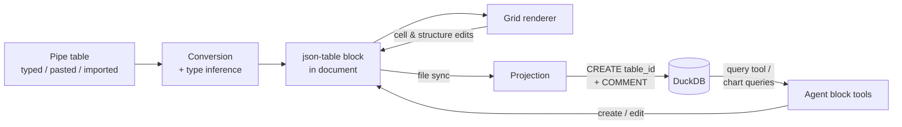

# Doc tables

A user writes a table inside a markdown document and can then query it with SQL. The table is a new `json-table` data block — `{ id, caption, columns: [{key, name, type}], rows: [{key: value}] }` — that renders as an editable grid in the editor and is projected at sync time into its own DuckDB table named `table_<id>`. Each table brings its own columns, which is what separates it from every existing block type: its SQL schema is per-instance, so its DDL happens at sync time rather than startup, and its schema never enters the agent's system prompt — the agent discovers doc tables at runtime through its query tool, which keeps the prompt byte-stable and the LLM prompt cache intact. Column types (text, number, date) are a parsing contract over string cells: a cell that fails its type shows as invalid in the grid and lands as NULL in SQL, and the damage count rides the table's SQL comment. Plain markdown pipe tables stop being a thing a document can hold: they convert into `json-table` blocks at migration time and live in the editor.

## Components

- [Table block](table-block.md) — the `json-table` block type: schema, registry entry, key rules, validation of agent writes, agent-facing constraints.
- [Cell types](cell-types.md) — the pure parsing contract: cell string × column type → value or failure, and column type inference for conversion.
- [Projection](projection.md) — the dynamic SQL side: per-block `CREATE`/`DROP` at sync, `table_<id>` naming, comments, and staying out of the prompt.
- [Grid](grid.md) — the editable grid renderer: a new `"table"` renderer kind beside `"hidden" | "callout" | "chart"`.
- [Conversion](conversion.md) — pipe tables become blocks: one migration for import and existing docs, plus live conversion when typing or pasting in the editor.

## Data flow

Cell parsing sits under three of these arrows: the grid marks failing cells, the projection inserts them as NULL, and conversion infers column types — all against the one contract in [cell-types.md](cell-types.md).

## Walking skeleton

Paste a two-column pipe table (one header row, one body row with a numeric column) into a document in the running app. It converts into a `json-table` block, renders as a grid, and after the debounced sync `SELECT * FROM table_<id>` — via the browser console `window.query` helper — returns one row with a DOUBLE column. That slice touches every component: conversion (paste), cell types (inference), table block (schema and registry), grid (render), projection (table exists and answers).

Build and test this first. It needs the dev stack running and a browser; no credentials.

## Decisions carried in from the conversation

- One real DuckDB table per block, named `table_<id>`. No file part in the name — moves and renames must not break queries. The block id is unique and immutable, so collisions are impossible by construction.
- Doc tables never enter `getDatabaseSchema()`'s listing. That string is injected into the agent's system prompt as its own system block and cached; prompt caching is prefix-based, so it must stay byte-identical whether a project has zero or fifty doc tables. Discovery is runtime-only: `duckdb_tables()` for names, captions, and health (via `COMMENT ON TABLE`), `DESCRIBE` for columns, through the agent's existing query tool. The system prompt (in `nabu-prompts`) gains one static sentence pointing at that path; tool descriptions are untouched.
- The block's own JSON schema is static (generic columns and rows), so `json-table` joins `getBlockSchemaDefinitions()` like every block type — the agent creates and edits tables through the ordinary block tools, and that listing stays cache-safe too.
- Column `key` is the SQL identifier, generated once from the display `name` at column creation (snake_case, deduped, `file` reserved) and immutable after. Renaming a header edits `name` only; nothing else moves. This is what makes header renames and column reorders unable to break existing chart queries.
- Cell values are stored as strings; the column type is a parse contract. A failing cell is visible in the grid, NULL in SQL, counted in the table comment — never blocked, never auto-fixed. Agent writes are the exception: `asyncValidate` bounces failing cells back as validation errors, so only humans can make dirty tables.
- Dirty tables still sync. One typo never removes a table from SQL mid-edit.
- Conversion is total: after this feature no gfm table node persists in a document. The migration converts imported and existing docs (it runs wherever migrations run — the ingest path is being reworked toward one shared entry per spec `2026-08-14-06`, and the migration rides that seam wherever it lands); the editor converts typed `| foo |` lines and pasted tables live.
- Conversion infers column types: number or date when more than half of a column's non-empty cells parse as that type, higher rate wins, ties to number, otherwise text. Wrong guesses surface as red cells and are one header-dropdown click from fixed.
- The grid is deliberately minimal: add and delete rows and columns at a chosen spot, no drag reordering. Read-only mode renders a static table.
- v1 boundaries, recorded as defaults: datetime deferred (text, number, date only); no auto-fix of failing cells; tool descriptions unchanged.

## What must not change

- Static projections and their DDL: pinned by `app/lib/db/ddl.test.ts`, `app/lib/db/sync.test.ts`, `app/lib/db/extract.test.ts`, and `app/domain/db/projections.test.ts`. The doc-table path is a second projection mechanism beside them, not a change to them.
- The block registry and parsing behaviors: pinned by `app/lib/data-blocks/registry.test.ts`, `parse.test.ts`, `validate.test.ts`, `migrate.test.ts`.
- Chart blocks, end to end: pinned by `app/domain/data-blocks/chart/schema.test.ts` and the stories under `app/lib/editor/chart-blocks/`.
- Callout and hidden block rendering: pinned by the stories under `app/lib/editor/callout-blocks/` and `app/lib/editor/hidden-blocks/`.
- The prompt-stability behavior is new and nothing pins it, so it gets a case here before any component builds: given a project whose documents contain doc tables, when the agent request is assembled, then the database-schema system block is byte-identical to the one assembled for the same project with every doc table removed.
