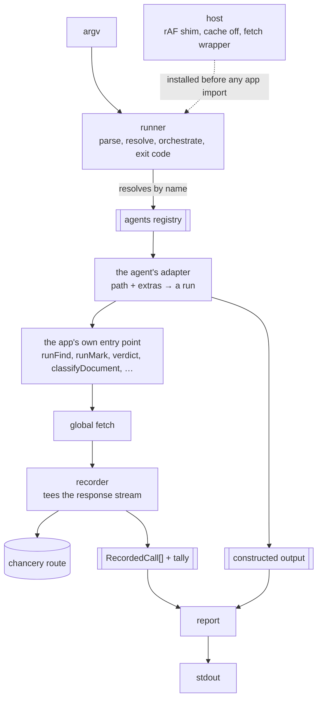

# try-prompt

Nabu's model-backed features are only reachable by clicking through the app. When a region finder misses a person, there is no way to tell whether the prompt failed to name them or whether the code between the model and the stored block threw the answer away — both look identical from the outside, and the only way to see either is to open a browser, load a project, and wait for a debounce. `try-prompt` is a terminal script that drives one of those features against a real file, calls the real gateway route, and prints two things: every raw reply the model gave, and the artifact the app's own code constructed from those replies. It judges nothing, compares nothing, and writes nothing. Its user is an agent in a debug loop — run it, read both ends, edit a prompt in `nabu-prompts`, run it again — and every decision below follows from keeping that loop cheap and keeping the tool from ever guessing which end is at fault.

## Components

- [host.md](host.md) — the process bootstrap: what has to be true before a single app module is imported, and why the ordering is load-bearing.
- [recorder.md](recorder.md) — the `fetch` interception that captures every gateway request and reply, and the run tally.
- [agents.md](agents.md) — the registry: what an agent declares, and how each supported one turns a path plus flags into a run against the app's real entry point.
- [runner.md](runner.md) — argument parsing, agent resolution, orchestration, help, and the exit code.
- [report.md](report.md) — what lands on stdout, in what order, and how a failed run is kept from reading as an empty one.

## How data flows

What this proves: only the adapter knows what an agent means. The runner resolves a name, the recorder sees bytes, the report sees a request-and-reply list plus one opaque value. Adding a ninth agent is one registry entry and no change anywhere else.



The recorder sits at `fetch` rather than at the `ParseCall` seam the app already exposes for its tests. That seam covers `runFind`, `runMark`, `filterEntries` and `verdict`, but `classifyDocument`, `generateFileHydes` and `describeGroup` import `callAndParse` and `callLlm` directly with no parameter to override, so a `ParseCall` decorator would silently record nothing for three of the eight agents. `fetch` is the one boundary every route crosses, and intercepting it costs no change to app code — which is the constraint this spec is built under.

## Walking skeleton

```
npx vite-node scripts/try-prompt.ts -- region-finder scripts/fixtures/try-prompt/transcript.md --kind person
```

One agent, one file, one kind, threaded through the real stack: the real `cutUnits` and `indexProseSentences`, the real `runFind` with its real batching and rounds, the real chancery route over HTTP, the real `gateOccurrences`. It prints the request count, every raw reply, and the hits that survived, then exits 0.

This is the first thing to build because every integration surprise in the feature lives in it: whether `import.meta.env` resolves under `vite-node`, whether the `requestAnimationFrame` shim lands before `raw-store` is imported, whether the response stream survives being teed, whether `regionKinds()` can be imported in Node without dragging React in behind it, and whether the gateway is reachable at all. None of those are visible from a unit test and all of them are cheap to find here.

To run it, the operator needs the `nabu-prompts` docker stack up on the port `getLlmHost()` resolves to, with a provider key set for the tier `region-finder` runs on. No browser, no `nabu-storage`, no project, no DuckDB.

A fixture directory `scripts/fixtures/try-prompt/` holds the markdown the skeleton runs against, matching the existing `scripts/fixtures/chunking/` convention. One transcript with several named people across more scan units than one find call takes (`FIND_MAX_ITEMS`), so the skeleton exercises batching and the known-value list growing between calls rather than a single trivial request.

## What must not change

The tool changes no app code, with one exception: `toEntryInput` in `app/lib/search/scout.ts` gains an `export` so `scout-filter` builds its entries with the app's own function instead of a copy of it. Nothing else in `app/` outside `app/lib/debug/try-prompt/` is touched. Everything below is existing behavior the tool depends on and is forbidden to alter.

**The `ParseCall` seam stays as it is.** `runFind`, `runMark`, `filterEntries`, `verdict`, `filterEnvelopes` and `adjudicateEnvelopes` keep their optional trailing parse parameter defaulting to `callAndParse`, because the existing tests drive them through it. Pinned by `app/lib/regions/detect/find.test.ts`, `app/lib/regions/detect/mark.test.ts` and `app/lib/regions/detect/retry.test.ts`. The tool does not use this seam, but removing it while adding the tool would break those tests.

**Batching, rounds and dispatch order are untouched.** The tool adds no concurrency control and no batch selection, so a run exercises the same packing and the same requeue behavior the app performs. Pinned by `app/lib/calls/pack.test.ts`, `app/lib/calls/rounds.test.ts` and `app/lib/calls/calling.correctness.test.ts`.

**The gate and the entry protocol are untouched.** Pinned by `app/lib/regions/detect/hits.test.ts`, `app/lib/regions/detect/detect.correctness.test.ts` and `app/lib/calls/entry.correctness.test.ts`.

**Cache skipping short-circuits before IndexedDB is touched.** `setCacheSkipped(true)` must make `tryGet` return `undefined` and `tryPut` return without opening a database, because the tool relies on that both to avoid stale answers and to run in a process with no `indexedDB` at all. No test covers this today, so one is required before any component here is built:

- Given cache skipping is on, when `tryGet` is called with any prefix and key, then it resolves to `undefined` and no database is opened.
- Given cache skipping is on, when `tryPut` is called, then it resolves without opening a database.
- Given cache skipping is off and `indexedDB` is absent from the global scope, when `tryGet` is called, then it resolves to `undefined` rather than throwing.

The third case pins the behavior that lets a missed `setCacheSkipped` call degrade instead of crashing the run.
